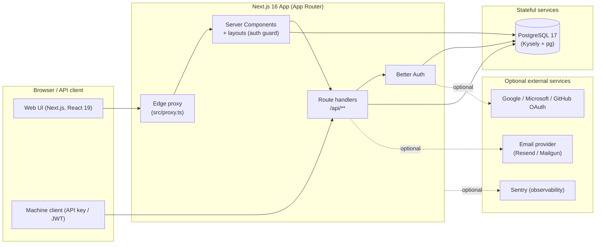

# DevResponseKit Documentation

> **DevResponseKit** is a production-grade, security-first **enterprise application shell** for multi-tenant B2B platforms — built on **Next.js 16**, **Better Auth**, **PostgreSQL + Kysely**, and **next-intl**. It ships organizations, three-tier RBAC, an admin console, a versioned machine API, cross-subdomain SSO, audit logging, and internationalization as an assembled, tested, documented foundation.

This folder is the canonical documentation set, organized by **audience**.

---

## Pick your path

### 📣 Marketing & Business

| Document | What's inside |
| --- | --- |
| [Product Overview](./product-overview.md) | Value proposition, target customers, the plain-English feature catalog, differentiators, and suggested promo/landing/sales copy |

### 👩‍💻 Developers

| Document | What's inside |
| --- | --- |
| [Architecture](./architecture.md) | System design, modules, boundaries, data flow, auth/authz, the data model — including the load-bearing **access-control decisions** (ADR-0001 three-tier access, ADR-0002 organization groups) |
| [Developer Onboarding](./developer-onboarding.md) | Tooling, install, run, test, project structure, conventions, "how to add a feature" |
| [API Reference & Clients](./api.md) | The `/api/v1` machine API and admin console API — surface, authentication, error model, request/response examples, and the typed v1 + committed admin SDK clients |
| [Admin Manager](./admin-manager.md) | Specification for the administrator console: navigation, screens, the guarded request pipeline, permission catalog, audit model |
| [Sign-up Policy](./auth-signup-policy.md) | The runtime-configurable per-organization signup workflow — email verification, admin approval / auto-activation / invite-only, organization invitations, method allow-lists, auto-approve domains, resolution order |
| [API Keys & Tokens Design](./design-api-keys-and-tokens.md) | Design of the machine credentials — scoped API keys and short-lived EdDSA JWT access tokens — issuance, rotation, revocation |
| [Satellite Apps Design](./design-satellite-apps.md) | Standing up lightweight, SSO-delegated apps on the shell (subdomain deployment) — the auth models (handoff vs. shared `auth` schema), what to strip, and the fork playbook |
| [Form Validation](./form-validation.md) | Shared client/server Zod schemas → `useZodForm` → `Form*` primitives, required markers, error borders, localized messages, accessibility |
| [Testing](./testing.md) | Test strategy, the suites, how to run each, the coverage ratchet, the security-test coverage, and the manual QA checklist |

### 🛠️ DevOps & Infrastructure

| Document | What's inside |
| --- | --- |
| [Configuration](./configuration.md) | Every environment variable, config files, secrets, local vs production |
| [Deployment](./deployment.md) | The migrate-first **Vercel + Neon** pipeline, one-time database provisioning, CI/CD, environment, and post-deploy verification |
| [Docker](./docker.md) | The container image and Compose setup for self-hosting — build, local stack, healthcheck, production notes |
| [Observability](./observability.md) | Structured logging, Sentry error/performance monitoring, and the opt-in Prometheus metrics endpoint |
| [Troubleshooting](./troubleshooting.md) | The incident-response runbook **and** common setup, build, runtime, and deployment failures and their fixes |

> The HTTP API also ships machine-readable specs: [`openapi.json`](./openapi.json) (the `/api/v1` surface) and [`openapi-admin.json`](./openapi-admin.json) (the admin console API), both generated from code.

---

## System at a glance

## Technology summary

| Layer | Technology |
| --- | --- |
| Framework | Next.js 16 (App Router, React 19, Server Components by default) |
| Authentication | Better Auth (email/password + Google/Microsoft/GitHub OAuth) |
| Database | PostgreSQL 17 + Kysely (typed query builder) + `pg` pool |
| Internationalization | next-intl — `en`, `fr`, `es`, `uk`, `pt`, `zh`, `hi`, `ja` |
| UI | Tailwind CSS 4 + shadcn/ui (Radix UI, cmdk) |
| Validation | Zod 4 |
| Observability | Sentry (`@sentry/nextjs`, opt-in) + Prometheus metrics (`prom-client`, opt-in) |
| Package manager | pnpm 10.33.2 |
| Tests | Vitest 4 (unit/component/integration/security) + Playwright (e2e + accessibility) |

> Versions reflect `package.json` at the time of writing. See [Configuration](./configuration.md) for the authoritative runtime requirements.

---

## Conventions used in these docs

- **Commands** assume a POSIX-like shell unless noted; Windows PowerShell equivalents are called out where they differ.
- `TODO:` marks a genuine unknown or a value a human must supply — it is **not** filler.
- Placeholders such as `<your-secret>` must be replaced; never commit real secrets.
