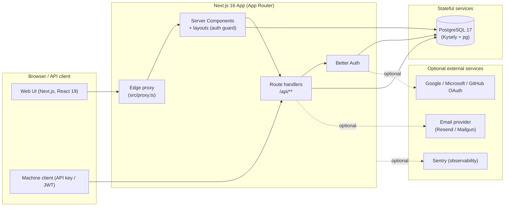

# DevResponseKit Documentation

> **DevResponseKit** is a production-grade, security-first **enterprise application shell** for multi-tenant B2B platforms — built on **Next.js 16**, **Better Auth**, **PostgreSQL + Kysely**, and **next-intl**. It ships organizations, three-tier RBAC, an admin console, a versioned machine API, cross-subdomain SSO, audit logging, and internationalization as an assembled, tested, documented foundation.

This folder is the canonical documentation set. It is organized by **audience** so you can jump straight to what you need.

> Historical/previous documentation lives in [`/docs-backup`](../docs-backup) and is kept as **read-only reference material**. Where the two disagree, **this `/docs` set and the current code are authoritative.**

---

## Pick your path

### 📣 Marketing & Business
Understand what the product is, who it's for, and how to talk about it.

| Document | What's inside |
| --- | --- |
| [Product Overview](./product-overview.md) | Value proposition, target customers, differentiators, use cases, suggested promo/landing/sales copy |
| [Features](./features.md) | Plain-English feature catalog, user flows, roles & permissions |

### 👩‍💻 Developers
Onboard, understand the architecture, and start building.

| Document | What's inside |
| --- | --- |
| [Architecture](./architecture.md) | System design, modules, boundaries, data flow, auth/authz, diagrams |
| [Developer Onboarding](./developer-onboarding.md) | Tooling, install, run, test, project structure, conventions, "how to add a feature" |
| [API Reference](./api.md) | HTTP API surface, auth requirements, request/response examples, error model |
| [API Clients & SDKs](./api-clients.md) | Authenticate, generate (or use) a typed client for the v1 API and the committed admin SDK |
| [Testing](./testing.md) | Test strategy, frameworks, how to run each suite, coverage, manual QA checklist |

### 🛠️ DevOps & Infrastructure
Stand the system up from scratch and operate it.

| Document | What's inside |
| --- | --- |
| [Configuration](./configuration.md) | Every environment variable, config files, secrets, local vs production |
| [DevOps Setup](./devops-setup.md) | From-scratch infrastructure, provisioning, CI/CD, monitoring, backups, security, readiness checklist |
| [Deployment](./deployment.md) | Build, artifacts, hosting model, container notes, release & post-deploy verification |
| [Troubleshooting](./troubleshooting.md) | Common setup, build, runtime, and deployment failures and fixes |

---

## System at a glance

## Technology summary

| Layer | Technology |
| --- | --- |
| Framework | Next.js 16 (App Router, React 19, Server Components by default) |
| Authentication | Better Auth (email/password + Google/Microsoft/GitHub OAuth) |
| Database | PostgreSQL 17 + Kysely (typed query builder) + `pg` pool |
| Internationalization | next-intl — `en`, `fr`, `es`, `uk` |
| UI | Tailwind CSS 4 + shadcn/ui (Radix UI, cmdk) |
| Validation | Zod 4 |
| Observability | Sentry (`@sentry/nextjs`, opt-in) |
| Package manager | pnpm 10.33.2 |
| Tests | Vitest 4 (unit/component/integration/security) + Playwright (e2e + accessibility) |

> Versions reflect `package.json` at the time of writing. See [Configuration](./configuration.md) for the authoritative runtime requirements.

---

## Conventions used in these docs

- **Commands** assume a POSIX-like shell unless noted; Windows PowerShell equivalents are called out where they differ.
- `TODO:` marks a genuine unknown or a value a human must supply — it is **not** filler.
- Placeholders such as `<your-secret>` must be replaced; never commit real secrets.
