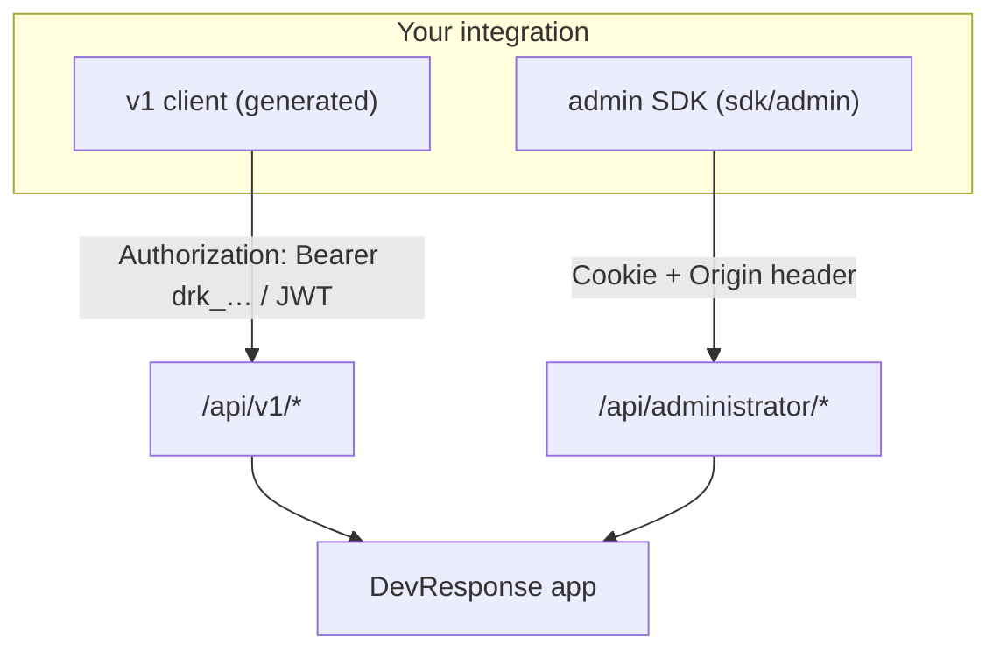

# API Clients & SDKs

_Audience: developers integrating with the platform from another service, script, or app. How to authenticate, generate (or use) a typed client, and call each API surface._

There are **two** HTTP API surfaces, each with its own auth model and client approach:

| Surface | Base path | Audience | Auth | Client |
| --- | --- | --- | --- | --- |
| **Machine API (v1)** | `/api/v1` | External integrations, service-to-service, a user's own self-service | **Bearer** — API key (`drk_…`) or short-lived JWT | **Generated on demand** from [`docs/openapi.json`](./openapi.json) |
| **Admin console API** | `/api/administrator` | Internal tooling that drives the admin console | **Session cookie** + an `Origin` header on every mutation (CSRF) | **Pre-generated, committed** at [`sdk/admin/`](../sdk/admin/) |

Both are described by committed OpenAPI 3.1 documents produced by the builders in `src/lib/api-auth/` (`openapi.ts`, `openapi-admin.ts`); the live v1 spec is also served at `GET /api/v1/openapi.json`. Drift-guard tests keep the committed specs byte-identical to the builders, so a generated client never describes a different API than the running one. See the [API Reference](./api.md) for the human-readable endpoint list.



---

## 1. The v1 machine API client

Use this for **anything outside the browser** — integrations, cron jobs, other services, or letting a user manage their own resources programmatically. It's the surface designed for generated SDKs.

### Step 1 — get a credential

Both credential paths are **off by default**; enable per environment (see [Configuration](./configuration.md#machine-api-credentials-both-paths-dark-by-default)).

- **API key** (`drk_live_…` / `drk_test_…`) — mint one in the UI (Account → API Keys, or Admin → API Keys) or via the API. Send it directly as a bearer token.
- **JWT access token** — exchange an API key or OAuth client-credentials at the token endpoint for a short-lived token:

```bash
curl -X POST https://app.example.com/api/v1/auth/token \
  -H "Content-Type: application/json" \
  -d '{"grant_type":"api_key","api_key":"drk_live_xxxxxxxx","scope":"admin.users.read"}'
# → { "access_token": "eyJ…", "token_type": "Bearer", "expires_in": 900, "scope": "admin.users.read" }
```

> A credential's authority is the **intersection of its scopes and its owner's permissions** — it can never exceed its creator. See [API Reference → Authentication](./api.md#2-authentication).

### Step 2 — get the spec

The spec is committed, so you don't need a running server:

```bash
# Already in the repo:
docs/openapi.json
# …or fetch the live one:
curl https://app.example.com/api/v1/openapi.json -o openapi.json
```

### Step 3 — generate a client

Every operation has a stable `operationId` (`listUsers`, `createUser`, `issueToken`, …) so generated method names are predictable. Pick whichever generator fits your stack:

```bash
# A) TypeScript types only (lightweight)
npx openapi-typescript docs/openapi.json -o api.d.ts

# B) A full typed client (zero-runtime-dep, like the admin SDK)
npx @openapitools/openapi-generator-cli generate \
  -i docs/openapi.json -g typescript-fetch -o ./clients/v1

# C) Other languages — pick any openapi-generator target
npx @openapitools/openapi-generator-cli generate \
  -i docs/openapi.json -g python -o ./clients/python
```

### Step 4 — call the API

```ts
// Example with a generated typescript-fetch client (see the admin SDK below
// for the same Configuration pattern).
import { Configuration, UsersApi } from "./clients/v1";

const api = new UsersApi(
  new Configuration({
    basePath: "https://app.example.com/api/v1",
    headers: { Authorization: `Bearer ${process.env.API_TOKEN}` },
  }),
);

const page = await api.listUsers({ page: 1, pageSize: 25, q: "acme" });
console.log(page.items, page.total);
```

### Conventions

- **Pagination** — list endpoints return `{ items, page, pageSize, total, sort }`. Query with `page`, `pageSize`, `sort` (`field.asc` / `field.desc`), `q`, and `filter[…]`.
- **Errors** — RFC 7807 `application/problem+json`: `{ type, title, status, code, detail?, requestId }`. Every response carries an `x-request-id` header.
- **Tenant scoping** — out-of-scope resources return **404**, never 403.

---

## 2. The admin console SDK

Use this only for **internal tooling that needs the admin console's full surface** (users, roles, permissions, groups, organizations, memberships, enterprise apps, API keys, email, audit, CSV export). It is the cookie-session console API — **not** a public/integration API.

Unlike the v1 client, this SDK is **already generated and committed** at [`sdk/admin/`](../sdk/admin/) (openapi-generator `typescript-fetch`, zero runtime dependencies — it uses the global `fetch`). Import it directly.

### Authenticate

This surface authenticates with the **Better Auth session cookie**, and every **mutation** (`POST`/`PATCH`/`PUT`/`DELETE`) additionally requires an `Origin` (or `Referer`) header matching a trusted origin — the CSRF guard. A non-browser caller must supply **both**.

```ts
import { Configuration, UsersApi, OrganizationsApi } from "../sdk/admin";

// In the browser: cookies are sent automatically with credentials:"include".
const browser = new Configuration({
  basePath: "https://app.example.com/api/administrator",
  credentials: "include",
  headers: { Origin: "https://app.example.com" }, // required on mutations
});

// On the server: forward the session cookie + an Origin header explicitly.
const server = new Configuration({
  basePath: "https://app.example.com/api/administrator",
  headers: {
    Cookie: `better-auth.session_token=${sessionToken}`,
    Origin: "https://app.example.com",
  },
});

const users = new UsersApi(browser);
```

### Call the API

There is one `…Api` class per resource group, with typed models under `sdk/admin/models/`.

```ts
// List (typed query + response)
const page = await users.listUsers({ page: 1, pageSize: 25, filterStatus: ["active"] });

// Create
const created = await users.createUser({
  createUserRequest: { email: "new.user@example.com", password: "<temp>", name: "New User" },
});

// Another resource
const orgs = await new OrganizationsApi(browser).listOrganizations({ q: "acme" });
```

### Conventions

- **Pagination** — same `{ items, page, pageSize, total, sort }` envelope and query params as v1.
- **Errors** — the admin envelope `{ error, message, requestId }` (`AdminError`); failed requests reject with a `ResponseError`. `message` is an i18n key.
- **Tenant scoping** — org admins are scoped to their own organization; out-of-scope resources return **404**.

### Type-check / regenerate

```bash
pnpm sdk:admin:typecheck   # type-check the committed client (sdk/admin/tsconfig.json)
pnpm sdk:admin:generate    # re-export docs/openapi-admin.json + regenerate sdk/admin
```

> **Regenerating needs Java + network** (openapi-generator runs on a JVM; the version is pinned in `openapitools.json`). The **committed** client itself has no dependencies. After editing the admin API, run `pnpm sdk:admin:generate` and commit — a drift-guard test fails otherwise.

See [`sdk/admin/README.md`](../sdk/admin/README.md) for more.

---

## 3. Which one should I use?

| If you're… | Use |
| --- | --- |
| Integrating from another service / script / language | **v1 machine API** (bearer auth, generate from `docs/openapi.json`) |
| Letting a user manage *their own* resources programmatically | **v1 machine API** (`account.*` scopes, `/api/v1/me/*`) |
| Building internal tooling that mirrors the admin console | **Admin SDK** (`sdk/admin/`, cookie + Origin) |
| Unsure | **v1** — it's the supported integration surface; the admin SDK is an internal convenience |

The two surfaces overlap (both can manage users), but differ in **auth** (bearer vs cookie+Origin) and **error format** (RFC 7807 vs `{error,message,requestId}`).

---

## 4. Keeping clients in sync

- The committed specs (`docs/openapi.json`, `docs/openapi-admin.json`) and the admin SDK are produced from the builders in `src/lib/api-auth/`. **Drift-guard tests** (`tests/unit/openapi-export.test.ts`) fail CI if a spec falls out of sync — the fix is `pnpm openapi:export` (both specs) and, for the admin surface, `pnpm sdk:admin:generate`, then commit.
- **Regenerate your downstream client** whenever the relevant spec changes (watch `docs/openapi.json` / `docs/openapi-admin.json` in the repo, or the `version` in the spec's `info`).

---

## 5. Troubleshooting

| Symptom | Cause / fix |
| --- | --- |
| `401` from `/api/v1/*` | Missing/invalid bearer; or the path is disabled (`API_KEYS_ENABLED` / `API_JWT_ENABLED` are off by default). |
| `403` with an unexpected scope error | The credential's scope doesn't cover the endpoint, **or** exceeds the owner's permissions (it's capped to the creator). |
| `401`/`403` from `/api/administrator/*` | No session cookie, or (on a mutation) a missing/untrusted `Origin` header — add it (CSRF guard). |
| `404` for a resource you know exists | Tenant scoping — an org admin can't see other orgs; out-of-scope is 404 by design. |
| `429` | Rate-limited; respect the `Retry-After` header. |
| Generated client types don't match responses | Regenerate from the current spec; list/detail endpoints return raw snake_case rows, create endpoints return camelCase summaries (both are modeled in the spec). |
| `pnpm sdk:admin:generate` fails | It needs **Java** and network access (openapi-generator). The committed client doesn't. |

---

_See also: [API Reference](./api.md) · [Configuration](./configuration.md) · [Architecture → Machine API auth](./architecture.md#machine-api-authentication)._
