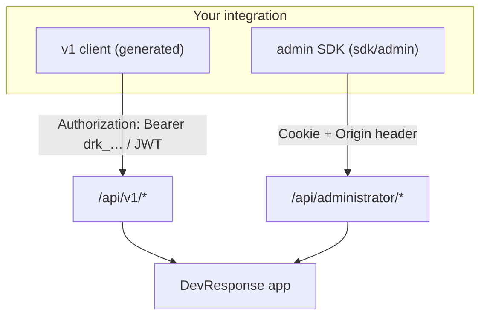

# API Reference & Clients

_Audience: developers consuming, extending, or integrating with the HTTP API — from a browser, a script, another service, or any language. This page is the human-readable companion to the committed OpenAPI specs; the route handlers under `src/app/api/**` and `src/lib/api-auth/**` are authoritative. Where this prose and the code disagree, the code wins — fix the doc._

Two related references carry the deeper detail this page links to rather than repeats:

- **[Design: API Keys & Access Tokens](./design-api-keys-and-tokens.md)** — the canonical threat model, issuance, rotation, and revocation design for the machine-credential subsystem (`src/lib/api-auth/**`).
- **[Administrator Console — Specification](./admin-manager.md)** — the canonical `/api/administrator` surface, including the **permission catalog** ([§6.1](./admin-manager.md#61-permission-catalog)). The catalog is **not** reproduced here.

---

## 1. Surface overview

| Group | Base path | Auth | Audience |
| --- | --- | --- | --- |
| Better Auth | `/api/auth/[...all]` | Better Auth (cookies) | Browser auth flows & OAuth callbacks |
| Account self-service | `/api/account/*`, `/api/preferences/*` | Cookie session | The signed-in user |
| Invitations | `/api/invitations/accept` | Cookie session | Signed-in invitees accepting an organization invitation |
| Navigation | `/api/navigation/*` | Cookie session | The web UI |
| SSO handoff | `/api/sso/launch`, `/api/sso/consume` | Cookie session / signed token | Cross-subdomain SSO |
| Docs assets | `/api/docs/asset/[...path]` | Cookie session + `shell.view` | In-app docs viewer |
| Administrator | `/api/administrator/*` | **Cookie session** + `admin.*` permission | The admin console |
| Machine API (v1) | `/api/v1/*` | **Bearer** (API key or JWT) or cookie | Integrations & the user's own self-service |
| MCP agent gateway | `/api/mcp`, `/api/mcp/register` | **Bearer** (API key or JWT); registration public | AI agents (Model Context Protocol) — dark by default |
| Discovery | `/api/v1/openapi.json`, `/api/v1/jwks.json`, `/.well-known/oauth-*` | Public | Tooling · MCP / OAuth clients |

All handlers are `dynamic = "force-dynamic"` (no caching of authorized data). Every mutating route runs a permission check, an origin/CSRF guard, a per-actor rate-limit, Zod validation, and an audit write.

This page focuses on the two surfaces an external caller integrates with — the **machine API (`/api/v1`)** and the **admin console API (`/api/administrator`)** — plus the cross-cutting auth, envelope, and error model they share.

> **Authoritative machine spec:** both surfaces are described by OpenAPI 3.1 documents — the v1 spec is served live at **`GET /api/v1/openapi.json`** and both are committed for offline client generation: **[`docs/openapi.json`](./openapi.json)** (`/api/v1`) and **[`docs/openapi-admin.json`](./openapi-admin.json)** (`/api/administrator`). They are produced by the builders in `src/lib/api-auth/` (`openapi.ts`, `openapi-admin.ts`) — the same builders that power the live route and the committed SDK — and **drift-checked in CI** (`tests/unit/openapi-export.test.ts`), so a generated client never describes a different API than the running one. Treat the specs as the source of truth for exact request/response shapes; this page summarizes.



### List envelope & conventions

List endpoints across both surfaces share one envelope and one set of query parameters:

- **Envelope** — `{ items, page, pageSize, total }`, plus `sort` on the full list-query endpoints (users, audit). `pageSize` is clamped to 1–200.
- **Query** — `page` (1-indexed), `pageSize`, `sort` (repeatable `field.asc` / `field.desc`, applied in order), `q` (case-insensitive search), and repeatable `filter[…]` exact-match filters.
- **Tenant scoping** — an out-of-scope resource returns **404**, never 403, so existence is never leaked (see [Tenant scoping](#3-tenant-scoping)).
- **Wire format** — list/detail endpoints return raw **snake_case** DB rows; create endpoints return small **camelCase** summaries. Both are modeled in the spec, so a generated client matches the wire format exactly.

## 2. Authentication

There are two auth models. **Cookie session** gates the admin console and account endpoints; **bearer credentials** gate the machine API. The `/api/v1` surface accepts either.

### Cookie session (browser & admin console)

Better Auth sets a session cookie on sign-in. Cross-site mutations (`POST`/`PATCH`/`PUT`/`DELETE`) are additionally protected by an **origin guard**: the request's `Origin` (or `Referer`) must be a trusted origin. A non-browser caller of `/api/administrator/*` must therefore send **both** the session cookie and a matching `Origin` header.

### Bearer credentials (machine API)

`/api/v1/**` accepts either credential in an `Authorization: Bearer …` header. **Both paths are disabled by default** and enabled per environment (`API_KEYS_ENABLED`, `API_JWT_ENABLED` — see [Configuration](./configuration.md#machine-api-credentials-both-paths-dark-by-default)).

| Type | Looks like | Enabled by | At rest |
| --- | --- | --- | --- |
| **API key** | `drk_<env>_<rand>` (`drk_live_…` / `drk_test_…`) | `API_KEYS_ENABLED=1` | SHA-256 hash only |
| **JWT access token** | `eyJ…` (EdDSA) | `API_JWT_ENABLED=1` + signing key | Stateless; verified via JWKS |

An API key is `drk_<env>_<random>` (32 base62 chars, ~190 bits of entropy); only its SHA-256 hash is stored, and the plaintext is shown once. A JWT is a short-lived EdDSA token verified by signature against `GET /api/v1/jwks.json` — no server-side secret. Get one by exchanging a long-lived credential (an API key, or OAuth2 client-credentials) at the token endpoint:

```bash
curl -X POST https://app.example.com/api/v1/auth/token \
  -H "Content-Type: application/json" \
  -d '{"grant_type":"api_key","api_key":"drk_live_xxxxxxxx","scope":"admin.users.read"}'
# → { "access_token": "eyJ…", "token_type": "Bearer", "expires_in": 900, "scope": "admin.users.read" }
```

Then call the API:

```bash
curl https://app.example.com/api/v1/users -H "Authorization: Bearer eyJ…"
```

**Authority rule (the one invariant to remember):** a credential's effective access is the **intersection of its scopes and its owner's live permissions** (`src/lib/api-auth/scopes.ts`, enforced by `requireApiPermission` in `v1-guard.server.ts`). A credential can never be minted with more authority than its creator holds, and `GET /api/v1/me` reports the resulting `effectiveScopes`.

Scopes **are** the permission vocabulary — every `admin.*` catalog key (see [`admin-manager.md` §6.1](./admin-manager.md#61-permission-catalog)) plus a small set of self-service `account.*` scopes (`account.read`, `account.profile.write`, `account.preferences.write`, `account.apikeys.manage`). A scope ending in `.*` (e.g. `admin.users.*`) matches every key under that prefix.

> For the full threat model, secret storage, issuance, rotation, and revocation, see **[Design: API Keys & Access Tokens](./design-api-keys-and-tokens.md)**.

## 3. Tenant scoping

Applies to the admin console and the `admin.*` v1 routes:

- **Super Admin** (holds `superuser`): all organizations.
- **Org Admin** (holds `admin.*`, no `superuser`): their single organization only.
- An out-of-scope resource returns **404**, never 403, so existence is not leaked.

See [Architecture → Authorization](./architecture.md#authorization-the-three-tier-model).

## 4. Error model

### Machine API (`/api/v1`)

RFC 7807 `application/problem+json`:

```json
{ "type": "https://devresponse.com/problems/forbidden", "title": "Insufficient scope or permission", "status": 403, "code": "forbidden", "detail": "…", "requestId": "5f3c…" }
```

### Administrator routes

A JSON envelope with a stable machine code, an i18n message key, and the correlation id (`AdminError`):

```json
{ "error": "forbidden", "message": "errors.forbidden", "requestId": "5f3c…" }
```

Common statuses on both surfaces: `400` invalid body, `401` unauthenticated, `403` forbidden, `404` not found / out of scope, `409` conflict, `412` stale `If-Match` ETag (v1), `429` rate-limited (with `Retry-After`). Every response (success or error) carries an `x-request-id` header that matches the audit log.

## 5. Machine API (`/api/v1`)

| Endpoint | Methods | Auth (scope) | Purpose |
| --- | --- | --- | --- |
| `/api/v1/auth/token` | POST | API key or OAuth client credentials | Exchange long-lived credentials for a short-lived JWT |
| `/api/v1/me` | GET | `account.read` | Caller identity, permissions, effective scopes |
| `/api/v1/me/api-keys` | GET / POST | `account.read` / `account.apikeys.manage` | List / mint the caller's own keys (plaintext once) |
| `/api/v1/me/api-keys/[id]` | DELETE; `…/rotate` POST | `account.apikeys.manage` | Revoke / rotate one of the caller's own keys |
| `/api/v1/users` | GET / POST | `admin.users.read` / `.create` | User administration |
| `/api/v1/users/[id]` | GET; `…/status` POST | `admin.users.read` / `.manage` | Read a user (emits a weak ETag); apply a status transition |
| `/api/v1/admin/api-keys` | GET; `…/[id]` DELETE | `admin.apikeys.read` / `.manage` | API-key governance (list / revoke any key) |
| `/api/v1/admin/oauth-clients` | GET / POST; `…/[id]` GET/PATCH/DELETE; `…/rotate-secret` POST | `admin.clients.read` / `.manage` | OAuth client (client-credentials) management |
| `/api/v1/audit-events` | GET | `admin.audit.read` | Read the audit log |
| `/api/v1/jwks.json` | GET | public | Public keys for verifying issued JWTs |
| `/api/v1/openapi.json` | GET | public | OpenAPI 3.1 spec |

The token endpoint accepts `grant_type` of `api_key` or `client_credentials`, with an optional `scope` to **down-scope** the token to a subset of the credential's scopes. Mutations are mutating-rate-limited per credential (the bucket keys on the credential id, so one noisy key can't exhaust the principal's whole budget).

### Example — who am I

```bash
curl https://app.example.com/api/v1/me -H "Authorization: Bearer eyJ…"
```

```json
{
  "betterAuthUserId": "…", "appUserId": "…", "email": "svc@example.com",
  "status": "active", "organizationId": "…", "preferredLocale": "en",
  "authentication": { "kind": "api_key", "credentialId": "…" },
  "permissions": ["admin.users.read"], "grantedScopes": ["admin.users.read"], "effectiveScopes": ["admin.users.read"]
}
```

### Generating & using a v1 client

The v1 surface is designed for generated SDKs — use it for **anything outside the browser** (integrations, cron jobs, other services, or letting a user manage their own resources). Every operation has a stable `operationId` (`listUsers`, `createUser`, `issueToken`, …) so generated method names are predictable.

```bash
# 1. Get the spec — committed, so no running server is needed:
#    docs/openapi.json   (…or fetch the live one)
curl https://app.example.com/api/v1/openapi.json -o openapi.json

# 2. Generate a client for your stack:
npx openapi-typescript docs/openapi.json -o api.d.ts                 # TS types only
npx @openapitools/openapi-generator-cli generate \                  # full typed client
  -i docs/openapi.json -g typescript-fetch -o ./clients/v1
npx @openapitools/openapi-generator-cli generate \                  # any other language
  -i docs/openapi.json -g python -o ./clients/python
```

```ts
// 3. Call it — authenticate with a bearer token (API key or JWT).
import { Configuration, UsersApi } from "./clients/v1";

const api = new UsersApi(
  new Configuration({
    basePath: "https://app.example.com/api/v1",
    headers: { Authorization: `Bearer ${process.env.API_TOKEN}` },
  }),
);

const page = await api.listUsers({ page: 1, pageSize: 25, q: "acme" });
console.log(page.items, page.total);
```

## 6. Administrator API (`/api/administrator`) & the committed admin SDK

This is the cookie-session console surface (users, roles, permissions, groups, organizations, memberships, sign-up policy, invitations, enterprise apps, API keys, email, audit, CSV export). It is **internal tooling that mirrors the admin console — not a public/integration API**; prefer the v1 surface for integrations. All endpoints require a cookie session and the noted permission; mutations are rate-limited and audited.

| Resource | Methods & paths | Permissions |
| --- | --- | --- |
| Users | `GET/POST /users`; `GET/PATCH/DELETE …/[id]`; `…/[id]/status`, `/password`, `/role`, `/sessions`, `/ban`, `/unban`, `/restore`, `/impersonate`, `/memberships`, `/app-roles`, `/groups`; `POST …/users/bulk` | `admin.users.*` (per action) |
| Roles | `GET/POST /roles`; `GET/PATCH/DELETE …/[id]`; `…/[id]/permissions`, `/members`, `/duplicate` | `admin.roles.*` |
| Permissions | `GET/POST /permissions`; `…/[id]` | `admin.roles.read`, `admin.permissions.manage` |
| Groups | `GET/POST /groups`; `GET/PATCH/DELETE …/[id]`; `…/[id]/roles`, `/members` | `admin.groups.*`, `admin.roles.assign` |
| Organizations | `GET/POST /organizations`; `GET/PATCH/DELETE …/[id]`; `…/[id]/members`, `/provider-bindings`, `/auth-settings`, `/invitations`, `/invitations/[invitationId]`, `/invitations/[invitationId]/resend` | `admin.orgs.*` |
| Sign-up policy (platform) | `GET/PATCH /auth-settings/defaults` | `admin.orgs.*` + **superadmin** |
| API keys | `GET/POST /api-keys`; `GET/PATCH/DELETE …/[id]`; `…/[id]/rotate` | `admin.apikeys.*` |
| Email | `GET /email/outbox`; `…/templates`, `…/templates/[id]`; `POST …/email/test` | `admin.email.*` |
| MCP agents | `GET /mcp-agents`; `POST …/[id]/approve`; `PATCH`/`DELETE …/[id]` | `admin.clients.read` / `admin.clients.manage` |
| Audit | `GET /audit` | `admin.audit.read` |
| Export | `GET /export/[resource]` | export permission |

> The exact permission per action and request/response shapes live in [`docs/openapi-admin.json`](./openapi-admin.json) and [`admin-manager.md`](./admin-manager.md). `GET /api/administrator/metrics` exists but is **intentionally excluded** from the spec/SDK — it backs the console home dashboard only. The `mcp-agents` routes are **not yet modeled** in the spec or the committed SDK either — drive them from the console UI (or plain `fetch`) per [Admin Manager §8.13](./admin-manager.md#813-mcp-agents).

### The committed admin SDK

Unlike the v1 client, the admin SDK is **already generated and committed** at [`sdk/admin/`](../sdk/admin/) (openapi-generator `typescript-fetch`, zero runtime dependencies — it uses the global `fetch`). Import it directly. Authenticate with the **session cookie**, plus an **`Origin` header on every mutation** (the CSRF guard); a non-browser caller must supply both.

```ts
import { Configuration, UsersApi, OrganizationsApi } from "../sdk/admin";

// In the browser: cookies are sent automatically with credentials:"include".
const browser = new Configuration({
  basePath: "https://app.example.com/api/administrator",
  credentials: "include",
  headers: { Origin: "https://app.example.com" }, // required on mutations
});

// On the server: forward the session cookie + an Origin header explicitly.
const server = new Configuration({
  basePath: "https://app.example.com/api/administrator",
  headers: {
    Cookie: `better-auth.session_token=${sessionToken}`,
    Origin: "https://app.example.com",
  },
});

const users = new UsersApi(browser);
const page = await users.listUsers({ page: 1, pageSize: 25, filterStatus: ["active"] });
const created = await users.createUser({
  createUserRequest: { email: "new.user@example.com", password: "<temp>", name: "New User" },
});
const orgs = await new OrganizationsApi(server).listOrganizations({ q: "acme" });
```

Failed requests reject with a `ResponseError` carrying the `AdminError` envelope (`message` is an i18n key). Regenerate after editing the admin API — a drift-guard test fails otherwise:

```bash
pnpm sdk:admin:typecheck   # type-check the committed client (sdk/admin/tsconfig.json)
pnpm sdk:admin:generate    # re-export docs/openapi-admin.json + regenerate sdk/admin
```

> **Regenerating needs Java + network** (openapi-generator runs on a JVM, pinned in `openapitools.json`); the **committed** client itself has no dependencies. See [`sdk/admin/README.md`](../sdk/admin/README.md).

### Which surface should I use?

| If you're… | Use |
| --- | --- |
| Integrating from another service / script / language | **v1 machine API** (bearer auth, generate from `docs/openapi.json`) |
| Letting a user manage *their own* resources programmatically | **v1 machine API** (`account.*` scopes, `/api/v1/me/*`) |
| Building internal tooling that mirrors the admin console | **Admin SDK** (`sdk/admin/`, cookie + Origin) |
| Unsure | **v1** — it's the supported integration surface; the admin SDK is an internal convenience |

The two surfaces overlap (both can manage users) but differ in **auth** (bearer vs cookie+Origin) and **error format** (RFC 7807 vs `{ error, message, requestId }`).

## 7. SSO handoff endpoints

| Endpoint | Method | Auth | Purpose |
| --- | --- | --- | --- |
| `/api/sso/launch` | GET | Cookie session (not impersonated) | Verify access to a registered app, mint a one-time handoff token, redirect to the destination |
| `/api/sso/consume` | GET | Signed token | Verify the token and redirect to the confirmation interstitial (no nonce burn, no session) |
| `/api/sso/consume` | POST | Signed token + trusted origin | Burn the token, establish the destination session, redirect to the dashboard |

Query parameters for `launch`: `applicationId` (required; must match the app-id shape `^[a-z0-9][a-z0-9._-]{0,127}$` — anything else is a `400 invalid_application_id` with no database work), `locale` (optional). The token is HS256, single-use, valid ≤60s, with an audience bound to the destination application. See [Architecture → SSO](./architecture.md#single-sign-on-handoff) and [Configuration](./configuration.md#single-sign-on-handoff).

Contract details that matter to a caller:

- **Impersonated sessions cannot launch.** A session with `impersonatedBy` set gets `403 forbidden_while_impersonating` (audited against the impersonating admin). The satellite session a handoff would mint carries no impersonation marker, outlives the impersonation cap, and is attributed to the target — so it is never minted.
- **Application-id binding on consume.** Besides the `aud` check, both consume methods require the token's `targetApplicationId` claim to equal the consumer's own `SSO_HANDOFF_APPLICATION_ID`, and the nonce burn is predicated on that id too. A token minted for another registered app is rejected (`401 invalid_token`, audit reason `target_application_mismatch`) even if the two apps' audiences collide. The catalog refuses a duplicate `sso_audience` at registration (`409 audience_taken`).
- **Rate limits.** `launch` is throttled per principal (session user id, or trusted client IP while signed out); `consume` GET and POST are throttled per trusted client IP. Both use the standard 30-burst / 1 per second budget and answer `429 rate_limited` with a `Retry-After` header before any audit row is written.

## 8. Secret-handling notes

- API-key and OAuth-client secrets are returned **once** at creation/rotation and stored only as hashes. There is no endpoint to retrieve them again.
- Never log or echo a plaintext credential; the audit log records metadata only.

## 9. Troubleshooting

| Symptom | Cause / fix |
| --- | --- |
| `401` from `/api/v1/*` | Missing/invalid bearer; or the path is disabled (`API_KEYS_ENABLED` / `API_JWT_ENABLED` are off by default). |
| `403` with an unexpected scope error | The credential's scope doesn't cover the endpoint, **or** exceeds the owner's permissions (it's capped to the creator). |
| `401`/`403` from `/api/administrator/*` | No session cookie, or (on a mutation) a missing/untrusted `Origin` header — add it (CSRF guard). |
| `404` for a resource you know exists | Tenant scoping — an org admin can't see other orgs; out-of-scope is 404 by design. |
| `412` from a v1 mutation | Stale `If-Match` ETag — re-`GET` the resource and retry with the fresh ETag. |
| `429` | Rate-limited; respect the `Retry-After` header. |
| Generated client types don't match responses | Regenerate from the current spec; list/detail endpoints return snake_case rows, create endpoints camelCase summaries (both modeled). |
| `pnpm sdk:admin:generate` fails | It needs **Java** and network access (openapi-generator). The committed client doesn't. |

## 10. Source of truth & keeping clients in sync

- The committed **OpenAPI 3.1 specs are authoritative** for exact request/response shapes — [`docs/openapi.json`](./openapi.json) (`/api/v1`) and [`docs/openapi-admin.json`](./openapi-admin.json) (`/api/administrator`). They are regenerated from the handlers and **drift-checked in CI**; the fix when a check fails is `pnpm openapi:export` (both specs) and, for the admin surface, `pnpm sdk:admin:generate`, then commit.
- The `account.*` scopes are also enumerated in `x-account-scopes` of [`docs/openapi.json`](./openapi.json); the supported `export` resources/formats are described by the `/api/administrator/export/[resource]` operation in [`docs/openapi-admin.json`](./openapi-admin.json).
- **Regenerate your downstream client** whenever the relevant spec changes — watch `docs/openapi.json` / `docs/openapi-admin.json`, or the `version` in the spec's `info`.

## 11. MCP agent gateway (Model Context Protocol)

_Dark by default (`MCP_ENABLED`), like the machine API it fronts. Flags: [Configuration → AI agent gateway (MCP)](./configuration.md#ai-agent-gateway-mcp). Full design: [Design: MCP Agent Gateway](./design-mcp-agent-gateway.md)._

`/api/mcp` exposes the v1 machine API to AI agents over the **Model Context Protocol** — a stateless **Streamable HTTP** JSON-RPC 2.0 endpoint. It is a translation layer, not a second API: every tool call funnels through the same `permission ∩ scope` guard as `/api/v1`, so the MCP surface can never exceed the machine API's authority.

| Endpoint | Method | Auth | Purpose |
| --- | --- | --- | --- |
| `/api/mcp` | POST | **Bearer** (API key or client-credentials JWT) | JSON-RPC: `initialize`, `tools/list`, `tools/call`, `ping` |
| `/api/mcp` | GET | — | `405` — no server-initiated stream |
| `/api/mcp/register` | POST | Public (rate-limited) | RFC 7591 agent self-registration; gated by `MCP_REGISTRATION_ENABLED` |
| `/.well-known/oauth-protected-resource` | GET | Public | RFC 9728 protected-resource metadata |
| `/.well-known/oauth-authorization-server` | GET | Public | RFC 8414 authorization-server metadata |

- **Bearer-only.** A cookie session is rejected (it is not an audience-bound OAuth token). An unauthenticated call returns `401` with `WWW-Authenticate: Bearer …, resource_metadata="…/.well-known/oauth-protected-resource"`, so a compliant client auto-discovers the token endpoint (`/api/v1/auth/token`) and JWKS.
- **Tools are generated from the OpenAPI spec.** Each scoped `/api/v1` operation becomes one MCP tool (~18 today), carrying its required scope; a new scoped endpoint becomes a tool for free. `issueToken`, `getJwks`, and `getOpenApi` are excluded.
- **Self-registration is safe by construction.** A newly registered agent gets a machine service account + a **zero-scope** OAuth client. In `approval` mode (default) it cannot mint a token until an admin activates it; in `open` mode it is active but every tool `403`s until scopes are granted. Admins approve, scope, and revoke agents from **Administrator → Agents** ([Admin Manager §8.13](./admin-manager.md#813-mcp-agents)).

The MCP surface is **not** modeled in the OpenAPI specs (it is JSON-RPC, not REST) — the [design doc](./design-mcp-agent-gateway.md) is authoritative.

---

_See also: [Design: API Keys & Access Tokens](./design-api-keys-and-tokens.md) · [Administrator Console — Specification](./admin-manager.md) · [Configuration](./configuration.md) for the environment variables these endpoints depend on._
