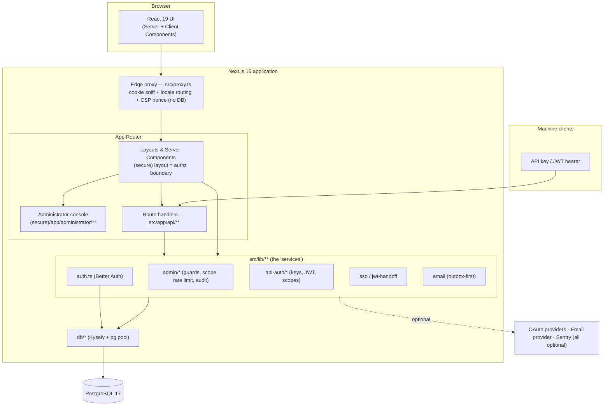
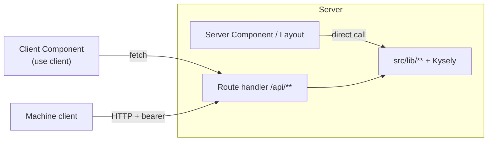
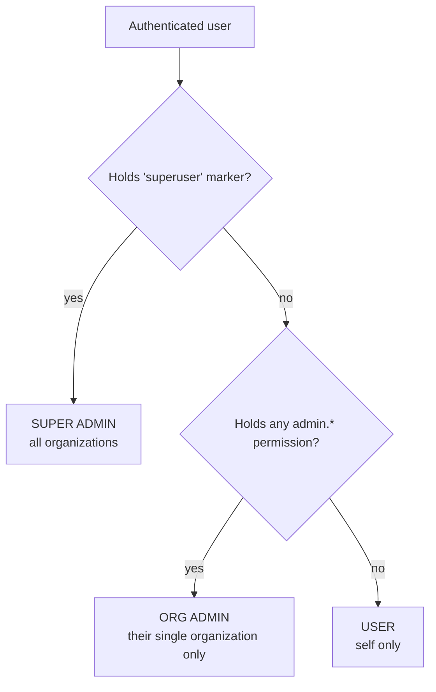
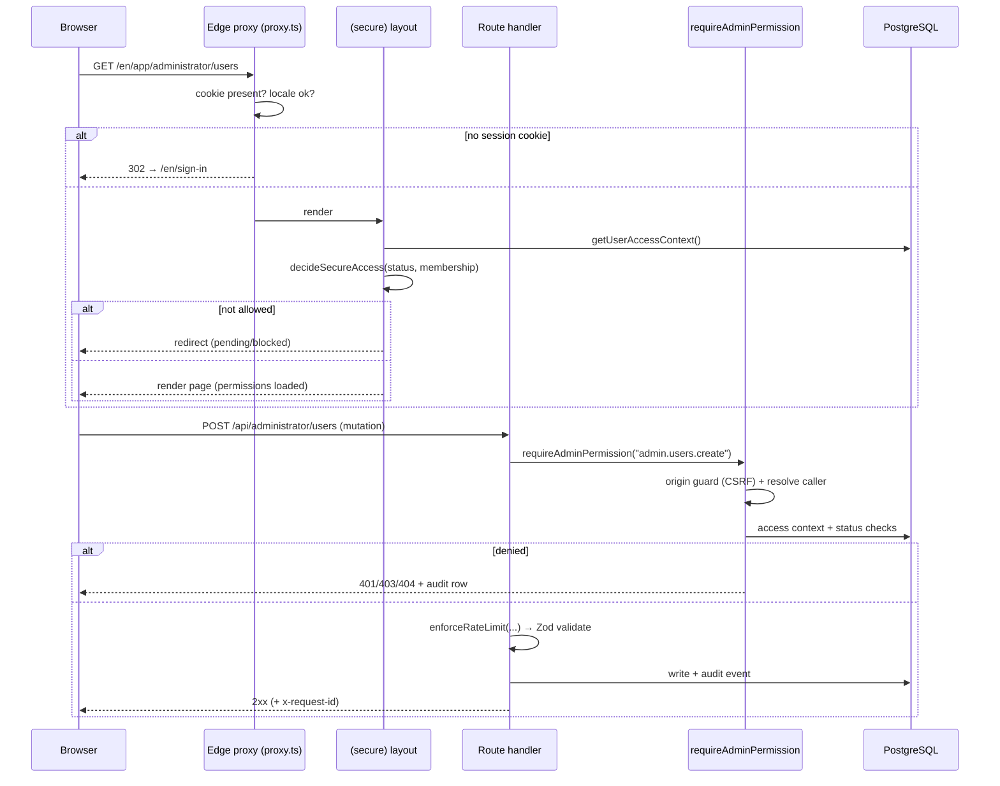
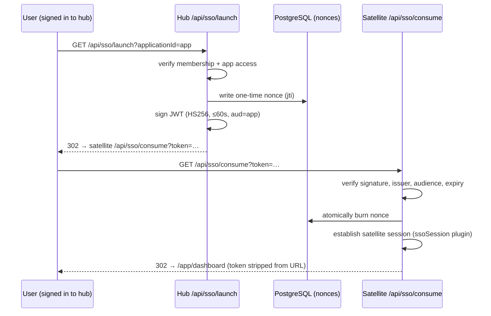
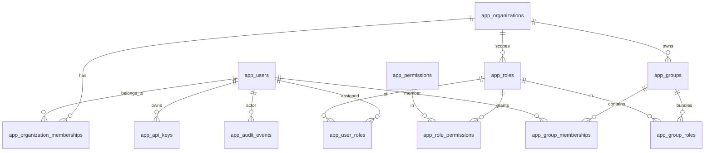

# Architecture

_Audience: developers and technical leads. How the system is structured, where the boundaries are, and how a request flows through it._

---

## 1. Overview

DevResponseKit is a **single Next.js 16 application** (App Router) backed by **PostgreSQL**. It is not a microservice mesh — it is a modular monolith where the "services" are libraries under `src/lib/**` and the HTTP surface is a set of route handlers under `src/app/api/**`. Authentication is provided by **Better Auth**, which shares the same Postgres connection pool as the application.



## 2. Major modules

| Area | Location | Responsibility |
| --- | --- | --- |
| **Routing & pages** | `src/app/[locale]/**` | Localized UI: `(public)`, `(auth)`, `(secure)` route groups + the administrator console. Plus `src/app/(root)/**` for locale-independent entry. |
| **HTTP API** | `src/app/api/**` | Route handlers: Better Auth catch-all, account self-service, navigation, SSO handoff, docs assets, and the versioned `/api/v1` machine API. |
| **Edge proxy** | `src/proxy.ts` | Cheap pre-render redirect + locale routing + per-request CSP-nonce minting (threaded into request/response headers). **Not** the authorization boundary; reads no database. |
| **Authentication** | `src/lib/auth.ts` | Better Auth configuration (providers, plugins, session hooks). |
| **Access context** | `src/lib/auth-status.ts` | `getUserAccessContext()` resolves a user's effective permissions; `decideSecureAccess()` is the pure allow/deny decision. |
| **Authorization primitives** | `src/lib/admin/access-scope.server.ts` | `isSuperadmin`, `resolveOrgScope`, `canAccessOrg`, `canAccessUser` — the single source of truth for tenant boundaries. |
| **Admin guards & helpers** | `src/lib/admin/**` | `requireAdminPermission`, list-query parsing, error envelopes, rate limiting, audit helpers, request-id correlation. |
| **Machine API auth** | `src/lib/api-auth/**` | API-key and JWT issuance/verification, scope catalog and grantability, caller resolution. |
| **SSO handoff** | `src/lib/sso*` / `src/lib/jwt-handoff.server.ts` | One-time signed token issue/verify for cross-subdomain SSO. |
| **Email** | `src/lib/email/**` (outbox-first) | Render → record in outbox → optionally deliver via Resend/Mailgun. |
| **Data layer** | `src/db/**` | Kysely instance + `pg` pool, schema types, migrations, seeds, reset tooling. |
| **i18n** | `src/i18n/**`, `src/messages/*.json` | next-intl request config and translations for `en`/`fr`/`es`/`uk`/`pt`/`zh`/`hi`/`ja`. |
| **UI primitives** | `src/components/**` | shadcn/ui components, the application shell, data grid, navigation. |

> See the [Data Layer section](#5-data-model) and [Developer Onboarding → Project structure](./developer-onboarding.md#5-project-structure) for a directory-level walkthrough.

## 3. Frontend / backend boundaries

This is a **server-first** application:

- **Server Components are the default.** They run on the server, can query the database directly, and never ship their code to the browser.
- **Client Components opt in** with `"use client"` and are used only at interaction boundaries (forms, grids, switchers).
- **Route handlers** (`src/app/api/**`) are the explicit HTTP boundary used by client components, machine clients, and external integrations.

Two consequences worth internalizing:

1. A page component can call `getUserAccessContext()` and query Kysely directly — there is no internal HTTP hop for first-party reads.
2. Mutations and any machine-facing reads go through `/api/**` route handlers, which apply the guards described below.



## 4. Authentication & authorization

### Authentication (Better Auth)

`src/lib/auth.ts` configures Better Auth:

- **Email + password** (always on) and **Google / Microsoft / GitHub OAuth** (each enabled only when its client id *and* secret are present).
- **Plugins:** the built-in `admin` plugin (ban / impersonate / session management), a server-only `ssoSession` plugin (subdomain SSO), and `nextCookies` (must be last).
- **Sessions:** rolling ~8-hour sessions refreshed on activity. Trusted origins come from `NEXT_PUBLIC_APP_URL`, `BETTER_AUTH_URL`, and `ADMIN_TRUSTED_ORIGINS`.
- **Provisioning hook:** on sign-up (email/password) or first login (OAuth), an `app_users` row is provisioned and linked to the Better Auth user via `better_auth_user_id`. The hooks resolve the target organization's runtime sign-up policy (0007) to decide the initial status and whether email verification is required; a live invitation (0008) activates the account in the inviting org. See [Sign-up Policy](./auth-signup-policy.md).

Better Auth uses the **same `pg` pool** as the app (`src/db/database.ts`) — there is no separate ORM.

### Authorization: the three-tier model

Authorization is an **application-layer** concern layered on top of authentication (the three-tier decision **ADR-0001**, documented in full under [Access-control design decisions](#access-control-design-decisions) below).



The boundary is enforced by four primitives in `src/lib/admin/access-scope.server.ts`, which are the **only** place tenant scope is decided:

| Primitive | Returns | Meaning |
| --- | --- | --- |
| `isSuperadmin(access)` | boolean | Holds the `superuser` marker → bypasses org scoping. |
| `resolveOrgScope(access)` | `{kind:"all"}` \| `{kind:"org", organizationId}` \| `null` | The caller's tenant scope. |
| `canAccessOrg(access, orgId)` | boolean | Whether the caller may touch a given organization. |
| `canAccessUser(access, appUserId)` | Promise\<boolean\> | Whether the caller may touch a given user (membership-based). |

**Design rule:** an out-of-scope resource returns **404, not 403**, so existence is never leaked across tenants.

**Permission resolution** happens in `getUserAccessContext()` (`src/lib/auth-status.ts`): a user's effective permissions for the **active organization** are the **union of directly assigned roles and roles conferred through groups** (ADR-0002), expanded with the full Super Admin set if the `superuser` marker is present in any active membership. The result is memoized per request.

### Request authorization flow



Two layers, two jobs:

1. **`src/proxy.ts`** — a cheap edge check that redirects unauthenticated users away from secure paths and handles locale routing. It does **not** read the database and is **not** the security boundary.
2. **Server guards** — the real boundary. `(secure)/layout.tsx` loads the access context and applies `decideSecureAccess`; admin route handlers call `requireAdminPermission(request, "admin.x.y")`, which additionally runs an **origin (CSRF) guard**, resolves the caller (cookie session or bearer credential), checks status and permission/scope, and writes an audit row on denial.

### Rate limiting

Administrator mutations pass through an in-memory **per-actor token bucket** (`src/lib/admin/rate-limit.server.ts`):

| Budget | Capacity | Refill | Applies to |
| --- | --- | --- | --- |
| `DEFAULT_ADMIN_MUTATION_LIMIT` | 30 | 1 / sec | Standard `POST`/`PATCH`/`DELETE` |
| `DEFAULT_ADMIN_BULK_LIMIT` | 6 | 0.2 / sec | Bulk operations |
| `DEFAULT_ADMIN_EXPORT_LIMIT` | 3 | 0.05 / sec | CSV export |

The store is in-process (resets on restart). A distributed (e.g. Redis) backend is a noted follow-up — see `TODO` in [Deployment](./deployment.md).

### Single Sign-On handoff

Cross-subdomain SSO uses a **one-time, short-lived signed token**, not a shared cookie:



The handoff JWT is symmetric (HS256) and signed with `SSO_HANDOFF_JWT_SECRET` — a **separate** secret from `BETTER_AUTH_SECRET` and from the machine-API signing key. Destination origins must fall under the configured allow-list. See [Configuration](./configuration.md#single-sign-on-handoff).

### Machine API authentication

`/api/v1/**` accepts two bearer credential types, resolved by `src/lib/api-auth/resolve-caller.server.ts`:

| Credential | Format | Notes |
| --- | --- | --- |
| **API key** | `drk_<env>_<random>` | SHA-256 hashed at rest; plaintext shown once. Enabled by `API_KEYS_ENABLED`. |
| **JWT access token** | Standard JWT (EdDSA / Ed25519) | Minted at `/api/v1/auth/token`; public key at `/api/v1/jwks.json`. Enabled by `API_JWT_ENABLED`. |

A credential's authority is the **intersection of its scopes and its owner's permissions** — a credential can never grant more than the person who created it (`src/lib/api-auth/scopes.ts`). Both paths are **off by default**.

### Access-control design decisions

Two load-bearing decisions are referenced throughout the code as **ADR-0001** (three-tier access control) and **ADR-0002** (organization groups). This section is their canonical home — the standalone ADR files have been retired into it.

#### ADR-0001 — three tiers, one boundary module

The `superuser` permission is a **marker**, not a capability: it was seeded but never checked until this decision made it **load-bearing** as the _sole_ explicit bypass of org scoping. The tier is derived from the marker's presence, so existing seed data keeps working:

| Seed role | Tier | Identified by |
| --- | --- | --- |
| `superuser` | SUPERADMIN | holds the `superuser` marker → all orgs |
| `admin.platform` | ORG ADMIN | full `admin.*`, no marker → its one org |
| `admin` | ORG ADMIN (limited) | a subset of `admin.*` |
| `member` | USER | `shell.view` only |

Every tenant-scoped resource is filtered by the column that carries its tenant — API keys, OAuth clients, audit events, and memberships by `organization_id`; users by membership in the org. **Creating, renaming, or deleting an organization** (the tenant entity itself) is SUPERADMIN-only — an org admin manages the _contents_ of their org, not the org record. Three rules keep the boundary airtight:

- An org admin **creating** a tenant resource has its `organization_id` **forced** to their org.
- `[id]` mutations **re-fetch the row, run `canAccessOrg`, and 404 on miss _before_ mutating** — so an out-of-scope write is indistinguishable from a missing row and is never audited as a real action.
- An org admin with **no active membership** resolves to `null` scope and is **denied** — provisioning order matters.

#### ADR-0002 — groups bundle roles, never permissions

A group is a first-class, **always org-scoped** cohort (`app_groups`, `organization_id NOT NULL` — there are no global groups) that collects users and bundles roles. A user's effective roles for the active org are the **union of direct (`app_user_roles`) and group-conferred (`app_group_memberships → app_group_roles`) roles**, resolved in one query in `getUserAccessContext`; permissions then expand from those roles exactly as before:

```sql
-- effective role ids = direct ∪ via-groups, both scoped to the ACTIVE org
select role_id from app_user_roles
 where app_user_id = :userId and organization_id = :activeOrgId
union
select gr.role_id from app_group_memberships gm
  join app_groups g on g.id = gm.group_id
  join app_group_roles gr on gr.group_id = g.id
 where gm.app_user_id = :userId and g.organization_id = :activeOrgId;
```

The org filter on **both** branches is what keeps groups inside the ADR-0001 boundary. Two invariants make groups add **zero new authority**:

- **Roles only, never permissions.** Groups reference `app_roles`, never `app_permissions` — the blast radius is "a different way to assign existing roles," not a new authority primitive.
- **Privilege-escalation guard.** A group may bundle only roles its own org owns, and bundling a `superuser`-granting role is SUPERADMIN-only — identical to direct role assignment, so a group can never be a backdoor to broader authority than its manager holds.

(Rejected alternatives: _roles-as-groups_ can't answer "who is in Marketing?" or re-point a cohort; _groups-grant-permissions-directly_ would duplicate the role→permission machinery and add a second authority primitive to secure; _nested groups_ are deferred — they'd need cycle detection.)

## 5. Data model

PostgreSQL accessed through **Kysely** with a shared `pg` pool (`src/db/database.ts`). The schema is provisioned by a **frozen baseline plus append-only migrations**: `src/db/migrations/0001-initial-schema.sql` is the complete, idempotent baseline (FROZEN — `CREATE … IF NOT EXISTS`, so re-running it never alters a provisioned database) and today the **only** core file; further schema changes are added as new numbered `NNNN-*.sql` files. A lightweight runner (`src/db/migrations/run-migrations.ts`) records applied filenames in an `app_schema_migrations` ledger and applies each not-yet-recorded file, in lexical order, inside its own transaction. It runs in two passes: the **core** top-level files, then the **email-template `locales/`** pass — one file per locale, of which the English base `locales/0000-email-templates-en.sql` is ALWAYS applied while the localized files are excludable via `DB_MIGRATE_LOCALES`. (Better Auth's own `better-auth*` files are owned by its tooling and skipped by this runner.) TypeScript types live in `src/db/schema/app-schema.ts`. See [Deployment](./deployment.md).

**Schema:** every table — the `app_*` tables **and** the Better Auth vendor tables — is deployed into one schema, **`auth`** by default, configurable via `DB_SCHEMA` (`src/db/schema-config.ts`). The schema is applied at the **connection level** via `search_path=<DB_SCHEMA>,public`, so all (unqualified) Kysely queries resolve to it with no per-query qualification; the shared extensions (`pgcrypto`, `pg_trgm`) stay in `public`. Setting a different `DB_SCHEMA` per deployment isolates applications by schema with no code changes. See [Configuration → `DB_SCHEMA`](./configuration.md#database-postgresql).



| Domain | Tables |
| --- | --- |
| Identity & org | `app_users`, `app_organizations`, `app_organization_memberships`, `app_provider_organizations` |
| Sign-up policy & invitations | `app_organization_auth_settings` (0007), `app_organization_invitations` (0008) |
| RBAC | `app_roles`, `app_permissions`, `app_role_permissions`, `app_user_roles` |
| Groups (ADR-0002) | `app_groups`, `app_group_roles`, `app_group_memberships` |
| SSO / enterprise apps | `app_enterprise_applications`, `app_sso_handoff_nonces` |
| Machine credentials | `app_api_keys`, `app_oauth_clients`, `app_revoked_tokens` |
| Messaging & audit | `app_email_templates`, `app_outbox`, `app_audit_events` |
| Localization | `app_user_locale_preferences` |
| Migration bookkeeping | `app_schema_migrations` |
| Better Auth (vendor-owned) | `user`, `session`, `account`, `verification` |

The application tables link to Better Auth's `user` table logically via `app_users.better_auth_user_id` (no hard FK across the boundary).

## 6. State management

- **Server state** is the database, read directly in Server Components or via route handlers. There is no global client data store for server data.
- **Client UI state** uses **Zustand** for small cross-component concerns and **React Hook Form + Zod** for forms. Most interactivity is local component state.
- **Active organization** is persisted via a cookie and read server-side so permission resolution reflects the chosen tenant.

## 7. Important design patterns

| Pattern | Where | Why |
| --- | --- | --- |
| **Single source of truth for scope** | `access-scope.server.ts` | One place decides tenant boundaries; enforced by a CI invariant test (`tests/unit/admin-route-scope-invariant.test.ts`) that fails the build if an admin route doesn't reference a scope primitive. |
| **Permissions as data** | `src/lib/admin/permissions.ts` | The catalog is defined once and shared by seed and runtime, so it cannot drift. |
| **404-not-403** | `canAccessOrg` / handlers | Out-of-scope resources are indistinguishable from non-existent ones. |
| **Outbox-first email** | `src/lib/email/**` | Every message is recorded before delivery; delivery failures never break the calling flow. |
| **Request correlation** | `request-id.server.ts` + audit + Sentry | One `x-request-id` ties a response, its audit rows, and any error event together. |
| **Uniform list envelope** | `list-query.server.ts` | Admin/v1 list endpoints share pagination, sorting, filtering, and response shape. |
| **Guard-returns-response** | `requireAdminPermission`, `requireAccountUser` | Guards return either a typed grant or a ready-to-send `NextResponse`, keeping handlers linear. |
| **Frozen baseline + append-only migrations** | `0001-initial-schema.sql` (+ future `NNNN-*.sql`) via `run-migrations.ts` | Idempotent baseline is frozen and safe to re-run; further changes are append-only numbered files applied once each and tracked in the `app_schema_migrations` ledger. Email templates live in `locales/` (en base always applied). |

---

_Next: [Developer Onboarding](./developer-onboarding.md) to get the project running and start contributing._
