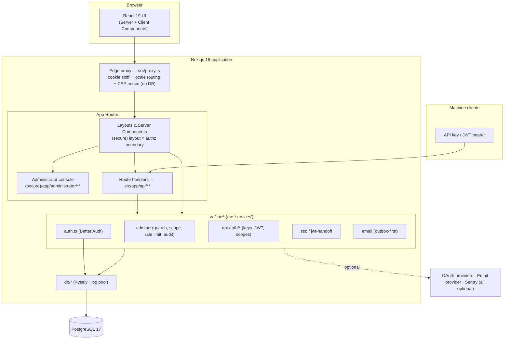
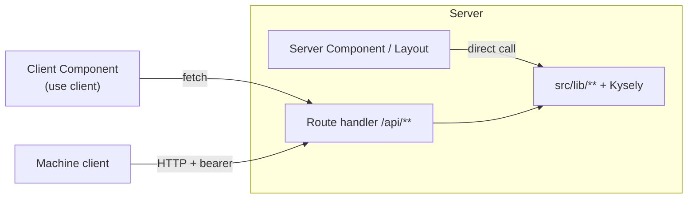
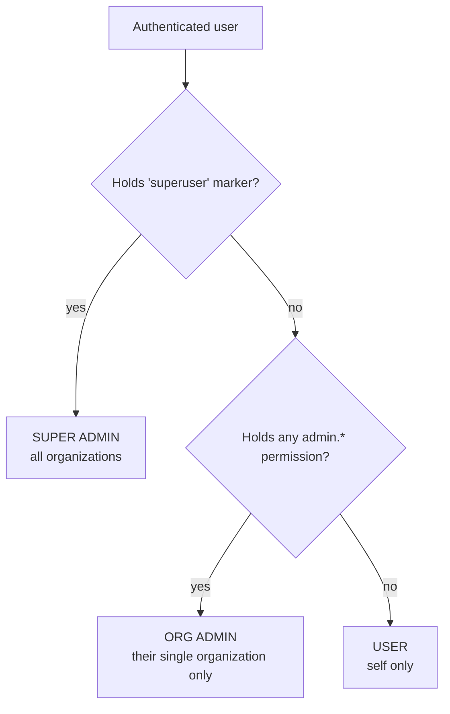
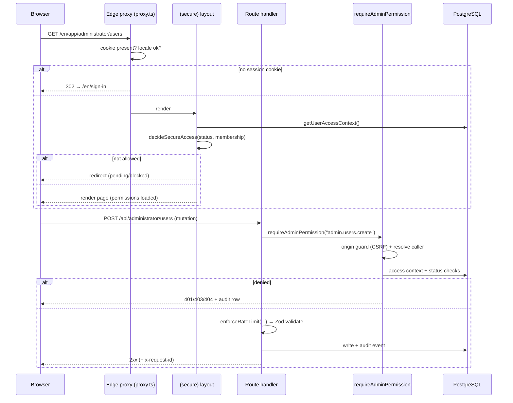
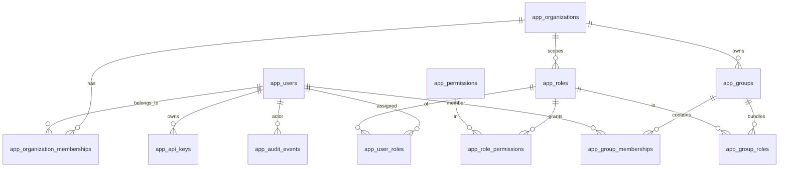

# Architecture

_Audience: developers and technical leads. How the system is structured, where the boundaries are, and how a request flows through it._

---

## 1. Overview

DevResponseKit is a **single Next.js 16 application** (App Router) backed by **PostgreSQL**. It is not a microservice mesh — it is a modular monolith where the "services" are libraries under `src/lib/**` and the HTTP surface is a set of route handlers under `src/app/api/**`. Authentication is provided by **Better Auth**, which shares the same Postgres connection pool as the application.



## 2. Major modules

| Area | Location | Responsibility |
| --- | --- | --- |
| **Routing & pages** | `src/app/[locale]/**` | Localized UI: `(public)`, `(auth)`, `(secure)` route groups + the administrator console. Plus `src/app/(root)/**` for locale-independent entry. |
| **HTTP API** | `src/app/api/**` | Route handlers: Better Auth catch-all, account self-service, navigation, SSO handoff, docs assets, the versioned `/api/v1` machine API, and the `/api/mcp` agent gateway. |
| **Edge proxy** | `src/proxy.ts` | Cheap pre-render redirect + locale routing + per-request CSP-nonce minting (threaded into request/response headers). **Not** the authorization boundary; reads no database. |
| **Authentication** | `src/lib/auth.ts` | Better Auth configuration (providers, plugins, session hooks). |
| **Access context** | `src/lib/auth-status.ts` | `getUserAccessContext()` resolves a user's effective permissions; `decideSecureAccess()` is the pure allow/deny decision. |
| **Authorization primitives** | `src/lib/admin/access-scope.server.ts` | `isSuperadmin`, `resolveOrgScope`, `canAccessOrg`, `canAccessUser` — the single source of truth for tenant boundaries. |
| **Admin guards & helpers** | `src/lib/admin/**` | `requireAdminPermission`, list-query parsing, error envelopes, rate limiting, audit helpers, request-id correlation. |
| **Machine API auth** | `src/lib/api-auth/**` | API-key and JWT issuance/verification, scope catalog and grantability, caller resolution. |
| **SSO handoff** | `src/lib/sso*` / `src/lib/jwt-handoff.server.ts` | One-time signed token issue/verify for cross-subdomain SSO. |
| **Email** | `src/lib/email/**` (outbox-first) | Render → record in outbox → optionally deliver via Resend/Mailgun. |
| **Data layer** | `src/db/**` | Kysely instance + `pg` pool, schema types, migrations, seeds, reset tooling. |
| **i18n** | `src/i18n/**`, `src/messages/*.json` | next-intl request config and translations for `en`/`fr`/`es`/`uk`/`pt`/`zh`/`hi`/`ja`. |
| **UI primitives** | `src/components/**` | shadcn/ui components, the application shell, data grid, navigation. |

> See the [Data Layer section](#5-data-model) and [Developer Onboarding → Project structure](./developer-onboarding.md#5-project-structure) for a directory-level walkthrough.

## 3. Frontend / backend boundaries

This is a **server-first** application:

- **Server Components are the default.** They run on the server, can query the database directly, and never ship their code to the browser.
- **Client Components opt in** with `"use client"` and are used only at interaction boundaries (forms, grids, switchers).
- **Route handlers** (`src/app/api/**`) are the explicit HTTP boundary used by client components, machine clients, and external integrations.

Two consequences worth internalizing:

1. A page component can call `getUserAccessContext()` and query Kysely directly — there is no internal HTTP hop for first-party reads.
2. Mutations and any machine-facing reads go through `/api/**` route handlers, which apply the guards described below.



## 4. Authentication & authorization

### Authentication (Better Auth)

`src/lib/auth.ts` configures Better Auth:

- **Email + password** (always on) and **Google / Microsoft / GitHub OAuth** (each enabled only when its client id *and* secret are present).
- **Plugins:** the built-in `admin` plugin (ban / impersonate / session management), a server-only `ssoSession` plugin (subdomain SSO), a `user-name-guard` plugin (`src/lib/auth-user-name.ts`, F-21) that refuses a name with control, line-break or invisible formatting characters, or over 200 characters, on sign-up and `/update-user` with 400 `INVALID_NAME` (the `user.create.before` / `user.update.before` database hooks bound every other writer, OAuth profiles included), a `response-floor` plugin (`src/lib/auth-response-floor.ts`, F-20) that holds HTTP responses on sign-up, the password-reset request and resend-verification to at least 500 ms so response time does not reveal which addresses have accounts (a rate-limited 429 and a 400 `INVALID_NAME` come back at once; neither depends on the address), and `nextCookies` (must be last).
- **Admin plugin surface:** the plugin's raw HTTP endpoints (`/api/auth/admin/*`) are closed — a global `hooks.before` middleware (`src/lib/auth-admin-surface.ts`) returns 404 for any `/admin/*` request carrying `ctx.request`. The app reaches the plugin only through server-side `auth.api.*` calls (headers, never `request`) made by the guarded `/api/administrator/users/[id]/*` routes, so app RBAC, org scoping, the impersonation escalation guard, rate limits and audit always apply. The same middleware confines an **impersonated** session to `/get-session` and `/sign-out`: every other mounted Better Auth endpoint answers 403, audited against the impersonator (IMP-3, deny-by-default since F-06), which the app's `/api/account/*` guard could not do because they are not app routes. Vendor endpoints the app never calls over HTTP (provider-token readers such as `/get-access-token`, account linking, `/verify-password`, raw `/update-user` / `/update-session`, …) are passed as `disabledPaths` and answer 404 for everyone, before the session is checked and so without an audit row; a security test classifies every endpoint the real instance mounts, so a Better Auth upgrade cannot add one silently. See [Administrator console §8.1](./admin-manager.md#81-users).
- **Sessions:** rolling ~8-hour sessions refreshed on activity. Trusted origins come from `NEXT_PUBLIC_APP_URL`, `BETTER_AUTH_URL`, and `ADMIN_TRUSTED_ORIGINS`.
- **Provisioning hook:** on sign-up (email/password) or first login (OAuth), an `app_users` row is provisioned and linked to the Better Auth user via `better_auth_user_id`. The hooks resolve the target organization's runtime sign-up policy (0007) to decide the initial status and whether email verification is required — the `user.create.before` hook (verification) and `user.create.after` provisioning (placement, activation) resolve that organization with one shared precedence (scoped-sign-in hint → provider metadata → email-domain routing → `default`), so a waiver can only come from the org the account lands in. A policy-waived verification is stamped with a distinct server-only user field (`emailVerificationWaived`) that domain auto-approval never accepts as proof. A live invitation (0008) activates the account in the inviting org. See [Sign-up Policy](./auth-signup-policy.md).

Better Auth uses the **same `pg` pool** as the app (`src/db/database.ts`) — there is no separate ORM.

### Authorization: the three-tier model

Authorization is an **application-layer** concern layered on top of authentication (the three-tier decision **ADR-0001**, documented in full under [Access-control design decisions](#access-control-design-decisions) below).



The boundary is enforced by four primitives in `src/lib/admin/access-scope.server.ts`, which are the **only** place tenant scope is decided:

| Primitive | Returns | Meaning |
| --- | --- | --- |
| `isSuperadmin(access)` | boolean | Holds the `superuser` marker → bypasses org scoping. |
| `resolveOrgScope(access)` | `{kind:"all"}` \| `{kind:"org", organizationId}` \| `null` | The caller's tenant scope. |
| `canAccessOrg(access, orgId)` | boolean | Whether the caller may touch a given organization. |
| `canAccessUser(access, appUserId)` | Promise\<boolean\> | Whether the caller may touch a given user (membership-based). |

**Design rule:** an out-of-scope resource returns **404, not 403**, so existence is never leaked across tenants.

**Permission resolution** happens in `getUserAccessContext()` (`src/lib/auth-status.ts`): a user's effective permissions for the **active organization** are the **union of directly assigned roles and roles conferred through groups** (ADR-0002), expanded with the full Super Admin set if the `superuser` marker is present in any active membership. The result is memoized per request.

**Only an `active` organization counts (F-09).** Every membership lookup in that resolver, and the helpers built on the same question (`userIsGlobalSuperuser`, the org switcher, the impersonation reach, the invitation lookup), joins `app_organizations` and requires `status = 'active'` (`ACTIVE_ORGANIZATION_STATUS`). A membership in a `pending`, `suspended` or `archived` org therefore resolves as no membership at all, and the secure shell, both admin and v1 guards, the token endpoint, bound API keys and OAuth clients, SSO launch and invitations all inherit that from the one resolver. A `superuser` grant held only in such an org confers nothing. The rank guards are the deliberate exception (`userHoldsSuperuserGrant`, read by `targetOutranksActor` and by the on-behalf credential bound `ownerOutranksActor`), because the grant returns on reactivation. Superadmins can still open and reactivate a non-active org, and suspending the tenant that holds the platform's last superuser grant is refused (REVOKE-2). See [Administrator console §8.2](./admin-manager.md#82-organizations).

**Which membership a session acts in (F-33).** When a user has several memberships in active orgs, the resolver picks one with a single ranked query: an **active** membership first, then the org named by the `active_org` cookie, then the earliest (with the membership id as the tiebreak). Whenever the user has an active membership, the cookie can only choose among those. A membership that is suspended, blocked or pending in one org does not affect the user's access to their other orgs. A non-active membership is used only when the user has no active one, which is what sends them to the blocked or pending-approval screen. Bearer credentials are not re-ranked, so a key or token bound to an org fails closed there (MACHINE-1). See [Administrator console §8.3](./admin-manager.md#83-memberships).

### Request authorization flow



Two layers, two jobs:

1. **`src/proxy.ts`** — a cheap edge check that redirects unauthenticated users away from secure paths and handles locale routing. It does **not** read the database and is **not** the security boundary.
2. **Server guards** — the real boundary. `(secure)/layout.tsx` loads the access context and applies `decideSecureAccess`; admin route handlers call `requireAdminPermission(request, "admin.x.y")`, which additionally runs an **origin (CSRF) guard**, resolves the caller (cookie session or bearer credential), checks status and permission/scope, and writes an audit row on a permission denial. An origin refusal comes before the caller is known, so it is logged and counted rather than audited (F-15 — see [Admin Manager §12](./admin-manager.md#12-audit-model)).

### Rate limiting

Two stores, chosen by who controls the fan-out. **Pre-auth floors** — where an unauthenticated caller chooses how many instances it hits — consume from a **Postgres-backed bucket** (`src/lib/admin/rate-limit-shared.server.ts`, table `app_rate_limits`, migration `0006`; review #98): the token endpoint's per-IP bucket and global floor, MCP registration's per-IP bucket and global floor, the CSP report sink's per-IP bucket and global floor, the SSO consume endpoint's and a signed-out SSO launch's per-IP bucket (F-19; no global floor, see below), and invitation acceptance (per user). Refill-and-consume is one atomic `INSERT … ON CONFLICT DO UPDATE … WHERE … RETURNING`, so N concurrent consumers of one key across any number of instances get exactly the budgeted number of allows. The three routes that pair a per-IP bucket with a global floor take both through `consumeSourceThenGlobal` (`src/lib/admin/rate-limit-tiered.server.ts`), which charges the floor only for a request the per-IP bucket admitted: taken first, the floor let one IP whose own requests were refused hold it at zero for every client (F-18). A backend error falls back to the in-process bucket for a 30 s cool-down with a structured warning and a `devresponsekit_rate_limit_shared_fallbacks_total{scope}` increment. An invariant test (`tests/unit/rate-limit-shared-floors-invariant.test.ts`) walks every limiter call under `src/` and fails on an in-memory bucket keyed on the client IP, so no IP-keyed floor can quietly move back into memory, whichever route it is in; it used to check a named list of routes, which is how the two SSO per-IP buckets stayed in memory unnoticed (F-19). Better Auth's own sign-in / password-reset limiter is likewise database-backed (`rateLimit: { storage: "database" }`, review #199).

The SSO handoff's pre-auth budgets (`src/lib/admin/rate-limit.server.ts`):

| Budget | Capacity | Refill | Applies to |
| --- | --- | --- | --- |
| `DEFAULT_SSO_CONSUME_LIMIT` | 30 | 1 / sec | `GET`/`POST /api/sso/consume`, per trusted client IP |
| `DEFAULT_SSO_LAUNCH_LIMIT` (signed out) | 30 | 1 / sec | `GET /api/sso/launch` with no session, per trusted client IP |

The token endpoint, MCP registration and the CSP sink keep their budgets next to their handlers ([design §10.2](./design-api-keys-and-tokens.md#102-rate-limiting) has the token endpoint's). The SSO pair deliberately has no deployment-wide floor. It would answer `429` before the handoff token is verified, so it would refuse genuine handoffs exactly like garbage ones, and a few dozen sources each sending at the per-IP rate could hold it at zero and lock every user out of SSO on every satellite. The work it would bound is cheap since F-15: a garbage token costs one signature check and one `pre_auth_refusal` log line, and a signed-out launch only a redirect. The token endpoint keeps its floor because its pre-auth work is a credential lookup and a hash verify.

**Authenticated per-actor limits** pass through an in-memory **per-actor token bucket** (`src/lib/admin/rate-limit.server.ts`) — the actor already holds a credential, so the fan-out is bounded:

| Budget | Capacity | Refill | Applies to |
| --- | --- | --- | --- |
| `DEFAULT_ADMIN_MUTATION_LIMIT` | 30 | 1 / sec | Standard `POST`/`PATCH`/`DELETE` |
| `DEFAULT_ADMIN_BULK_LIMIT` | 6 | 0.2 / sec | Bulk operations |
| `DEFAULT_ADMIN_EXPORT_LIMIT` | 3 | 0.05 / sec | CSV export |
| `DEFAULT_SSO_LAUNCH_LIMIT` (signed in) | 30 | 1 / sec | `GET /api/sso/launch` with a session, per session user id |

This per-actor store is in-process (resets on restart, per instance under horizontal scaling) — see [Deployment §5](./deployment.md#5-operations--gotchas) for the topology statement.

### Single Sign-On handoff

Cross-subdomain SSO uses a **one-time, short-lived signed token**, not a shared cookie:

```mermaid
sequenceDiagram
    participant U as User (signed in to hub)
    participant Hub as Hub /api/sso/launch
    participant DB as PostgreSQL (nonces)
    participant Sat as Satellite /api/sso/consume

    U->>Hub: GET /api/sso/launch?applicationId=app
    Hub->>Hub: validate app id shape, rate-limit per principal
    Hub->>Hub: verify session (refuse impersonated) + membership + app access
    Hub->>DB: write one-time nonce (jti, target app id)
    Hub->>Hub: sign JWT (EdDSA + kid, ≤60s, aud=app, targetApplicationId=app)
    Hub-->>U: 302 → satellite /api/sso/consume?token=…
    U->>Sat: GET /api/sso/consume?token=… (rate-limited per IP)
    Sat->>Hub: GET /api/sso/jwks.json (public keys, cached; skipped when self-issuing)
    Sat->>Sat: verify EdDSA signature (by kid), issuer, audience,<br/>expiry + maxTokenAge 60s, targetApplicationId == SSO_HANDOFF_APPLICATION_ID
    Sat->>DB: atomically burn nonce (jti + target app id)
    Sat->>Sat: establish satellite session (ssoSession plugin)
    Sat-->>U: 302 → /app/dashboard (token stripped from URL)
```

The handoff JWT is **asymmetric (EdDSA / Ed25519)**: the hub signs with `SSO_HANDOFF_PRIVATE_KEY` and publishes the public half at `/api/sso/jwks.json`; a satellite verifies against that document and holds **no signing material**, so a compromised satellite cannot mint tokens for its siblings (review #5). The key is **independent** from `BETTER_AUTH_SECRET` and from the machine-API key `API_JWT_PRIVATE_KEY`. The token's claims are minimal (`sub`, `email`, `locale`, `targetApplicationId`, `jti`) because it rides in a query string; a satellite resolves membership, roles and permissions from its own store. Destination origins must fall under the configured allow-list. See [Configuration](./configuration.md#single-sign-on-handoff).

Three guards sit around the diagram above:

- **No launch while impersonating.** An impersonated hub session is refused at launch (`403 forbidden_while_impersonating`). The satellite session would carry no `impersonatedBy`, outlive the impersonation cap, escape the tenant confinement that keeps the impersonation escalation guard sound, and be attributed to the target rather than the admin.
- **Application-id binding.** `sso_audience` is an admin-typed column; the consumer therefore also requires the token's `targetApplicationId` to equal its own `SSO_HANDOFF_APPLICATION_ID` and burns the nonce only where `target_application_id` matches. The catalog rejects a duplicate audience at registration (`409 audience_taken`); a UNIQUE index is scheduled for a later core migration.
- **Rate limits.** Both endpoints are throttled before any audit row is written — launch per principal, consume per trusted client IP (see [Rate limiting](#rate-limiting)). Consume and a signed-out launch are pre-auth, so their per-IP buckets are shared by every instance, with no deployment-wide floor behind them (F-19); a signed-in launch is limited per user in-process. Below the limit, nothing refused before verification is audited either (F-15): a signed-out launch, and a consume with no token, a token that fails verification or a cross-site confirm POST, are logged (`kind: "pre_auth_refusal"`) and counted, so an anonymous loop cannot grow the append-only table. A token that verified and is refused afterwards (another application's, already used, or no session could be opened) is still audited.

### Machine API authentication

`/api/v1/**` accepts two bearer credential types, resolved by `src/lib/api-auth/resolve-caller.server.ts`:

| Credential | Format | Notes |
| --- | --- | --- |
| **API key** | `drk_<env>_<random>` | SHA-256 hashed at rest; plaintext shown once. Enabled by `API_KEYS_ENABLED`. |
| **JWT access token** | Standard JWT (EdDSA / Ed25519) | Minted at `/api/v1/auth/token`; public key at `/api/v1/jwks.json`. Enabled by `API_JWT_ENABLED`. |

A credential's authority is the **intersection of its scopes and its owner's permissions** — a credential can never grant more than the person who created it (`src/lib/api-auth/scopes.ts`). Both paths are **off by default**.

### Access-control design decisions

Two load-bearing decisions are referenced throughout the code as **ADR-0001** (three-tier access control) and **ADR-0002** (organization groups). This section is their canonical home — the standalone ADR files have been retired into it.

#### ADR-0001 — three tiers, one boundary module

The `superuser` permission is a **marker**, not a capability: it was seeded but never checked until this decision made it **load-bearing** as the _sole_ explicit bypass of org scoping. The tier is derived from the marker's presence, so existing seed data keeps working:

| Seed role | Tier | Identified by |
| --- | --- | --- |
| `superuser` | SUPERADMIN | holds the `superuser` marker → all orgs |
| `admin.platform` | ORG ADMIN | full `admin.*`, no marker → its one org |
| `admin` | ORG ADMIN (limited) | a subset of `admin.*` |
| `member` | USER | `shell.view` only |

Every tenant-scoped resource is filtered by the column that carries its tenant — API keys, OAuth clients, audit events, and memberships by `organization_id`; users by membership in the org. **Creating, renaming, or deleting an organization** (the tenant entity itself) is SUPERADMIN-only — an org admin manages the _contents_ of their org, not the org record. Three rules keep the boundary airtight:

- An org admin **creating** a tenant resource has its `organization_id` **forced** to their org.
- `[id]` mutations **re-fetch the row, run `canAccessOrg`, and 404 on miss _before_ mutating** — so an out-of-scope write is indistinguishable from a missing row and is never audited as a real action.
- An org admin with **no active membership** resolves to `null` scope and is **denied** — provisioning order matters. A membership in an organization whose own status is not `active` does not count either (F-09).

#### ADR-0002 — groups bundle roles, never permissions

A group is a first-class, **always org-scoped** cohort (`app_groups`, `organization_id NOT NULL` — there are no global groups) that collects users and bundles roles. A user's effective roles for the active org are the **union of direct (`app_user_roles`) and group-conferred (`app_group_memberships → app_group_roles`) roles**, resolved in one query in `getUserAccessContext`; permissions then expand from those roles exactly as before:

```sql
-- effective role ids = direct ∪ via-groups, both scoped to the ACTIVE org
select role_id from app_user_roles
 where app_user_id = :userId and organization_id = :activeOrgId
union
select gr.role_id from app_group_memberships gm
  join app_groups g on g.id = gm.group_id
  join app_group_roles gr on gr.group_id = g.id
 where gm.app_user_id = :userId and g.organization_id = :activeOrgId;
```

The org filter on **both** branches is what keeps groups inside the ADR-0001 boundary. Two invariants make groups add **zero new authority**:

- **Roles only, never permissions.** Groups reference `app_roles`, never `app_permissions` — the blast radius is "a different way to assign existing roles," not a new authority primitive.
- **Privilege-escalation guard.** A group may bundle only roles its own org owns, and bundling a `superuser`-granting role is SUPERADMIN-only — identical to direct role assignment, so a group can never be a backdoor to broader authority than its manager holds.

(Rejected alternatives: _roles-as-groups_ can't answer "who is in Marketing?" or re-point a cohort; _groups-grant-permissions-directly_ would duplicate the role→permission machinery and add a second authority primitive to secure; _nested groups_ are deferred — they'd need cycle detection.)

## 5. Data model

PostgreSQL accessed through **Kysely** with a shared `pg` pool (`src/db/database.ts`). The schema is provisioned by a **frozen baseline plus append-only migrations**: `src/db/migrations/0001-initial-schema.sql` is the complete, idempotent baseline (FROZEN — `CREATE … IF NOT EXISTS`, so re-running it never alters a provisioned database); further schema changes are added as new numbered `NNNN-*.sql` files — today that is `0002-admin-groups-permissions.sql`, `0003-outbox-delivery-payload.sql`, `0004-oauth-client-secret-rotated-at.sql`, `0005-integrity-constraints.sql` and `0006-rate-limit-buckets.sql`, and the next core migration is `0007`. A lightweight runner (`src/db/migrations/run-migrations.ts`) records applied filenames — with a sha256 checksum of each file's comment-stripped, whitespace-normalised content, verified on every run — in an `app_schema_migrations` ledger and applies each not-yet-recorded file, in lexical order, inside its own transaction, holding a session advisory lock for the whole run so concurrent runners serialise. It runs in two passes: the **core** top-level files, then the **email-template `locales/`** pass — one file per locale, of which the English base `locales/0000-email-templates-en.sql` is ALWAYS applied while the localized files are excludable via `DB_MIGRATE_LOCALES`. (Better Auth's own `better-auth*` files are owned by its tooling and skipped by this runner.) TypeScript types live in `src/db/schema/app-schema.ts`. See [Deployment](./deployment.md).

**Writing a migration** (the rules the tooling enforces):

- **Never edit an applied file.** `0001`–`0006` are checksum-pinned in the ledger and in `tests/unit/migration-checksums.test.ts`; a change is a new `NNNN-*.sql`.
- **Scope every system-catalog lookup to this schema.** Several installs can share one database (`DB_SCHEMA`), so `where rel.relname = '<table>'` can match a namesake in a sibling schema. Use `conrelid = '<table>'::regclass` (as `0005` does), a `pg_namespace`/`nspname` join, or `table_schema = current_schema()` — all of which resolve through the runner's pinned `search_path`. `tests/unit/migration-catalog-scoping.test.ts` fails a file that does not (review #88; the one legacy site in the frozen `0001` is a documented exception, unfixable without editing a production-applied file).
- **Stay idempotent** (`IF NOT EXISTS`, `if not exists (select 1 from pg_constraint …)`) — the runner ledgers each file once, but a partially-migrated environment must be re-runnable.
- **Each file gets one transaction on one connection** (`src/db/migrations/apply-migration.ts`): the file's SQL and its ledger row commit together, and a failure rolls both back (review #84, proven in `tests/db/migration-transaction.db.test.ts`).

**Schema:** every table — the `app_*` tables **and** the Better Auth vendor tables — is deployed into one schema, **`auth`** by default, configurable via `DB_SCHEMA` (`src/db/schema-config.ts`). The schema is applied at the **connection level** via `search_path=<DB_SCHEMA>,public`, so all (unqualified) Kysely queries resolve to it with no per-query qualification; the shared extensions (`pgcrypto`, `pg_trgm`) stay in `public`. Setting a different `DB_SCHEMA` per deployment keeps their tables apart with no code changes. That is a naming boundary, not a security one: `search_path` grants and revokes nothing, so isolating deployments from each other takes a Postgres role per deployment with no privileges on the others' schemas; a separate database reached as the same role is no boundary either, since roles are cluster-wide ([Satellite Apps §1.1](./integration-satellite-apps.md#11-when-a-or-b-is-actually-contained)). See [Configuration → `DB_SCHEMA`](./configuration.md#database-postgresql).



| Domain | Tables |
| --- | --- |
| Identity & org | `app_users`, `app_organizations`, `app_organization_memberships`, `app_provider_organizations` |
| Sign-up policy & invitations | `app_organization_auth_settings` (0007), `app_organization_invitations` (0008) |
| RBAC | `app_roles`, `app_permissions`, `app_role_permissions`, `app_user_roles` |
| Groups (ADR-0002) | `app_groups`, `app_group_roles`, `app_group_memberships` |
| SSO / enterprise apps | `app_enterprise_applications`, `app_sso_handoff_nonces` |
| Machine credentials | `app_api_keys`, `app_oauth_clients`, `app_revoked_tokens` |
| Messaging & audit | `app_email_templates`, `app_outbox`, `app_audit_events` |
| Localization | `app_user_locale_preferences` |
| Shared rate-limit buckets (0006) | `app_rate_limits` — the pre-auth floors' token buckets, one row per key; Better Auth's sign-in limiter uses its own `rateLimit` table |
| Migration bookkeeping | `app_schema_migrations` |
| Better Auth (vendor-owned) | `user`, `session`, `account`, `verification` |

The application tables link to Better Auth's `user` table logically via `app_users.better_auth_user_id` (no hard FK across the boundary).

## 6. State management

- **Server state** is the database, read directly in Server Components or via route handlers. There is no global client data store for server data.
- **Client UI state** uses **Zustand** for small cross-component concerns and **React Hook Form + Zod** for forms. Most interactivity is local component state.
- **Active organization** is persisted via a cookie and read server-side so permission resolution reflects the chosen tenant.

## 7. Important design patterns

| Pattern | Where | Why |
| --- | --- | --- |
| **Single source of truth for scope** | `access-scope.server.ts` | One place decides tenant boundaries; enforced by a CI invariant test (`tests/unit/admin-route-scope-invariant.test.ts`) that fails the build if an admin route doesn't reference a scope primitive. |
| **Permissions as data** | `src/lib/admin/permissions.ts` | The catalog is defined once and shared by seed and runtime, so it cannot drift. |
| **404-not-403** | `canAccessOrg` / handlers | Out-of-scope resources are indistinguishable from non-existent ones. |
| **Outbox-first email** | `src/lib/email/**` | Every message is recorded before delivery; delivery failures never break the calling flow. |
| **Request correlation** | `request-id.server.ts` + audit + Sentry | One `x-request-id` ties a response, its audit rows, and any error event together. |
| **Uniform list envelope** | `list-query.server.ts` | Admin/v1 list endpoints share pagination, sorting, filtering, and response shape. |
| **Guard-returns-response** | `requireAdminPermission`, `requireAccountUser` | Guards return either a typed grant or a ready-to-send `NextResponse`, keeping handlers linear. |
| **Frozen baseline + append-only migrations** | `0001-initial-schema.sql` + numbered `NNNN-*.sql` (today: `0002`, `0003`, `0004`, `0005`, `0006`) via `run-migrations.ts` | Idempotent baseline is frozen and safe to re-run; further changes are append-only numbered files applied once each and tracked (id + normalised sha256 checksum) in the `app_schema_migrations` ledger under an advisory lock. Email templates live in `locales/` (en base always applied). |

---

_Next: [Developer Onboarding](./developer-onboarding.md) to get the project running and start contributing._
