# Database Schema

This is the entity-relationship reference for the application database. It is
derived from the single source of truth —
[`src/db/migrations/0001-initial-schema.sql`](../src/db/migrations/0001-initial-schema.sql) —
which provisions **every** `app_*` table, index, and baseline row in one
idempotent setup script (see [Get Started](get-started.md) and
[Better Auth setup](setup-better-auth.md) for how it is applied).

Two tables are the hubs almost everything hangs off:

- **`app_users`** — the application-side user profile.
- **`app_organizations`** — the tenant/organization boundary.

The **Better Auth** tables (`user`, `session`, `account`, `verification`) are
owned and migrated by Better Auth's own tooling, never hand-rolled here. The
application links to them logically through `app_users.better_auth_user_id`
(unique, 1:1) — there is no database foreign key across that boundary.

> **Rendering note:** GitHub renders the Mermaid diagram below natively, and
> the in-app documentation viewer also renders it (the render pipeline
> converts ```mermaid``` blocks to a client-mounted diagram, with the source
> shown as a fallback if its JS never runs). The per-domain tables that
> follow describe the same relationships in prose.

## Entity-relationship diagram

```mermaid
erDiagram
  %% ---- Identity & Org ----
  app_organizations ||--o{ app_organization_memberships : "has member"
  app_users         ||--o{ app_organization_memberships : "belongs to"
  app_organizations ||--o{ app_provider_organizations  : "maps provider org"

  %% ---- RBAC ----
  app_organizations |o--o{ app_roles            : "scopes (nullable)"
  app_roles         ||--o{ app_role_permissions : "grants"
  app_permissions   ||--o{ app_role_permissions : "granted via"
  app_users         ||--o{ app_user_roles       : "holds"
  app_organizations ||--o{ app_user_roles       : "within org"
  app_roles         ||--o{ app_user_roles       : "of role"

  %% ---- SSO & Applications ----
  app_organizations         |o--o{ app_enterprise_applications : "scopes (nullable)"
  app_users                 ||--o{ app_sso_handoff_nonces      : "initiates"
  app_enterprise_applications ||--o{ app_sso_handoff_nonces    : "targets"

  %% ---- Machine API credentials ----
  app_users         ||--o{ app_api_keys      : "owns"
  app_organizations |o--o{ app_api_keys      : "scopes (nullable)"
  app_users         |o--o{ app_api_keys      : "created / revoked by"
  app_users         ||--o{ app_oauth_clients : "service identity"
  app_organizations |o--o{ app_oauth_clients : "scopes (nullable)"
  app_users         |o--o{ app_oauth_clients : "created / revoked by"

  %% ---- Messaging & Ops ----
  app_users         ||--o| app_user_locale_preferences : "has prefs"
  app_users         |o--o{ app_audit_events            : "actor (nullable)"
  app_organizations |o--o{ app_audit_events            : "in org (nullable)"
  app_organizations |o--o{ app_outbox                  : "owns mail (nullable)"

  %% ---- Better Auth (vendor-owned, logical link) ----
  better_auth_user ||--|| app_users : "better_auth_user_id (logical)"

  app_organizations {
    uuid id PK
    text slug UK
    text name
    text status
    boolean is_default
    timestamptz created_at
    timestamptz updated_at
  }

  app_users {
    uuid id PK
    text better_auth_user_id UK "links to Better Auth user"
    text primary_email
    text display_name
    text status "pending_approval | active | blocked | suspended | deactivated"
    text status_reason
    text preferred_locale
    timestamptz deactivated_at
    text deactivated_by
    text deactivated_reason
    timestamptz created_at
    timestamptz updated_at
  }

  app_organization_memberships {
    uuid id PK
    uuid organization_id FK
    uuid app_user_id FK
    text status
    text source_provider
    text provider_organization_key
    text pre_deactivation_status
    timestamptz created_at
    timestamptz updated_at
  }

  app_provider_organizations {
    uuid id PK
    uuid organization_id FK
    text provider
    text provider_organization_key
    text display_name
    timestamptz created_at
  }

  app_roles {
    uuid id PK
    uuid organization_id FK "nullable = global role"
    text key
    text name
    text description
    timestamptz created_at
  }

  app_permissions {
    uuid id PK
    text key UK
    text description
  }

  app_role_permissions {
    uuid role_id PK,FK
    uuid permission_id PK,FK
  }

  app_user_roles {
    uuid app_user_id PK,FK
    uuid organization_id PK,FK
    uuid role_id PK,FK
    timestamptz created_at
  }

  app_enterprise_applications {
    text id PK
    uuid organization_id FK "nullable"
    text label
    text description
    text origin
    text subdomain
    text sso_audience
    text status
    int sort_order
    timestamptz created_at
  }

  app_sso_handoff_nonces {
    text jti PK
    uuid app_user_id FK
    text target_application_id FK
    timestamptz expires_at
    timestamptz consumed_at
    timestamptz created_at
  }

  app_api_keys {
    uuid id PK
    uuid app_user_id FK
    uuid organization_id FK "nullable"
    text name
    text key_prefix
    text key_hash UK "SHA-256; plaintext never stored"
    text_array scopes
    text status "active | revoked"
    timestamptz expires_at
    timestamptz last_used_at
    inet last_used_ip
    uuid created_by FK
    timestamptz created_at
    timestamptz revoked_at
    uuid revoked_by FK
    text revoked_reason
  }

  app_oauth_clients {
    uuid id PK
    text client_id UK
    text client_secret_hash
    uuid app_user_id FK "service user"
    uuid organization_id FK "nullable"
    text name
    text_array scopes
    text status "active | revoked"
    timestamptz created_at
    uuid created_by FK
    timestamptz revoked_at
    uuid revoked_by FK
  }

  app_revoked_tokens {
    text jti PK
    timestamptz expires_at
    timestamptz revoked_at
    text reason
  }

  app_audit_events {
    uuid id PK
    text event_type
    text outcome
    text actor_better_auth_user_id
    uuid app_user_id FK "nullable"
    uuid organization_id FK "nullable"
    text target_application_id
    text provider
    text email
    inet ip_address
    text user_agent
    text reason
    text request_id
    jsonb metadata
    timestamptz created_at
  }

  app_user_locale_preferences {
    uuid app_user_id PK,FK
    text locale
    text time_zone
    text date_format
    text number_format_locale
    timestamptz created_at
    timestamptz updated_at
  }

  app_email_templates {
    uuid id PK
    text key
    text locale
    text subject
    text body_html
    text body_text
    text description
    timestamptz created_at
    timestamptz updated_at
  }

  app_outbox {
    uuid id PK
    uuid organization_id FK "nullable = platform/system mail"
    text template_key
    text to_email
    text from_email
    text subject
    text body_html
    text body_text
    jsonb variables
    text status "pending | sent | failed | logged"
    text provider
    text provider_message_id
    text error
    text related_better_auth_user_id
    timestamptz created_at
    timestamptz sent_at
  }

  better_auth_user {
    text id PK
    text email
    text name
    text role
  }
```



## Domain breakdown

### Identity &amp; Organizations

| Table | Purpose | Key relationships |
| --- | --- | --- |
| `app_organizations` | Tenant boundary. Holds `slug` (unique), `status`, and `is_default`. | Parent of nearly every other table. |
| `app_users` | Application-side user profile. Links to Better Auth via `better_auth_user_id` (unique). Soft-delete bookkeeping in the `deactivated_*` columns. | Parent of memberships, roles, sessions handoffs, credentials, audit. |
| `app_organization_memberships` | A user's membership in an organization. `pre_deactivation_status` snapshots state for the soft-delete restore flow. Unique on `(organization_id, app_user_id)`. | → `app_organizations`, → `app_users`. |
| `app_provider_organizations` | Maps an external identity-provider org to a local organization. Unique on `(provider, provider_organization_key)`. | → `app_organizations`. |

### RBAC (roles &amp; permissions)

| Table | Purpose | Key relationships |
| --- | --- | --- |
| `app_roles` | Named role, optionally scoped to an organization (`organization_id` nullable ⇒ a global role). Unique on `(organization_id, key)`. | → `app_organizations`. |
| `app_permissions` | The permission catalog (`key` unique). The `admin.*` keys must stay in sync with `ADMIN_PERMISSION_CATALOG` in `src/lib/admin/permissions.ts` (30 keys + `superuser`, all seeded by `0001`). `pnpm db:seed` adds the two user-level keys `shell.view` and `audit.view`. | — |
| `app_role_permissions` | Junction: which permissions a role grants. Composite PK `(role_id, permission_id)`. | → `app_roles`, → `app_permissions`. |
| `app_user_roles` | Junction: which roles a user holds in which org. Composite PK `(app_user_id, organization_id, role_id)`. | → `app_users`, → `app_organizations`, → `app_roles`. |

### SSO &amp; Applications

| Table | Purpose | Key relationships |
| --- | --- | --- |
| `app_enterprise_applications` | Catalog of downstream SSO apps (`origin`, `subdomain`, `sso_audience`, `status`). `id` is a text key; `organization_id` nullable ⇒ available to all orgs. | → `app_organizations`. |
| `app_sso_handoff_nonces` | Single-use nonces for the SSO handoff. `jti` PK, burned via `consumed_at`. | → `app_users`, → `app_enterprise_applications`. |

### Machine API credentials

Disabled by default at runtime (`API_KEYS_ENABLED` / `API_JWT_ENABLED`); the
tables exist regardless. See
[design-api-keys-and-tokens.md](design-api-keys-and-tokens.md).

| Table | Purpose | Key relationships |
| --- | --- | --- |
| `app_api_keys` | Machine API keys. Only a SHA-256 `key_hash` is stored (unique), never plaintext. A key borrows its owner's authority (`app_user_id`) intersected with `scopes`. | → `app_users` (owner, and `created_by` / `revoked_by`), → `app_organizations`. |
| `app_oauth_clients` | OAuth2 client-credentials principals. `app_user_id` points at a dedicated service user so the same status/membership gates apply. | → `app_users` (service + `created_by` / `revoked_by`), → `app_organizations`. |
| `app_revoked_tokens` | Revocation list for stateless JWTs killed before expiry. Purged once `expires_at` passes. No foreign keys. | — |

### Messaging &amp; Ops

| Table | Purpose | Key relationships |
| --- | --- | --- |
| `app_audit_events` | Structured audit log; `request_id` correlates to the `x-request-id` response header. Actor/org FKs are nullable so system events can be recorded. | → `app_users` (nullable), → `app_organizations` (nullable). |
| `app_user_locale_preferences` | Per-user locale/formatting preferences. `app_user_id` is both PK and FK (1:1 with `app_users`). | → `app_users`. |
| `app_email_templates` | Editable email templates keyed by `(key, locale)` (unique). Falls back to code defaults when a row is missing. No foreign keys. | — |
| `app_outbox` | Outbox-first email log; every send is recorded before any delivery attempt. With no provider configured rows stay `logged`. `organization_id` (nullable, `on delete set null`) is the owning tenant: org admins read their org's rows, while `null` (platform/system or multi-org-ambiguous mail) is SUPERADMIN-only. | → `app_organizations` (nullable). |

### Migration ledger

| Table | Purpose | Key relationships |
| --- | --- | --- |
| `app_schema_migrations` | Records each applied `*.sql` migration filename so the runner ([`run-migrations.ts`](../src/db/migrations/run-migrations.ts)) applies each at most once (currently just `0001-initial-schema.sql`). Created imperatively by the runner — it is not declared in `0001-initial-schema.sql` or `app-schema.ts`. | — |

## Notes

- **Nullable foreign keys** are drawn with a `|o` (zero-or-one) cardinality:
  `app_roles.organization_id`, `app_enterprise_applications.organization_id`,
  and the `organization_id` / actor columns on `app_audit_events`,
  `app_api_keys`, and `app_oauth_clients`.
- **Self-referential FKs** to `app_users` (`created_by`, `revoked_by` on
  `app_api_keys` and `app_oauth_clients`) are shown as separate "created /
  revoked by" relationships.
- **`text_array`** in the diagram denotes the Postgres `text[]` type
  (`scopes`); Mermaid does not parse bracketed type names.
- The Better Auth `session`, `account`, and `verification` tables also exist
  but carry no application foreign keys, so only `better_auth_user` is shown
  (as the logical anchor for `app_users.better_auth_user_id`).
