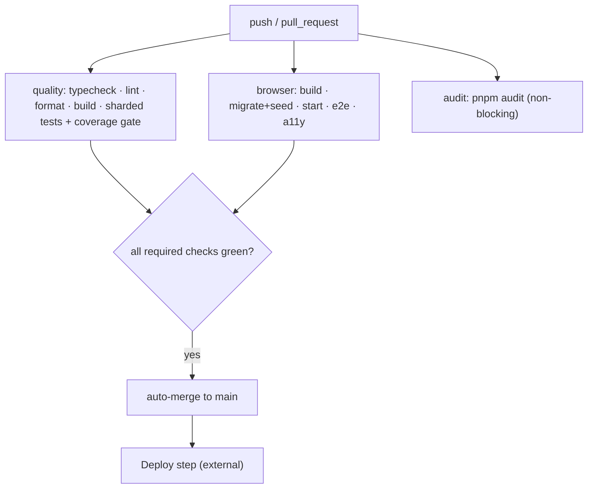

# Deployment

_Audience: DevOps and release engineers. How the app builds, what it produces, how it ships, and how to verify a release._

---

## 1. How the app is built

The app is a standard Next.js 16 build:

```bash
pnpm install --frozen-lockfile   # exact dependency pins
pnpm build                        # next build → .next/
pnpm start                        # next start (serves the built app)
```

Build characteristics (from `next.config.mjs` and `package.json`):

- **`output: "standalone"`** — the build also emits a self-contained server bundle (`.next/standalone`) used by the container image. `next start` against the conventional `.next/` output and serverless targets still work unchanged. See [docker.md](./docker.md).
- **next-intl plugin** wires localized routing from `src/i18n/request.ts`.
- **Sentry plugin is opt-in** — it only engages when `NEXT_PUBLIC_SENTRY_DSN` is set, and source-map *upload* additionally needs `SENTRY_AUTH_TOKEN` (+ `SENTRY_ORG`/`SENTRY_PROJECT`). Without a DSN the build is byte-for-byte unchanged.
- **Security headers** are emitted for every route by the `headers()` config.

## 2. Artifacts

| Artifact | Produced by | Notes |
| --- | --- | --- |
| `.next/` (incl. `.next/static/`) | `pnpm build` | The compiled application; served by `next start`. |
| `public/` | source | Static assets served as-is. |
| Coverage report | CI `quality` job | Uploaded as a CI artifact (7-day retention). |
| Playwright traces | CI `browser` job | Uploaded on failure (7-day retention). |

A production **`Dockerfile`** (multi-stage, non-root, built from the standalone output) and a **`.dockerignore`** are provided — build/run/deploy steps are documented in [docker.md](./docker.md). `docker-compose.yml` additionally defines **PostgreSQL** for local development.

## 3. Runtime requirements

| Requirement | Value | Source |
| --- | --- | --- |
| Node.js | 22.x | CI (`.github/workflows/ci.yml`); no `.nvmrc`/`engines` pin (`TODO:` add one) |
| pnpm | 10.33.2 | `package.json` → `packageManager` |
| PostgreSQL | 17 (extensions `pgcrypto`/`pg_trgm` in `public`) | `docker-compose.yml` / CI service image |
| DB schema | `auth` (default; `DB_SCHEMA`) — all tables; created by the migrate step | [Configuration](./configuration.md#database-postgresql) |
| Listens on | port 3000 (default `next start`) | Next.js default |
| Needs at runtime | `DATABASE_URL`, `BETTER_AUTH_SECRET`, `BETTER_AUTH_URL`, `NEXT_PUBLIC_APP_URL` (+ SSO vars if used) | [Configuration](./configuration.md) |

## 4. Hosting model

The repository **does not pin a hosting target**. Two models are consistent with the code:

| Model | Fit | Evidence / considerations |
| --- | --- | --- |
| **Serverless (e.g. Vercel)** | Natural for Next.js | `TRUSTED_PROXY_COUNT` defaults to 1 (a CDN/LB in front); `NEXT_PUBLIC_PRODUCTION_HOST` suggests a hosted origin. Use a **pooled** Postgres endpoint. |
| **Node server / container** | Self-hosted | Build the provided [`Dockerfile`](../Dockerfile) (standalone, non-root) and run it behind a TLS-terminating reverse proxy; run migrations as a separate init step. Full instructions in [docker.md](./docker.md). |

**Connection pool sizing (`PGPOOL_MAX`).** The runtime pool holds up to
`PGPOOL_MAX` (default `10`) connections **per process**, so the database sees
`PGPOOL_MAX × (number of running instances)` connections at peak:

- **Serverless:** each warm function instance opens its own pool, so total
  connections scale with concurrency. Set a **low** `PGPOOL_MAX` (e.g. `2`–`5`)
  and point `DATABASE_URL` at a **pooled** endpoint (PgBouncer / your provider's
  pooler), or you can exhaust `max_connections` under load.
- **Node server / container:** size `PGPOOL_MAX` so
  `PGPOOL_MAX × instances` stays comfortably under the database's
  `max_connections`, leaving headroom for migrations and admin tools.

A stalled transaction can no longer pin a connection indefinitely: the pool
sets `idle_in_transaction_session_timeout` (default 30s, `PG_IDLE_IN_TX_TIMEOUT_MS`)
alongside the per-statement `statement_timeout`.

> `TODO:` Choose and document the production hosting target for your infrastructure. A container path is now provided (see below); the serverless path needs no extra packaging.

### Supported topology for 1.0: a single application instance

The abuse-mitigation **rate limiter** on admin mutations, bulk operations, and
CSV export is **in-process** (`src/lib/admin/rate-limit.server.ts`) — its budget
lives in the memory of one Node process. The **supported 1.0 deployment
topology is therefore a single application instance** (one long-running
container) behind your TLS-terminating proxy: in that topology the limit
enforces one global, cluster-wide budget exactly as designed.

Horizontal scaling still *runs* — nothing in the app requires a single instance
to serve traffic, and all durable state is already external (PostgreSQL holds
sessions, audit, outbox, and token revocations). But with more than one instance
(multiple containers, or a serverless host where each invocation is a separate
process) the rate limit degrades to **best-effort**: the budget is enforced per
instance, so it effectively multiplies by the instance count and resets on each
cold start. The limiter is an abuse guard layered on top of the real
authorization checks, so this is a hardening regression, not an authz hole.

For a hard, cluster-wide rate limit in 1.0, run a single instance. A shared
(Redis/Postgres) rate-limit backend that lifts this constraint is planned
post-1.0 — see
[troubleshooting → rate limits across instances](./troubleshooting.md#deployment-issues).

> "Single instance" refers only to the **application** tier. PostgreSQL is
> external and unaffected — run it managed / HA / pooled as usual.

## 5. Containerized deployment

A production-ready, multi-stage **`Dockerfile`** is included: it builds from
the Next.js standalone output, runs as an unprivileged user, and copies only
the traced runtime bundle (`.next/standalone`), `.next/static`, `public/`,
and `docs/`. Build/configure/run/deploy — including running migrations as a
separate init step, the required env vars, a `docker compose` example, and
hardening recommendations — are documented in **[docker.md](./docker.md)**.

For local PostgreSQL, the provided `docker-compose.yml` runs
`pgvector/pgvector:pg17` on host port 5444 with an init script that enables
`vector` and `pg_trgm`.

## 6. CI/CD pipeline

CI is **`.github/workflows/ci.yml`** (push + pull_request). It validates quality and behavior but does **not** itself deploy.



- Both `quality` and `browser` run against a **PostgreSQL 17 service container**; the `browser` job migrates, seeds, starts the server, then runs Playwright e2e + accessibility.
- The `audit` job is non-blocking.
- **Deployment is not defined in the repo.** `TODO:` wire the deploy step (platform Git integration, a separate workflow with environment protection rules, or a CD tool). The historical docs mention a `production` GitHub environment with required reviewers and a separate DDL role for migrations — adopt or adapt that.

See [DevOps Setup → Build pipeline](./devops-setup.md#5-build-pipeline-ci) and [Testing](./testing.md).

## 7. Release checklist

- [ ] `main` is green (all required checks).
- [ ] Migrations applied to the target database **before** routing traffic to the new build.
- [ ] Required env present in the target environment; secrets from a manager.
- [ ] `BETTER_AUTH_URL` / `NEXT_PUBLIC_APP_URL` match the public origin.
- [ ] Optional features intentionally on/off (email, OAuth, machine API, Sentry).
- [ ] If Sentry is enabled: release tag set and source maps uploaded (`SENTRY_AUTH_TOKEN` in CI).
- [ ] Rollback path confirmed (previous build available; DB PITR window known).

## 8. Post-deployment verification

1. **Health:** `GET /api/health` returns `200 {"status":"ok"}` (liveness) and `GET /api/health/ready` returns `200 {"status":"ready"}` when the database is reachable (`503 {"status":"unavailable"}` otherwise). Wire these to the orchestrator's liveness/readiness probes; both are unauthenticated and `no-store`.
2. **Auth:** sign in with a known account; sessions persist; sign-out works.
3. **Database:** an admin list (e.g. Users) loads — confirms DB connectivity and migrations.
4. **Audit:** perform a small admin action and confirm a new `app_audit_events` row with a matching `x-request-id`.
5. **SSO (if used):** complete one launch→consume handoff into a registered app.
6. **Email (if enabled):** trigger a password reset and confirm an `app_outbox` row transitions to `sent`.
7. **Machine API (if enabled):** mint a token at `/api/v1/auth/token` and call `/api/v1/me`.
8. **Headers:** verify `Strict-Transport-Security` and `X-Frame-Options: DENY` on responses.
9. **Monitoring (if enabled):** confirm events arrive in Sentry and source maps resolve.

---

_Next: [Testing](./testing.md) · [Troubleshooting](./troubleshooting.md)_
