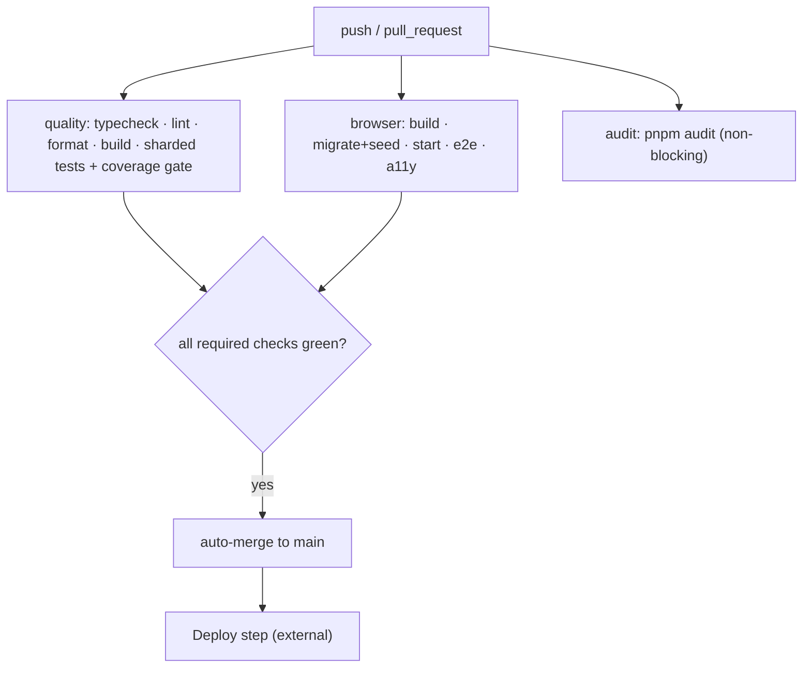

# Deployment

_Audience: DevOps and release engineers. How the app builds, what it produces, how it ships, and how to verify a release._

---

## 1. How the app is built

The app is a standard Next.js 16 build:

```bash
pnpm install --frozen-lockfile   # exact dependency pins
pnpm build                        # next build → .next/
pnpm start                        # next start (serves the built app)
```

Build characteristics (from `next.config.mjs` and `package.json`):

- **No `output: "standalone"`** — the build is the conventional `.next/` output, run with `next start` against `node_modules`. It is **not** pre-packaged as a self-contained server bundle.
- **next-intl plugin** wires localized routing from `src/i18n/request.ts`.
- **Sentry plugin is opt-in** — it only engages when `NEXT_PUBLIC_SENTRY_DSN` is set, and source-map *upload* additionally needs `SENTRY_AUTH_TOKEN` (+ `SENTRY_ORG`/`SENTRY_PROJECT`). Without a DSN the build is byte-for-byte unchanged.
- **Security headers** are emitted for every route by the `headers()` config.

## 2. Artifacts

| Artifact | Produced by | Notes |
| --- | --- | --- |
| `.next/` (incl. `.next/static/`) | `pnpm build` | The compiled application; served by `next start`. |
| `public/` | source | Static assets served as-is. |
| Coverage report | CI `quality` job | Uploaded as a CI artifact (7-day retention). |
| Playwright traces | CI `browser` job | Uploaded on failure (7-day retention). |

There is **no Docker image for the application** in the repository (no `Dockerfile`). The only container defined is **PostgreSQL** (`docker-compose.yml`, for local development).

## 3. Runtime requirements

| Requirement | Value | Source |
| --- | --- | --- |
| Node.js | 22.x | CI (`.github/workflows/ci.yml`); no `.nvmrc`/`engines` pin (`TODO:` add one) |
| pnpm | 10.33.2 | `package.json` → `packageManager` |
| PostgreSQL | 17 (extensions `pgcrypto`/`pg_trgm` in `public`) | `docker-compose.yml` / CI service image |
| DB schema | `auth` (default; `DB_SCHEMA`) — all tables; created by the migrate step | [Configuration](./configuration.md#database-postgresql) |
| Listens on | port 3000 (default `next start`) | Next.js default |
| Needs at runtime | `DATABASE_URL`, `BETTER_AUTH_SECRET`, `BETTER_AUTH_URL`, `NEXT_PUBLIC_APP_URL` (+ SSO vars if used) | [Configuration](./configuration.md) |

## 4. Hosting model

The repository **does not pin a hosting target**. Two models are consistent with the code:

| Model | Fit | Evidence / considerations |
| --- | --- | --- |
| **Serverless (e.g. Vercel)** | Natural for Next.js | `TRUSTED_PROXY_COUNT` defaults to 1 (a CDN/LB in front); no `output: standalone`; `NEXT_PUBLIC_PRODUCTION_HOST` suggests a hosted origin. Use a **pooled** Postgres endpoint. |
| **Node server / container** | Self-hosted | Run `pnpm build` then `pnpm start` behind a TLS-terminating reverse proxy; run migrations as an init step. You'd add your own `Dockerfile` (none is provided). |

> `TODO:` Choose and document the production hosting target. If containerizing, add a `Dockerfile` (consider enabling `output: "standalone"` to slim the image) and a deploy manifest. The historical [`docs-backup/setup-guide.md`](../docs-backup/setup-guide.md) references Vercel as the primary target and Docker/self-hosted as an alternative — confirm against your actual infrastructure.

## 5. Container notes (if you containerize)

There is no app Dockerfile today. A minimal approach:

- Build stage: `pnpm install --frozen-lockfile && pnpm build`.
- Runtime stage: copy `.next/`, `public/`, `package.json`, `node_modules` (or use `output: "standalone"` and copy `.next/standalone`), run `pnpm start`.
- Provide all required env at runtime; run migrations as a separate init job, not in the web container's start command.

For local PostgreSQL, the provided `docker-compose.yml` runs `pgvector/pgvector:pg17` on host port 5444 with an init script that enables `vector` and `pg_trgm`.

## 6. CI/CD pipeline

CI is **`.github/workflows/ci.yml`** (push + pull_request). It validates quality and behavior but does **not** itself deploy.



- Both `quality` and `browser` run against a **PostgreSQL 17 service container**; the `browser` job migrates, seeds, starts the server, then runs Playwright e2e + accessibility.
- The `audit` job is non-blocking.
- **Deployment is not defined in the repo.** `TODO:` wire the deploy step (platform Git integration, a separate workflow with environment protection rules, or a CD tool). The historical docs mention a `production` GitHub environment with required reviewers and a separate DDL role for migrations — adopt or adapt that.

See [DevOps Setup → Build pipeline](./devops-setup.md#5-build-pipeline-ci) and [Testing](./testing.md).

## 7. Release checklist

- [ ] `main` is green (all required checks).
- [ ] Migrations applied to the target database **before** routing traffic to the new build.
- [ ] Required env present in the target environment; secrets from a manager.
- [ ] `BETTER_AUTH_URL` / `NEXT_PUBLIC_APP_URL` match the public origin.
- [ ] Optional features intentionally on/off (email, OAuth, machine API, Sentry).
- [ ] If Sentry is enabled: release tag set and source maps uploaded (`SENTRY_AUTH_TOKEN` in CI).
- [ ] Rollback path confirmed (previous build available; DB PITR window known).

## 8. Post-deployment verification

1. **Health:** the app responds on its public URL; a known route renders.
2. **Auth:** sign in with a known account; sessions persist; sign-out works.
3. **Database:** an admin list (e.g. Users) loads — confirms DB connectivity and migrations.
4. **Audit:** perform a small admin action and confirm a new `app_audit_events` row with a matching `x-request-id`.
5. **SSO (if used):** complete one launch→consume handoff into a registered app.
6. **Email (if enabled):** trigger a password reset and confirm an `app_outbox` row transitions to `sent`.
7. **Machine API (if enabled):** mint a token at `/api/v1/auth/token` and call `/api/v1/me`.
8. **Headers:** verify `Strict-Transport-Security` and `X-Frame-Options: DENY` on responses.
9. **Monitoring (if enabled):** confirm events arrive in Sentry and source maps resolve.

---

_Next: [Testing](./testing.md) · [Troubleshooting](./troubleshooting.md)_
