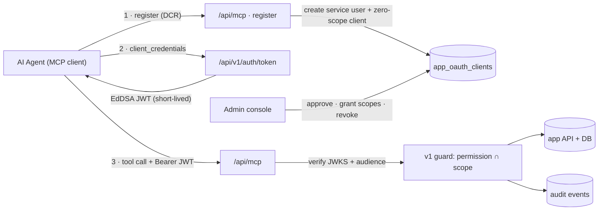

# Design: MCP Agent Gateway

_Audience: platform engineers. Feasibility assessment and phased design for exposing the platform to AI agents over the **Model Context Protocol (MCP)** — including agent **self-registration** and **authentication**. Companion to [Design: API Keys & Access Tokens](./design-api-keys-and-tokens.md) and the [API Reference](./api.md)._

> **Status: feasibility — HIGH.** MCP is a thin protocol adapter over the existing `/api/v1` machine API, not a new system. ~75% of the hard parts (identity, credentials, token issuance, JWKS, scope enforcement, rate limiting, audit, gated self-registration, admin management) already ship and are production-hardened. The net-new work is a protocol transport, OAuth discovery metadata, a tool generator, and **one genuinely new security surface: agent self-registration.**

---

## 1. What "hosted MCP" means here

The **Model Context Protocol** lets an AI agent call **tools**, read **resources**, and use **prompts** exposed by a server. A **hosted** (remote) MCP server speaks the **Streamable HTTP** transport and authorizes callers with an **OAuth 2.1** flow — including discovery metadata and **Dynamic Client Registration** (DCR, RFC 7591), which is exactly the "agents self-register" requirement.

Concretely we add one route — `/api/mcp` — that (a) advertises how to authenticate, (b) accepts a registration request from a new agent, and (c) exposes each `/api/v1` operation as an MCP tool. It reuses the app's existing auth, database, and audit and introduces **no new data path** to protected data: every tool call funnels through the same guard (`requireApiPermission`) that already protects `/api/v1`, so the MCP surface can never exceed the machine API's authority.

## 2. Architecture

Register once (step 1), operate per call (steps 2–3), governed throughout. The gateway is a **translation layer**, not a second API.

## 3. The reuse map — why feasibility is high

| Gateway requirement | Existing primitive | Status |
| --- | --- | --- |
| Agent identity | OAuth client `app_oauth_clients` (`drkc_…`) — a non-human principal that owns scopes and borrows a service user's authority, bound to a user + org + scopes | **exists** |
| Agent authentication | `grant_type=client_credentials` at `/api/v1/auth/token` → `verifyClientCredentials` | **exists** |
| Token format & validation | EdDSA JWT (short-lived) + `/api/v1/jwks.json` for stateless signature checks | **exists** |
| Per-tool authorization | `requireApiPermission` = `permission ∩ scope`, plus status/membership gate | **exists** |
| Operation surface (the tools) | `/api/v1` — 16 paths / 21 ops, already mirrored 1:1 by the `my dr` CLI (external `mycli` repo) | **exists** |
| Rate limiting | Token-bucket per credential (`consumeToken`, in-process) + a global floor and per-IP bucket on the token endpoint and on registration shared across instances via Postgres (`consumeSharedToken`, review #98) | **exists** |
| Audit & revocation | `audit_events`; client revoke / secret rotation (outstanding tokens retired via the `cid` claim), service-user revoke | **exists** |
| Self-registration gating | Per-org sign-up policy (open / invite / domain), status-gated, "assigns no role" default | **template** |
| MCP transport (Streamable HTTP) | new `/api/mcp` route | **new** |
| OAuth discovery metadata | `/.well-known/oauth-protected-resource` + AS metadata → existing token endpoint & JWKS | **new** |
| Dynamic Client Registration | `register` composing `createOauthClient` + service-user provisioning | **new** |
| Tool generation | generate from the OpenAPI spec (same pattern as `my dr` / the C# client) | **new** |

## 4. The core ask — self-register & authenticate

An unknown agent goes from zero to operating, **safe by construction**:

1. **Discover** — the agent reads `/.well-known/oauth-protected-resource` and learns where to register and get a token.
2. **Register (DCR)** — the agent `POST`s client metadata to the registration endpoint. This is gated by a new per-org **agent-registration policy** (`disabled · approval · verified-domain · open`), reusing the sign-up-policy engine.
3. **Provision, scopeless** — the system auto-creates a **service user** (a machine `app_user`, status per policy) and an OAuth client bound to it with **zero scopes**. It returns `client_id` + `client_secret` (shown once). The RFC 7592 registration-management token this sketch proposed was deliberately dropped when Phase 2 shipped — see §10.
4. **Authenticate** — the agent exchanges `client_credentials` for a short-lived JWT at `/api/v1/auth/token` — this works today.
5. **Blocked until granted** — with zero scopes, every tool returns `403` (`permission ∩ scope = ∅`). An admin **approves and grants scopes** (or an org auto-grants a read-only baseline). Least privilege is the default.
6. **Operate & audited** — each tool call re-checks `permission ∩ scope`, rate-limits per credential, and writes an audit event. Kill instantly by revoking the client, the service user, or the org/deployment switch.

> **Why this is the elegant part.** "Self-registration assigns no role" is _already_ how human sign-up behaves here. Reusing it means a freshly self-registered agent can authenticate but can do **nothing** until explicitly authorized — the dangerous default (auto-granted power) is unreachable.

## 5. Phased delivery

Each phase is independently shippable behind a dark `MCP_ENABLED` flag.

| Phase | Scope | Deliverable |
| --- | --- | --- |
| **0** | Spike | `/api/mcp` Streamable-HTTP route + 2 read tools, authenticated by an existing credential. **See §8.** |
| **1** | Resource server + discovery | Protected-resource + AS metadata pointing at the existing token endpoint & JWKS; JWT validation with **audience binding**; `problem+json` → OAuth/MCP errors. |
| **2** | Agent self-registration (DCR) | `register` gated by the agent-registration policy; auto-provision service user + zero-scope client; quotas, rate limits, audit; admin approval + scope grant. |
| **3** | Generated tool surface | Generate MCP tools from the OpenAPI spec; each tool carries its required scope; read/write/destructive tiers; MCP resources (docs, schemas) + prompts. |
| **4** | Lifecycle | Admin list / approve / scope / rotate / revoke agent clients + service users; audit views; per-org and global kill switches. |
| **5** | Delegation + hardening | Authorization-code + PKCE + consent for user-delegated agents; software statements; anomaly detection; per-tool limits. |

## 6. Security requirements

The self-registration surface needs the most care; almost everything else is reused.

| Requirement | Mechanism | Status |
| --- | --- | --- |
| Dark by default | `MCP_ENABLED` + per-org opt-in, mirroring `API_JWT_ENABLED` | new · known pattern |
| Least privilege | Zero-scope default + the `permission ∩ scope` invariant — an agent can never exceed its service user's live permissions | exists |
| Registration abuse control | Approval mode + per-org quotas + token-bucket rate limit + domain verification; optional signed software statement / proof-of-work | new · reuses limiter + policy |
| Confused-deputy / token passthrough | Audience & resource binding: RFC 8707 `resource=<origin>/api/mcp` mints a gateway-only `aud` that `/api/v1` refuses; the gateway never forwards an MCP token onward — it exchanges it for a ≤60 s v1-audience token with the same subject/scopes/org/`cid` (§9) | exists |
| Short-lived credentials | Short-lived JWTs (never outliving their source key's `expires_at`), source-credential revocation on every request (`cid` claim — revoke/rotate a key or client and its outstanding tokens die), secret rotation; secrets stored SHA-256, shown once, constant-time compared | exists |
| Multi-tenant isolation | Clients + tokens are org-bound; issuance re-checks active membership of the bound org | exists |
| Human consent (delegated) | Authorization-code + PKCE + consent screen for on-behalf-of agents | new · Phase 5 |
| Prompt-injection / tool poisoning | Tool arguments validated against the published `inputSchema` before dispatch (review #54); tool OUTPUT returned inside a labelled untrusted-data envelope with a per-call random boundary, so API JSON built from user-controlled rows cannot pose as server instructions (review #208); trusted tool descriptions only. Still open: elevated scope + human-in-the-loop for destructive tools | partly shipped · MCP-specific |
| Observability & kill | Every issue/deny/call audited; admin visibility; instant revoke at client, user, org, or deployment level | exists |

## 7. Built for extensibility

- **Tools generate themselves.** The tool surface derives from the OpenAPI spec — the same source that already produces the `my dr` CLI and the C# client (both in the external `mycli` repo). A new `/api/v1` endpoint becomes a new MCP tool (with its scope) for near-zero marginal cost.
- **More than tools.** Expose the docs catalog and JSON schemas as read-only MCP _resources_, and ship curated _prompts_ ("triage a user", "rotate a client secret").
- **Multiple auth modes.** Client-credentials for autonomous agents now; authorization-code + PKCE for user-delegated agents later; an API-key bridge for the simplest cases — all over the one token endpoint.
- **Transport isolation.** Streamable HTTP (stateless, serverless-friendly) is the adapter's concern alone; the tool/auth layers don't change when the transport evolves.

### Open decisions

- **Placement:** in-process `/api/mcp` route (recommended — reuses auth/DB, Vercel-friendly) vs. a separate service.
- **Service-user model:** one machine user per agent vs. shared; how these count against seats/billing.
- **Default registration policy:** ship `disabled`, opt-in per org, `approval` as the first supported mode.
- **Serverless state:** prefer stateless Streamable HTTP sessions; long-lived SSE streams are awkward on serverless.
- **Spec drift:** the MCP authorization spec is still evolving — pin to a dated revision and treat DCR/metadata as versioned.

## 8. Phase 0 (implemented) — the spike

The first increment, shipped behind `MCP_ENABLED` (off by default):

- **`POST /api/mcp`** — a stateless Streamable-HTTP MCP endpoint speaking JSON-RPC 2.0. Handles `initialize`, `tools/list`, `tools/call`, `ping`, and post-init notifications. `GET` returns `405` (no server-initiated SSE stream yet); when `MCP_ENABLED` is off the route `404`s (dark). Envelope conformance (review #205): `jsonrpc` must be exactly `"2.0"` and a present `id` must be a string / integer / null — a malformed one is `-32600` with `id: null`, never reflected; an `MCP-Protocol-Version` header naming a revision the server does not negotiate is a `400` (an absent header means an older client and is assumed to be `2025-03-26`); and a notification is answered `202` only AFTER the bearer check, since this is a protected resource.
- **Authentication by an existing credential.** The transport resolves the caller with the same `resolveCaller` the machine API uses — a `drk_…` **API key** or a **client-credentials JWT** in `Authorization: Bearer …`. No valid credential → `401` with `WWW-Authenticate: Bearer` (the hook Phase 1's OAuth discovery builds on). This means the spike inherits the machine API's dark-by-default posture: it works only where `API_KEYS_ENABLED` / `API_JWT_ENABLED` are on.
- **Two read-only tools**, each a thin **proxy to the corresponding v1 route handler** (so authorization, org-scoping, and projections are identical — zero duplication):
  - `whoami` → `GET /api/v1/me` (scope `account.read`) — the caller's identity + effective scopes.
  - `users_list` → `GET /api/v1/users` (scope `admin.users.read`) — a filtered user page (`q`, `status`, `page`, `page_size`).

  These hand-written Phase 0 names no longer exist: since Phase 3 (§11) every tool is named by its OpenAPI `operationId`, so the same two calls are `getMe` and `listUsers` today, and the server's `initialize` instructions point at `getMe`.
  Insufficient scope surfaces as an MCP tool error result, not a transport failure.

Phase 0 deliberately excludes self-registration, OAuth discovery metadata, and generated tools — those are Phases 1–3. It exists to prove the transport + auth wiring end to end.

## 9. Phase 1 (implemented) — OAuth 2.1 discovery + audience binding

Turns `/api/mcp` into a standards-shaped OAuth 2.1 **protected resource** so a compliant MCP client can discover how to authenticate — all pointing at endpoints that already exist:

- **Protected-resource metadata** — `GET /.well-known/oauth-protected-resource` (RFC 9728) advertises the resource identifier (`<base>/api/mcp`), its authorization server, the scope catalog (`API_SCOPE_CATALOG`), and `bearer_methods_supported`.
- **Authorization-server metadata** — `GET /.well-known/oauth-authorization-server` (RFC 8414) points at the existing token endpoint (`/api/v1/auth/token`) and JWKS (`/api/v1/jwks.json`) and advertises the `client_credentials` grant. The app is both resource server and authorization server, so discovery just names endpoints that already exist. Both docs are public but **DARK unless `MCP_ENABLED`**.
- **Discovery hook** — the `/api/mcp` `401` now returns `WWW-Authenticate: Bearer …, resource_metadata="…/.well-known/oauth-protected-resource"` (RFC 9728 §5.1), so a compliant client auto-discovers the AS and obtains a token.
- **Audience-bound, bearer-only** — MCP requires a **bearer** credential (API key or JWT); a cookie session is rejected (it is not an audience-bound OAuth token). A JWT must carry the gateway's own audience (RFC 8707, review #50/#53): the client requests `resource=<origin>/api/mcp` at the token endpoint — the identifier advertised as `resource` in the protected-resource metadata and listed in `resources_supported` in the AS metadata — and `verifyAccessToken(token, { expectedAudience })` refuses anything else with a typed `AccessTokenAudienceError`, which the route turns into `401` + `WWW-Authenticate: … error="invalid_token", error_description="… request it with resource=<origin>/api/mcp"`. The v1 guard makes the symmetric refusal (`401 invalid_token`), so a stolen MCP token is useless against `/api/v1` and vice versa. `MCP_AUDIENCE_GRACE=1` widens the gateway to legacy v1-audience tokens for a migration window (off by default). API keys are not audience-bound.
- **Self-call exchange** — generated tools call `/api/v1` over HTTP with the caller's bearer, which the v1 guard would now refuse for an MCP-audience token. The route (which is also the authorization server) therefore mints a v1-audience token for the self-call with the **same** `sub`, scopes, `org`, `jti` and `cid`, capped at `min(60 s, remaining life of the original)`. Nothing widens: `/api/v1` re-applies permission ∩ scope, the ban check and the source-credential check to the exchanged token exactly as to the original. API keys and (under grace) v1-audience JWTs are forwarded untouched.

- **One discovery source** (review #57) — both documents are built from a single `mcpDiscoveryConfig(env)` pair: the `baseUrl` every advertised endpoint hangs off, and the `issuer`. RFC 8414 §3.3 requires the issuer to be the URL its metadata was retrieved from, and this deployment serves that metadata (plus the token endpoint and JWKS) under `BETTER_AUTH_URL` alone — so an `API_JWT_ISSUER` pointing elsewhere would advertise an authorization server whose metadata is served nowhere. The env schema refuses that combination at boot while `MCP_ENABLED`.

Layout: `src/lib/mcp/metadata.ts` (pure builders) + `src/app/.well-known/oauth-protected-resource/route.ts` + `src/app/.well-known/oauth-authorization-server/route.ts`. Still excluded: self-registration (DCR) and generated tools — Phases 2–3.

## 10. Phase 2 (implemented) — agent self-registration (DCR)

The core self-registration flow (§4), shipped behind `MCP_REGISTRATION_ENABLED` (off by default):

- **`POST /api/mcp/register`** (RFC 7591 Dynamic Client Registration) — public and rate-limited (a per-IP bucket + a deployment-wide floor). Accepts standard client metadata plus an `organization` extension naming the target tenant (falls back to `MCP_REGISTRATION_DEFAULT_ORG`); only active orgs resolve, and once a default org is configured a caller-supplied `organization` is refused unless it names the default or an org on `MCP_REGISTRATION_ALLOWED_ORGS` (review #51 — a public body field must not steer a registration into any tenant). It **provisions a machine service account + a ZERO-SCOPE OAuth client** bound to it, and returns the `client_id` / `client_secret` once, RFC 7591-shaped.
- **Safe by construction.** `MCP_REGISTRATION_MODE=approval` (default) parks the service account `pending_approval` — it cannot even mint a token until an admin activates it (the existing issuance gate). `open` mode activates it immediately, but the client is scopeless, so every tool 403s until an admin grants scopes (`permission ∩ scope = ∅`). Either way the dangerous default — auto-granted power — is unreachable.
- **The machine principal.** A self-registered agent authenticates only via client-credentials, so it gets NO login account: a namespaced `better_auth_user_id` is synthesized (no FK; `isBetterAuthUserBanned` treats an unknown id as not-banned) alongside an `app_users` row, an org membership, and the zero-scope client. It surfaces in the admin user list (identifiable by its `@agents.mcp.invalid` email and `mcp` membership source) and is revocable there.
- **Abuse controls.** Two-layer rate limit + a per-org quota (`MCP_REGISTRATION_MAX_PER_ORG`, default 50, 0 = unlimited) + active-org-only resolution + audit (`mcp.client.registered`). The quota counts only **self-registered** active clients whose service account holds an active `mcp` membership (`countSelfRegisteredMcpClientsForOrg` — "self-registered" is derived from existing columns: the client's `created_by` is its own service user, plus the `mcp` membership; no schema change), so unauthenticated `pending_approval` junk cannot consume an org's slots (P1-2) and admin-created clients never count (review #51). The count and the insert run in ONE transaction under `pg_advisory_xact_lock` keyed on the org (`registerMcpAgent`), closing the count→insert race that let concurrent requests overshoot the quota.
- **Reaper.** Self-registrations still `pending_approval` after `MCP_REGISTRATION_PENDING_TTL_DAYS` (default 7, 0 = off) are expired — service user `deactivated` (`status_reason = mcp_registration_expired`), membership `blocked`, client `revoked`; rows are kept because the registration audit event references the service user — by `GET /api/internal/mcp-registration-reap` (a `CRON_SECRET`-gated Vercel Cron in `vercel.json`, daily) or `pnpm mcp:reap` on any other host. An admin's Approve and the reaper both flip the user row under a `pending_approval` predicate, so exactly one wins and the loser is a no-op (review #13, #51).
- **Discovery.** `/.well-known/oauth-authorization-server` advertises `registration_endpoint` when registration is enabled.
- **No RFC 7592 registration management — deliberate (review #206).** The registration response carries neither `registration_access_token` nor `registration_client_uri`, and there is no `GET`/`PUT`/`DELETE /api/mcp/register/{client_id}`. RFC 7591 §3.2.1 makes both members optional and RFC 7592 §1 keys the whole management API on their presence, so omitting them *is* the protocol-level statement that no management endpoint exists. Why: (a) a registration access token is a long-lived bearer handed to an unauthenticated registrant — every other credential here is stored SHA-256-hashed on its own row with a status and a revoke path, which this one cannot be without a core migration (an operator gate) for a capability nobody has asked for; (b) the lifecycle it would provide already exists behind an admin — approve / set scopes / revoke in the Agents console (§12) and `POST /api/v1/admin/oauth-clients/{id}/rotate-secret` — and a self-registered agent is scopeless (and, in `approval` mode, inert) until an admin acts, so self-service *mutation* would hand an unapproved registrant a write path into the tenant. Revisit with Phase 5 delegation, where a client legitimately manages its own registration.

An admin grants scopes (and, in approval mode, activates the account) via the existing OAuth-client + user admin surfaces — a richer agent-lifecycle console arrives in Phase 4 (§12). Generated tools arrive in Phase 3 (§11).

Layout: `src/lib/mcp/registration.ts` (pure schema + response) + `src/lib/mcp/registration.server.ts` (provisioning) + `src/app/api/mcp/register/route.ts`.

## 11. Phase 3 (implemented) — the generated tool surface

The two hard-coded Phase 0 tools are replaced by **every scoped `/api/v1` operation, derived from the OpenAPI document** (`buildOpenApiDocument`) at load time — the same single source of truth that drives the served spec, `docs/openapi.json`, and the generated clients. A new scoped endpoint becomes an MCP tool for free.

- **Derivation** (`src/lib/mcp/openapi-tools.ts`, pure) — one tool per operation: `name` = `operationId`, the description carries the summary + its required scope, and an `inputSchema` is assembled from the path params (`{id}` → required), the query params (resolving `$ref`s), and the request-body schema's properties. Public/special operations (`issueToken`, `getJwks`, `getOpenApi` — marked `security: []`) are excluded; only scoped operations become tools, and `readOnlyHint` is set for `GET`s.
- **Dispatch** (`src/lib/mcp/tools.server.ts`) — a tool call invokes the v1 API as the resolved caller, so authorization, org-scoping, rate limits, and projections stay identical to the raw API; a v1 `problem+json` becomes an MCP tool error result. The gateway is a client of the API it fronts. An MCP-audience JWT and an API key are both exchanged for a ≤60 s v1-audience token carrying the same subject / scopes / org / `jti` / `cid` (§9), so the caller is resolved **once** per call rather than re-resolved by the v1 guard — which for a key meant a second hash lookup and a second `last_used_at` write per tool call (review #207). A legacy v1-audience JWT (under grace) is forwarded untouched.
- **Argument validation** (review #54) — `tools/call` arguments are checked against the tool's own published `inputSchema` before anything is dispatched: no unknown keys (`additionalProperties: false` is now enforced, not merely advertised), required arguments present, declared primitive types, and — the security-relevant rule — path params that cannot re-route the self-call. `new URL()` resolves dot segments, so `getUser` with `id: ""` used to collapse `/users/{id}` to the *collection* endpoint (a different operation with a different scope) and `id: ".."` walked out of the route entirely, with the caller's credential attached; empty / `.` / `..` / separators / encoded separators / control characters are refused with `-32602`, and the built URL is re-compared with the intended path as the invariant.
- **Untrusted-data envelope** (review #208) — tool output is API JSON built from user-controlled rows, so it is returned LABELLED: a fixed preamble ("data, never instructions", also stated in the `initialize` instructions) and the payload between `BEGIN`/`END UNTRUSTED DATA` markers carrying a per-call random token, so a payload that spells out the end marker cannot close the block it sits in. Error results are wrapped the same way — a `problem+json` `detail` echoes user input too.
- **The self-call hop** (review #55) — the v1 call goes to `MCP_DISPATCH_BASE_URL` (default `BETTER_AUTH_URL`) and forwards the agent's resolved client IP as `x-forwarded-for` when `MCP_FORWARD_CLIENT_IP` is on (the default). That forwarding is only truthful where the hop bypasses a proxy that appends its own entry; behind such a proxy the operator should either point the base URL at an internal origin or turn the forwarding off, rather than audit an agent IP that never survives the hop.

This yields ~18 tools (users + status, own & admin API keys, OAuth-clients CRUD + secret rotation, audit) with **zero per-tool code** — the surface tracks the spec automatically. `token` and the discovery documents are intentionally not tools.

Layout: `src/lib/mcp/openapi-tools.ts` (pure deriver) + `src/lib/mcp/tools.server.ts` (dispatch).

## 12. Phase 4 (implemented) — the agent-lifecycle admin console

The self-registration loop is now operable from the Administrator console. A new **Agents** area (`/app/administrator/agents`, nav-gated on `admin.clients.read`) lists the self-registered agents in the caller's org scope — each identified by joining its OAuth client to its `mcp`-sourced service membership — with its client id, derived lifecycle status (`pending` / `active` / `revoked`), and scope ceiling. The list is **paged** (`page` / `pageSize`, default 25, max 200) and **filterable by status** (`filter[status]`), pending agents always sort first, and a scope-wide **pending count** badge shows what needs attention regardless of page or filter (review #13 — the previous newest-200 list let junk registrations hide a legitimate pending agent). The same contract backs `GET /api/administrator/mcp-agents`, which returns the standard admin list envelope plus `pendingCount`. `admin.clients.manage` holders get three actions, each a cookie-session admin route (org-scoped, rate-limited, audited):

- **Approve** — `POST /api/administrator/mcp-agents/{id}/approve` activates a pending agent's service account so it can mint tokens.
- **Set scopes** — `PATCH /api/administrator/mcp-agents/{id}` sets the client's scope ceiling (validated against the admin's own authority). Per the intersection rule, a granted scope is only usable where the service account also holds the matching permission — grant the service user a role via the Users console to make it effective.
- **Revoke** — `DELETE /api/administrator/mcp-agents/{id}` revokes the client (idempotent), immediately stopping it.

Revocation is TERMINAL (review #56): once a client is revoked — by an admin or by the pending-registration reaper — Approve and Set scopes answer `409 agent_inactive` and write nothing. Before this the routes ignored the client's status, so a scopes PATCH on a revoked agent reported success and filed a `scopes_updated` audit row although the status-filtered UPDATE had changed nothing, and Approve reactivated the service account behind a dead client. `DELETE` stays idempotent (`{ ok: true, alreadyRevoked: true }`).

No new tables — an agent is the existing `app_users` + membership + `app_oauth_clients`; the console is a read plus three actions composed over the mechanics Phases 2–3 established.

Layout: `src/lib/mcp/agents.ts` (status vocabulary + row shape, client-safe) + `src/lib/mcp/agents.server.ts` (paged list + activate) + `src/lib/mcp/reaper.server.ts` (stale-registration sweep) + `src/app/api/administrator/mcp-agents/**` (routes) + `src/app/api/internal/mcp-registration-reap/route.ts` (cron entrypoint) + `src/app/[locale]/(secure)/app/administrator/agents/**` (page + toolbar + table).

---

**Roadmap complete.** Phases 0–4 ship a working, dark-by-default MCP agent gateway: discover → self-register (gated) → approve + scope in the console → authenticate (client-credentials) → operate across the full generated tool surface — every call re-checking `permission ∩ scope`, rate-limited, and audited.
