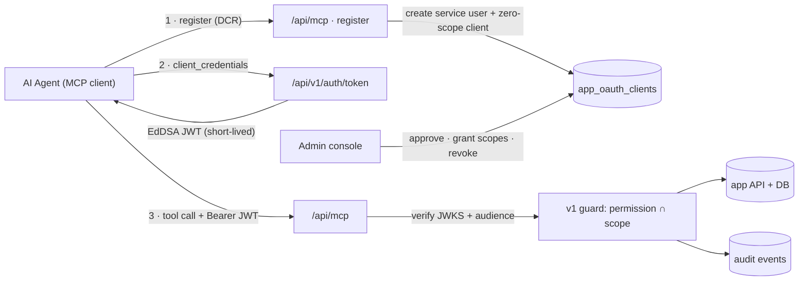

# Design: MCP Agent Gateway

_Audience: platform engineers. Feasibility assessment and phased design for exposing the platform to AI agents over the **Model Context Protocol (MCP)** — including agent **self-registration** and **authentication**. Companion to [Design: API Keys & Access Tokens](./design-api-keys-and-tokens.md) and the [API Reference](./api.md)._

> **Status: feasibility — HIGH.** MCP is a thin protocol adapter over the existing `/api/v1` machine API, not a new system. ~75% of the hard parts (identity, credentials, token issuance, JWKS, scope enforcement, rate limiting, audit, gated self-registration, admin management) already ship and are production-hardened. The net-new work is a protocol transport, OAuth discovery metadata, a tool generator, and **one genuinely new security surface: agent self-registration.**

---

## 1. What "hosted MCP" means here

The **Model Context Protocol** lets an AI agent call **tools**, read **resources**, and use **prompts** exposed by a server. A **hosted** (remote) MCP server speaks the **Streamable HTTP** transport and authorizes callers with an **OAuth 2.1** flow — including discovery metadata and **Dynamic Client Registration** (DCR, RFC 7591), which is exactly the "agents self-register" requirement.

Concretely we add one route — `/api/mcp` — that (a) advertises how to authenticate, (b) accepts a registration request from a new agent, and (c) exposes each `/api/v1` operation as an MCP tool. It reuses the app's existing auth, database, and audit and introduces **no new data path** to protected data: every tool call funnels through the same guard (`requireApiPermission`) that already protects `/api/v1`, so the MCP surface can never exceed the machine API's authority.

## 2. Architecture

Register once (step 1), operate per call (steps 2–3), governed throughout. The gateway is a **translation layer**, not a second API.

## 3. The reuse map — why feasibility is high

| Gateway requirement | Existing primitive | Status |
| --- | --- | --- |
| Agent identity | OAuth client `app_oauth_clients` (`drkc_…`) — a non-human principal that owns scopes and borrows a service user's authority, bound to a user + org + scopes | **exists** |
| Agent authentication | `grant_type=client_credentials` at `/api/v1/auth/token` → `verifyClientCredentials` | **exists** |
| Token format & validation | EdDSA JWT (short-lived) + `/api/v1/jwks.json` for stateless signature checks | **exists** |
| Per-tool authorization | `requireApiPermission` = `permission ∩ scope`, plus status/membership gate | **exists** |
| Operation surface (the tools) | `/api/v1` — 16 paths / 21 ops, already mirrored 1:1 by the `my dr` CLI | **exists** |
| Rate limiting | Token-bucket per credential + a global floor (`consumeToken`) | **exists** |
| Audit & revocation | `audit_events`; client revoke, `jti` denylist, service-user revoke | **exists** |
| Self-registration gating | Per-org sign-up policy (open / invite / domain), status-gated, "assigns no role" default | **template** |
| MCP transport (Streamable HTTP) | new `/api/mcp` route | **new** |
| OAuth discovery metadata | `/.well-known/oauth-protected-resource` + AS metadata → existing token endpoint & JWKS | **new** |
| Dynamic Client Registration | `register` composing `createOauthClient` + service-user provisioning | **new** |
| Tool generation | generate from the OpenAPI spec (same pattern as `my dr` / the C# client) | **new** |

## 4. The core ask — self-register & authenticate

An unknown agent goes from zero to operating, **safe by construction**:

1. **Discover** — the agent reads `/.well-known/oauth-protected-resource` and learns where to register and get a token.
2. **Register (DCR)** — the agent `POST`s client metadata to the registration endpoint. This is gated by a new per-org **agent-registration policy** (`disabled · approval · verified-domain · open`), reusing the sign-up-policy engine.
3. **Provision, scopeless** — the system auto-creates a **service user** (a machine `app_user`, status per policy) and an OAuth client bound to it with **zero scopes**. It returns `client_id` + `client_secret` (shown once) + a registration-management token (RFC 7592).
4. **Authenticate** — the agent exchanges `client_credentials` for a short-lived JWT at `/api/v1/auth/token` — this works today.
5. **Blocked until granted** — with zero scopes, every tool returns `403` (`permission ∩ scope = ∅`). An admin **approves and grants scopes** (or an org auto-grants a read-only baseline). Least privilege is the default.
6. **Operate & audited** — each tool call re-checks `permission ∩ scope`, rate-limits per credential, and writes an audit event. Kill instantly by revoking the client, the service user, or the org/deployment switch.

> **Why this is the elegant part.** "Self-registration assigns no role" is _already_ how human sign-up behaves here. Reusing it means a freshly self-registered agent can authenticate but can do **nothing** until explicitly authorized — the dangerous default (auto-granted power) is unreachable.

## 5. Phased delivery

Each phase is independently shippable behind a dark `MCP_ENABLED` flag.

| Phase | Scope | Deliverable |
| --- | --- | --- |
| **0** | Spike | `/api/mcp` Streamable-HTTP route + 2 read tools, authenticated by an existing credential. **See §8.** |
| **1** | Resource server + discovery | Protected-resource + AS metadata pointing at the existing token endpoint & JWKS; JWT validation with **audience binding**; `problem+json` → OAuth/MCP errors. |
| **2** | Agent self-registration (DCR) | `register` gated by the agent-registration policy; auto-provision service user + zero-scope client; quotas, rate limits, audit; admin approval + scope grant. |
| **3** | Generated tool surface | Generate MCP tools from the OpenAPI spec; each tool carries its required scope; read/write/destructive tiers; MCP resources (docs, schemas) + prompts. |
| **4** | Lifecycle | Admin list / approve / scope / rotate / revoke agent clients + service users; audit views; per-org and global kill switches. |
| **5** | Delegation + hardening | Authorization-code + PKCE + consent for user-delegated agents; software statements; anomaly detection; per-tool limits. |

## 6. Security requirements

The self-registration surface needs the most care; almost everything else is reused.

| Requirement | Mechanism | Status |
| --- | --- | --- |
| Dark by default | `MCP_ENABLED` + per-org opt-in, mirroring `API_JWT_ENABLED` | new · known pattern |
| Least privilege | Zero-scope default + the `permission ∩ scope` invariant — an agent can never exceed its service user's live permissions | exists |
| Registration abuse control | Approval mode + per-org quotas + token-bucket rate limit + domain verification; optional signed software statement / proof-of-work | new · reuses limiter + policy |
| Confused-deputy / token passthrough | Audience & resource binding (`aud=devresponse-api` today; add RFC 8707 resource indicator); the gateway never forwards a caller's token onward | partial |
| Short-lived credentials | Short-lived JWTs, `jti` revocation, secret rotation; secrets stored SHA-256, shown once, constant-time compared | exists |
| Multi-tenant isolation | Clients + tokens are org-bound; issuance re-checks active membership of the bound org | exists |
| Human consent (delegated) | Authorization-code + PKCE + consent screen for on-behalf-of agents | new · Phase 5 |
| Prompt-injection / tool poisoning | Validated tool inputs (zod), destructive tools require elevated scope + optional human-in-the-loop; trusted tool descriptions only | new · MCP-specific |
| Observability & kill | Every issue/deny/call audited; admin visibility; instant revoke at client, user, org, or deployment level | exists |

## 7. Built for extensibility

- **Tools generate themselves.** The tool surface derives from the OpenAPI spec — the same source that already produces the `my dr` CLI and the C# client. A new `/api/v1` endpoint becomes a new MCP tool (with its scope) for near-zero marginal cost.
- **More than tools.** Expose the docs catalog and JSON schemas as read-only MCP _resources_, and ship curated _prompts_ ("triage a user", "rotate a client secret").
- **Multiple auth modes.** Client-credentials for autonomous agents now; authorization-code + PKCE for user-delegated agents later; an API-key bridge for the simplest cases — all over the one token endpoint.
- **Transport isolation.** Streamable HTTP (stateless, serverless-friendly) is the adapter's concern alone; the tool/auth layers don't change when the transport evolves.

### Open decisions

- **Placement:** in-process `/api/mcp` route (recommended — reuses auth/DB, Vercel-friendly) vs. a separate service.
- **Service-user model:** one machine user per agent vs. shared; how these count against seats/billing.
- **Default registration policy:** ship `disabled`, opt-in per org, `approval` as the first supported mode.
- **Serverless state:** prefer stateless Streamable HTTP sessions; long-lived SSE streams are awkward on serverless.
- **Spec drift:** the MCP authorization spec is still evolving — pin to a dated revision and treat DCR/metadata as versioned.

## 8. Phase 0 (implemented) — the spike

The first increment, shipped behind `MCP_ENABLED` (off by default):

- **`POST /api/mcp`** — a stateless Streamable-HTTP MCP endpoint speaking JSON-RPC 2.0. Handles `initialize`, `tools/list`, `tools/call`, `ping`, and post-init notifications. `GET` returns `405` (no server-initiated SSE stream yet); when `MCP_ENABLED` is off the route `404`s (dark).
- **Authentication by an existing credential.** The transport resolves the caller with the same `resolveCaller` the machine API uses — a `drk_…` **API key** or a **client-credentials JWT** in `Authorization: Bearer …`. No valid credential → `401` with `WWW-Authenticate: Bearer` (the hook Phase 1's OAuth discovery builds on). This means the spike inherits the machine API's dark-by-default posture: it works only where `API_KEYS_ENABLED` / `API_JWT_ENABLED` are on.
- **Two read-only tools**, each a thin **proxy to the corresponding v1 route handler** (so authorization, org-scoping, and projections are identical — zero duplication):
  - `whoami` → `GET /api/v1/me` (scope `account.read`) — the caller's identity + effective scopes.
  - `users_list` → `GET /api/v1/users` (scope `admin.users.read`) — a filtered user page (`q`, `status`, `page`, `page_size`).
  Insufficient scope surfaces as an MCP tool error result, not a transport failure.

Phase 0 deliberately excludes self-registration, OAuth discovery metadata, and generated tools — those are Phases 1–3. It exists to prove the transport + auth wiring end to end.

## 9. Phase 1 (implemented) — OAuth 2.1 discovery + audience binding

Turns `/api/mcp` into a standards-shaped OAuth 2.1 **protected resource** so a compliant MCP client can discover how to authenticate — all pointing at endpoints that already exist:

- **Protected-resource metadata** — `GET /.well-known/oauth-protected-resource` (RFC 9728) advertises the resource identifier (`<base>/api/mcp`), its authorization server, the scope catalog (`API_SCOPE_CATALOG`), and `bearer_methods_supported`.
- **Authorization-server metadata** — `GET /.well-known/oauth-authorization-server` (RFC 8414) points at the existing token endpoint (`/api/v1/auth/token`) and JWKS (`/api/v1/jwks.json`) and advertises the `client_credentials` grant. The app is both resource server and authorization server, so discovery just names endpoints that already exist. Both docs are public but **DARK unless `MCP_ENABLED`**.
- **Discovery hook** — the `/api/mcp` `401` now returns `WWW-Authenticate: Bearer …, resource_metadata="…/.well-known/oauth-protected-resource"` (RFC 9728 §5.1), so a compliant client auto-discovers the AS and obtains a token.
- **Audience-bound, bearer-only** — MCP now requires a **bearer** credential (API key or JWT); a cookie session is rejected (it is not an audience-bound OAuth token). JWTs are validated against the deployment audience (`API_JWT_AUDIENCE`, default `devresponse-api`) by `verifyAccessToken`. Per-resource token narrowing (RFC 8707 `resource` indicators, a distinct `aud` per resource) is a Phase 2 refinement.

Layout: `src/lib/mcp/metadata.ts` (pure builders) + `src/app/.well-known/oauth-protected-resource/route.ts` + `src/app/.well-known/oauth-authorization-server/route.ts`. Still excluded: self-registration (DCR) and generated tools — Phases 2–3.

## 10. Phase 2 (implemented) — agent self-registration (DCR)

The core self-registration flow (§4), shipped behind `MCP_REGISTRATION_ENABLED` (off by default):

- **`POST /api/mcp/register`** (RFC 7591 Dynamic Client Registration) — public and rate-limited (a per-IP bucket + a deployment-wide floor). Accepts standard client metadata plus an `organization` extension naming the target tenant (falls back to `MCP_REGISTRATION_DEFAULT_ORG`); only active orgs resolve. It **provisions a machine service account + a ZERO-SCOPE OAuth client** bound to it, and returns the `client_id` / `client_secret` once, RFC 7591-shaped.
- **Safe by construction.** `MCP_REGISTRATION_MODE=approval` (default) parks the service account `pending_approval` — it cannot even mint a token until an admin activates it (the existing issuance gate). `open` mode activates it immediately, but the client is scopeless, so every tool 403s until an admin grants scopes (`permission ∩ scope = ∅`). Either way the dangerous default — auto-granted power — is unreachable.
- **The machine principal.** A self-registered agent authenticates only via client-credentials, so it gets NO login account: a namespaced `better_auth_user_id` is synthesized (no FK; `isBetterAuthUserBanned` treats an unknown id as not-banned) alongside an `app_users` row, an org membership, and the zero-scope client. It surfaces in the admin user list (identifiable by its `@agents.mcp.invalid` email and `mcp` membership source) and is revocable there.
- **Abuse controls.** Two-layer rate limit + a per-org quota (`MCP_REGISTRATION_MAX_PER_ORG`, 0 = unlimited) + active-org-only resolution + audit (`mcp.client.registered`).
- **Discovery.** `/.well-known/oauth-authorization-server` advertises `registration_endpoint` when registration is enabled.

An admin grants scopes (and, in approval mode, activates the account) via the existing OAuth-client + user admin surfaces — a richer agent-lifecycle console is Phase 4. Generated tools remain Phase 3.

Layout: `src/lib/mcp/registration.ts` (pure schema + response) + `src/lib/mcp/registration.server.ts` (provisioning) + `src/app/api/mcp/register/route.ts`.
