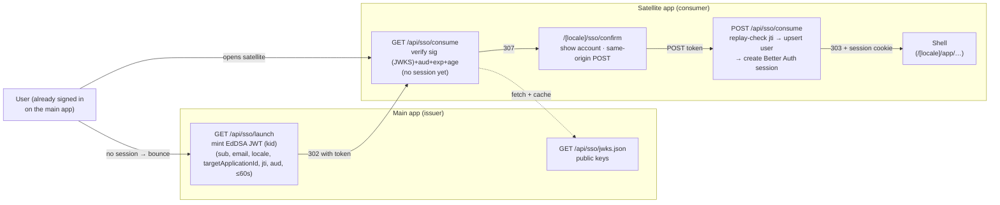
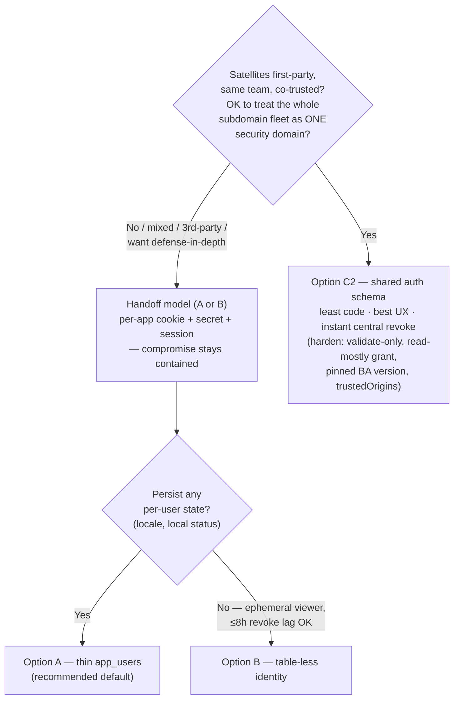

# Design: Satellite Apps

_Audience: platform engineers standing up **satellite apps** — small apps that
orbit the main DevResponseKit deployment, reuse its **application shell**, and
**delegate authentication** to it rather than owning sign-up/sign-in. The
canonical instance is `devresponseapps` (a shell-only app deployed per
subdomain). This doc is the design + decision record for that pattern; the
executable fork playbook is [Appendix A](#appendix-a--fork-playbook)._

Companion docs: the SSO handoff endpoints in [API Reference §7](./api.md#7-sso-handoff-endpoints),
the handoff internals in [Architecture → Single Sign-On handoff](./architecture.md#single-sign-on-handoff),
the env vars in [Configuration → Single Sign-On handoff](./configuration.md#single-sign-on-handoff),
the full handoff spec in [`specs.md` §22](../specs.md), and the companion
credential/gateway designs in [Design: API Keys & Access Tokens](./design-api-keys-and-tokens.md)
and [Design: MCP Agent Gateway](./design-mcp-agent-gateway.md).

> **Status: built.** The `devresponseapps` repository now exists and implements
> all three auth options as separate apps (`app-standalone` = A, `app-handoff` = B,
> `app-shared` = C). This doc remains the design + decision record; the
> as-built, step-by-step walkthrough is the
> [Satellite Apps — Integration Guide](./integration-satellite-apps.md).

---

## 1. What & why

A **satellite app** is the DevResponseKit **shell only** — secure layout,
sidebar/navigation, theme, i18n, providers — with **no** administration console,
**no** account/self-service management, **no** machine API (`/api/v1`, `/api/mcp`),
and **no** roles/permissions/orgs/groups/invitations authoring. It deploys on its
own subdomain and a user who signed in on the main app arrives **already
authenticated**. Developers drop their own pages under `(secure)/app/**` and ship.

**Why this exists:** the platform already invested in a **cross-subdomain SSO
handoff** ([`specs.md` §22](../specs.md)) precisely so additional apps can reuse
one identity without re-implementing auth. A satellite app is that idea taken to
its minimum: keep the polished shell + the delegated-auth path, drop everything
else.

**TL;DR**

- Auth is **delegated** to the main app; the satellite is (by default) an SSO
  **consumer** only (§2).
- The one real architectural decision is the **auth-data model** — three options
  (**A/B/C**) chosen by **trust boundary**, not by size (§3).
- Stripping is large but mechanical; the auth-rewire is small but has **three
  cross-DB gotchas** a naïve copy gets wrong (§2.1).
- The whole thing is a `git clone` + strip + a handful of rewrites (§9,
  [Appendix A](#appendix-a--fork-playbook)).

---

## 2. The delegated-auth model (default: SSO handoff)

By default a satellite is a **consumer** of the EdDSA SSO handoff — it never
*launches* handoffs, only *consumes* them, and holds **no signing key** (it
verifies against the main app's public JWKS at `/api/sso/jwks.json`):



Register once is not required — the handoff is per-request. The satellite holds
its **own** session cookie scoped to its **own** subdomain; the handoff is the
bridge, so there is no shared-cookie coupling in this model.

### 2.1 Three code facts (verified in source) that shape the rewrite

A "copy the shell + the consume route" approach breaks on each of these:

| # | Fact in DevResponseKit | Consequence for the satellite |
|---|---|---|
| 1 | `ssoSession.createSsoSession` calls `findUserById(sub)` and throws **"unknown user"** if absent (`src/lib/auth-sso-session.ts`) — it does **not** provision. | The satellite has a **separate DB**, so `sub` won't exist. The consume POST must **upsert the Better Auth `user` (+ a thin `app_users` row) from the token claims** *before* creating the session. |
| 2 | The nonce is **INSERTed at launch** into the *issuer's* `app_sso_handoff_nonces`; `consumeSsoHandoffNonce` **burns a pre-existing row** (`src/lib/sso.server.ts`). | Cross-DB there is no row to burn → every handoff would 401. Replay protection must be **inverted**: a local `sso_consumed_nonces` table (UNIQUE `jti`); on consume **INSERT the jti** — success = first use, unique-violation = replay → reject. |
| 3 | The consume route imports `request-id` + `origin-guard` from `src/lib/admin/**` (`src/app/api/sso/consume/route.ts`), which gets stripped. | **Relocate** those two helpers to neutral libs (`src/lib/request-id.server.ts`, `src/lib/origin-guard.server.ts`) *before* deleting `src/lib/admin/`. |

**Can a satellite be stateless (no DB)?** No — the jti replay-cache and Better
Auth session persistence both require storage. So even the leanest handoff-model
satellite needs a **minimal Postgres** (§5).

---

## 3. Auth-data model — A · B · C (the load-bearing decision)

Two independent axes are in play:

- **Auth model** — does the satellite run its **own** session store (bridged by
  the handoff), or **share** the main app's? A and B share one model (the
  handoff) and differ only in identity storage; **C changes the model itself.**
- **Infrastructure** — a **separate** database, or **one Postgres instance with a
  schema per app** (`DB_SCHEMA`). Orthogonal — it can host A, B, or C.

**Option A — handoff + thin `app_users` (default).** Keep a small app-owned
identity row (`better_auth_user_id` UNIQUE, `email`, `display_name`,
`preferred_locale`, `status`). Consume upserts the Better Auth `user` **and** this
row; the access context reads it.

**Option B — handoff + table-less.** No `app_users`. Only Better Auth core +
`sso_consumed_nonces` (+ audit). Consume upserts only the Better Auth `user`;
identity is read straight off the session's `user` object.

**Option C — shared `auth` schema (no handoff).** The satellite validates the
main app's *own* session instead of minting its own. Two facets:

- **C1 (infra, low-stakes):** share one Postgres **instance**, one **schema per
  app** — already supported by `DB_SCHEMA`. Purely a cost/ops consolidation; it
  can host A or B unchanged (each app still owns its `user`/`session`, still
  bridged by the handoff). Sharing the *instance* does **not** share auth.
- **C2 (auth model, high-stakes):** the satellite **directly reads the `auth`
  schema**. It runs Better Auth in **validate-only** mode with the **same
  `BETTER_AUTH_SECRET`**, the **same `DATABASE_URL` + `DB_SCHEMA=auth`**, and a
  **parent-domain session cookie** (`advanced.crossSubDomainCookies`,
  `Domain=.<root>`). `getSession()` then reads the primary's `auth.session` /
  `auth.user`. No handoff, no nonce, no confirm page, no provisioning — the
  satellite mounts **no** sign-in/up and never writes identity. Tidy shape: it
  owns its *own* schema for app data and cross-schema-reads `auth` for identity
  (`search_path = app2, auth, public`).

| Dimension | A — handoff + `app_users` | B — handoff, table-less | C — shared `auth` schema |
|---|---|---|---|
| Auth model | own session store, SSO handoff | own session store, SSO handoff | **shared** session backend, no handoff |
| New auth tables in satellite | `app_users` + nonces (+audit) | nonces (+audit) | **none** — reads `auth.*` (app tables optional, own schema) |
| Database | separate DB *or* shared instance/own schema | same | **same instance, reads primary's `auth` schema** |
| Auth code to build/maintain | consume + confirm + nonce + provision | same | **least** — Better Auth validate-only |
| Login provisioning | upsert BA `user` + `app_users` | upsert BA `user` | none |
| Session cookie | per-subdomain (isolated) | per-subdomain (isolated) | **shared parent-domain cookie** (`.root`) |
| Shared secret | **none** — verifies EdDSA tokens (≤60s) against the primary's public JWKS | same | **full `BETTER_AUTH_SECRET`** (long-lived sessions) |
| Blast radius if a satellite is compromised | contained to that app | contained | **platform-wide** (cookie + secret + sessions) |
| Coupling to the main app | stable JWT claim contract | JWT contract | **tight** — `auth` schema shape + Better Auth version |
| Revocation | ≤8h lag (or instant via local `status`) | ≤8h lag | **instant, central** |
| Multi-tenant exposure | only the token's claims | token's claims | **whole `auth` user/role graph** (must self-scope) |
| Failure/resource domain | isolated (separate DB) | isolated | **shared instance** (pool/blast contention) |
| Local kill-switch | yes (`status`) | no | central (revoke in primary) |
| UX | one-time handoff bounce | one-time bounce | **seamless, zero redirect** |
| Best when | isolated / mixed-trust deployable app | ultra-thin isolated viewer | **first-party, co-trusted fleet, same team** |

**A vs B nuance.** B isn't free of app fields — it just relocates them. The moment
you want persisted locale or a local `status`, B forces either Better Auth
`additionalFields` (which puts app data **onto** the vendor table and re-entangles
Better Auth schema-drift/regeneration) or re-adding the admin plugin's `banned` —
rebuilding `app_users` inside the vendor table, usually worse than a clean
separate one.

**C nuance.** C2's simplicity is real but it buys it by **collapsing the trust
boundary** — a shared parent-domain cookie + shared `BETTER_AUTH_SECRET` mean an
XSS or subdomain takeover on *any* satellite can impersonate the user on the main
app and every sibling; subdomain isolation is gone. It also couples every
satellite to the primary's `auth` schema shape + Better Auth version, and shares
one failure/resource domain. In exchange you get the least code, the best UX, one
identity source, and **instant central revocation**. Note rolling-session refresh
*writes* to `session`, so a strictly read-only DB role breaks refresh — scope the
grant deliberately. (Two facts apply to A, B, and C alike: the Better Auth `user`
id is the IdP's `sub`, and the handoff token carries `email`/`locale`/`org`/`roles`
but **no display name**, so `name` is derived.)

### 3.1 How to choose



**Decide by trust boundary first, then storage, then infra.** The handoff (A) is
the right **default** for a *generically deployable* satellite because it
preserves per-app isolation. **C2** is genuinely the better choice **when the
satellites are first-party and co-trusted** — it is the least code, best UX, and
gives instant central revocation. **Infra (C1)** is orthogonal: run any model on a
shared instance with a per-app schema to save cost, or a separate DB for hard
isolation. Sharing the *instance* is low-risk; sharing the *auth schema* is the
consequential call.

---

## 4. What a satellite keeps / strips / rewrites

**KEEP (the shell, essentially verbatim):** `src/components/app-shell/**`,
`theme/**`, `i18n/**`, `ui/**`, `navigation/**`; `src/app/[locale]/layout.tsx` +
`(root)` + `(secure)/layout.tsx`; `proxy.ts`, `instrumentation.ts`,
`next.config.mjs`, `Dockerfile`; the `(auth)/sso/confirm` page;
`jwt-handoff.server.ts` (verify side). Theme + Zustand are localStorage-only — no
DB dependency.

**STRIP (delete):**

- Pages: `(secure)/app/administrator/**` (~138 files), `(secure)/app/account/**`
- API: `api/administrator/**` (~53), `api/account/**`, `api/v1/**`, `api/mcp/**`, `.well-known/**`, `api/sso/launch`
- Libs: `src/lib/admin/**` (except two relocated helpers), `src/lib/api-auth/**`, `src/lib/mcp/**`, `invitations.server.ts`, `auth-policy.server.ts`, `provider-organization-resolver.ts`, `src/lib/account/**`, enterprise-apps libs
- DB: the RBAC / orgs / invitations / enterprise / machine tables, the `0002` migration, all seeds
- Email subsystem, social login, machine-API crypto
- ~63 admin/account/v1/mcp test files

**REWRITE (the real work — six focused changes):**

1. `auth.ts` → `betterAuth({ database, secret, baseURL, trustedOrigins, session, plugins:[ssoSession(), nextCookies()] })`. Drop email/password, social, verification, account-linking, provisioning hooks, admin plugin.
2. `auth-status.ts` / `auth-guard.ts` → collapse `getUserAccessContext` to **"valid session ⇒ `{ email, locale, permissions:['shell.view'] }`"** (read the thin `app_users`; no membership/roles/permission-graph; drop the `userIsGlobalSuperuser` lookup). Keep `requireSecureSession`'s redirect contract.
3. `api/sso/consume` (POST) → replace `consumeSsoHandoffNonce` with **insert-if-absent** jti replay-check + **upsert Better Auth user + thin `app_users`** from claims, then `createSsoSession`.
4. `navigation.server.ts` → `DEFAULT_SHELL_MENU` becomes a **static list with no admin entries** (Dashboard + your app pages); keep the icon allow-list.
5. Relocate `request-id.server.ts` + `origin-guard.server.ts` out of `admin/`; keep a **write-only** `audit.server.ts`. Trim `admin/permissions.ts` to constants only and relocate to `src/lib/permissions.ts`.
6. Add an **unauthenticated bounce** (§7): `(secure)` with no session → redirect to the main app's launch URL for this app id, instead of a local sign-in page. Remove local sign-in/sign-up.

> Under **Option C2** (§3) the auth-rewire is smaller still: delete `api/sso/**`,
> the confirm page, and the nonce table; run Better Auth validate-only against the
> shared `auth` schema; there is no provisioning and no `app_users`.

---

## 5. Minimal database

Handoff model (A) — **7 tables**:

- Better Auth core (vendor): `user`, `session`, `account`, `verification`
- `app_users` — **thin** profile: `better_auth_user_id` (UNIQUE), `email`, `display_name`, `preferred_locale`, `status` *(Option A; omitted under table-less B)*
- `sso_consumed_nonces` — `jti` (PK/UNIQUE), `expires_at`, `created_at`
- `app_audit_events` — write-only (consume + login audit)

One new migration replaces `0001`; `0002` and all seeds are dropped. Under
**Option B** it is 6 tables (no `app_users`); under **Option C** the satellite
creates **no** auth tables — it reads the primary's `auth.session` / `auth.user`
and keeps any app-only tables in its own schema.

---

## 6. The two-app configuration contract

| | Main app (issuer) | Satellite (consumer) |
|---|---|---|
| `SSO_HANDOFF_ISSUER` | `https://<main-host>` | **same** (the satellite fetches `<issuer>/api/sso/jwks.json`) |
| `SSO_HANDOFF_AUDIENCE_PREFIX` | `devresponse-app` | **same** |
| `SSO_HANDOFF_PRIVATE_KEY` | Ed25519 private JWK (issuer only) | **unset** — no signing material on a satellite |
| `SSO_HANDOFF_APPLICATION_ID` | — | **unique**, e.g. `apps` |
| Enterprise-app row | registers the satellite: `origin`, `sso_audience = devresponse-app:apps` | — (issuer-only) |
| `SSO_ALLOWED_ORIGIN_SUFFIXES` | must cover the subdomain | — |
| `BETTER_AUTH_SECRET` / `DATABASE_URL` | its own | its own (separate) |

Session cookies are **per-subdomain** (not shared on a parent domain) — the
handoff is the bridge, so there is no shared-cookie-domain coupling.

> Under **Option C2** the contract is different: **no** handoff audience/secret and
> **no** enterprise-app row; instead the satellite shares the **same
> `DATABASE_URL` + `DB_SCHEMA=auth`**, the **same `BETTER_AUTH_SECRET`**, and a
> **parent-domain session cookie**.

---

## 7. The "not logged in" path

A satellite has no sign-in UI. An unauthenticated hit on a `(secure)` route
redirects to the main app's launch endpoint for this application id:

```
${SSO_HANDOFF_ISSUER}/api/sso/launch?applicationId=${SSO_HANDOFF_APPLICATION_ID}&returnTo=<original path>
```

…which authenticates on the main app and hands a token back to
`/api/sso/consume`. (Under Option C2 there is no bounce — the shared parent-domain
cookie is already present.)

---

## 8. Deployment (subdomain)

- **Build/host:** `output: "standalone"` (Docker) or a per-satellite Vercel
  project; keep `next.config.mjs` security headers; add a `vercel.json` without
  the outbox cron.
- **Cookie & origin:** in the handoff model each satellite gets its **own**
  session cookie scoped to its subdomain; the main app registers the satellite as
  an enterprise app and lists its subdomain in `SSO_ALLOWED_ORIGIN_SUFFIXES`. In
  C2, Better Auth sets the cookie on the parent domain and `trustedOrigins` must
  span the fleet.
- **Env:** the minimal set is app name/url, `NEXT_PUBLIC_PRODUCTION_HOST`,
  `BETTER_AUTH_SECRET`/`URL`, `DATABASE_URL`, `DB_SCHEMA`, the four
  `SSO_HANDOFF_*`, and `ADMIN_TRUSTED_ORIGINS` (= main app origin). Everything
  `API_*` / `MCP_*` / `EMAIL_*` / social / `SENTRY_*` / `METRICS_*` / retention
  is dropped.

---

## 9. Fork mechanics & phasing

`git clone` the main repo → satellite → **fresh `git init`** (new product line,
clean history) → **P0** rename/scaffold → **P1** strip → **P2** rewire auth (the
six changes) → **P3** simplify nav + a sample home page → **P4** trim
env/deps/migrations/CI + wire the launch-bounce → **P5** validate + smoke-test the
handoff + write the README config contract.

**Guardrail:** never modify the source repo — read it for reference only.

**Validation gates:** `pnpm typecheck && lint && format:check && build && test`
green; `db:*:migrate` applies against a local DB; and a **manual handoff smoke
test** signs a real user into the shell end-to-end. Refactor hotspots (where a
copy-paste breaks): `auth-status.ts` (permission-graph removal), the consume POST
(nonce-inversion + user upsert), and relocating the two `admin/` helpers.

The full step-by-step is in [Appendix A](#appendix-a--fork-playbook).

### Source references (in DevResponseKit)

- `src/lib/auth-sso-session.ts` — the `ssoSession` plugin (requires the user to exist)
- `src/app/api/sso/consume/route.ts` — GET verify → confirm → POST burn + session
- `src/lib/sso.server.ts` — launch-side nonce insert + `consumeSsoHandoffNonce`
- `src/lib/jwt-handoff.server.ts` — `signSsoHandoff` / `verifySsoHandoff`
- `src/app/[locale]/(auth)/sso/confirm/page.tsx` — the confirmation interstitial
- `src/lib/auth-status.ts` / `src/lib/auth-guard.ts` — access context + secure boundary
- `src/lib/navigation.server.ts` — `DEFAULT_SHELL_MENU` + permission filter
- `src/lib/auth.ts` — Better Auth config (what to reduce)

---

## Appendix A — Fork playbook

A step-by-step you can follow by hand or hand to an autonomous coding agent. It
targets a **local checkout**: it clones `C:\my\repos\devresponsekit` into
`C:\my\repos\devresponseapps` (adjust paths for your machine). It bakes in the
**handoff model with thin `app_users` (Option A)**; swaps to **B** or **C2** are
noted inline.

```text
You are building a NEW repository, `devresponseapps`, at C:\my\repos\devresponseapps.
It is a lightweight fork of the "application shell" from the existing app at
C:\my\repos\devresponsekit (Next.js 16 App Router, Better Auth, Postgres, Kysely,
next-intl 8 locales, in-house theme, Tailwind 4, pnpm).

GOAL: a minimal, easily-deployable subdomain app that IS ONLY the shell (secure
layout, sidebar/nav, theme, i18n, providers) and DELEGATES all authentication to
devresponsekit via its existing EdDSA SSO handoff (verified against the primary's
/api/sso/jwks.json; the satellite holds no signing key). NO sign-up/sign-in UI, NO admin
console, NO account/self-service management, NO machine API (v1/MCP), NO
roles/permissions/orgs/groups/invitations authoring.

HARD GUARDRAILS
- NEVER modify anything under C:\my\repos\devresponsekit. Read it for reference only.
- Do not commit secrets. Use .env / .env.example placeholders.
- Read the actual devresponsekit source for exact code; the file paths below are authoritative.

AUTH MODEL — the app is an SSO CONSUMER only. Verify these three facts in the
source and honor them (a naive copy breaks each):
1. createSsoSession (src/lib/auth-sso-session.ts) throws "unknown user" if the
   Better Auth user id from the token doesn't exist locally. Because this app has
   its OWN database, the consume POST MUST upsert the Better Auth `user` (id = token
   `sub`, email/name from claims, emailVerified true) AND a thin `app_users` row
   BEFORE calling createSsoSession.
2. In devresponsekit the nonce is INSERTED at launch and consumeSsoHandoffNonce
   BURNS a pre-existing row (src/lib/sso.server.ts). That only works same-DB. This
   app is a separate DB, so REPLACE that with insert-if-absent replay protection:
   a new table `sso_consumed_nonces` (jti PK/UNIQUE, expires_at, created_at); on
   consume, verify sig+aud+exp, then INSERT the jti — success = first use,
   unique-violation = replay → reject. Purge expired rows opportunistically.
3. src/app/api/sso/consume/route.ts imports request-id + origin-guard from
   src/lib/admin/**. Relocate those two helpers to src/lib/request-id.server.ts and
   src/lib/origin-guard.server.ts before deleting src/lib/admin/.

ALTERNATIVE AUTH MODEL (Option C — shared auth schema; use ONLY if the side app
is first-party and co-trusted with devresponsekit, accepting one shared security
domain across all subdomains): skip the handoff entirely. Run Better Auth in
VALIDATE-ONLY mode against devresponsekit's shared schema — same DATABASE_URL +
DB_SCHEMA=auth, same BETTER_AUTH_SECRET, and a parent-domain session cookie
(advanced.crossSubDomainCookies, Domain=.<root>). Then: P1 ALSO deletes
src/app/api/sso/**, the confirm page, and skips the nonce table; P2 mounts NO
sign-in/up endpoints and uses a read-mostly DB role on `auth` (note rolling-
session refresh writes to `session`); there is NO per-app provisioning and NO
app_users. getUserAccessContext reads the shared auth.user/session via
auth.api.getSession(). Do NOT take this path if apps must stay isolated or vary
in trust — use the handoff model below instead.

EXECUTE IN PHASES; validate after each.

P0 — Scaffold
- git clone C:\my\repos\devresponsekit C:\my\repos\devresponseapps
- cd devresponseapps; remove .git; `git init`; new initial branch `main`.
- package.json: rename to "devresponseapps", reset version 0.1.0.
- Update NEXT_PUBLIC_APP_NAME and README title. Keep pnpm + Node/Next versions.

P1 — Strip (delete)
- Pages: src/app/[locale]/(secure)/app/administrator, .../app/account
- API: src/app/api/administrator, src/app/api/account, src/app/api/v1, src/app/api/mcp,
       src/app/.well-known, src/app/api/sso/launch
- Libs: src/lib/api-auth, src/lib/mcp, src/lib/invitations.server.ts,
        src/lib/auth-policy.server.ts, src/lib/provider-organization-resolver.ts,
        src/lib/account (account self-service), enterprise-apps libs.
- src/lib/admin: FIRST relocate request-id.server.ts + origin-guard.server.ts (and any
  tiny neutral helper the shell/consume still import) to src/lib/**, then delete the rest.
- Trim src/lib/validation to just what the shell uses (drop roles/permissions/groups/
  organizations/email-templates/enterprise-apps/auth-policy/invitations).
- Tests: delete admin/account/v1/mcp suites (tests/**/{admin,administrator,account,api-v1,mcp}*).
- Migrations: delete 0002 and all seeds; you will author a fresh minimal 0001 in P4.
- Email subsystem, social login config, machine-API crypto: remove.

P2 — Rewire auth (the core work)
- src/lib/auth.ts: reduce to betterAuth({ database, secret, baseURL, trustedOrigins,
  session:{expiresIn:8h,updateAge:15m}, plugins:[ssoSession(), nextCookies()] }).
  Remove emailAndPassword, socialProviders, emailVerification, account linking,
  databaseHooks (provisioning), admin plugin.
- src/lib/auth-status.ts + auth-guard.ts: collapse getUserAccessContext to a minimal
  version — read the thin app_users row by better_auth_user_id (Option A, default; under
  the table-less Option B read the Better Auth user directly and skip app_users); if
  status active, return { appUserId, email, preferredLocale, permissions:['shell.view'] }.
  Remove the membership/roles/permission-graph queries and the userIsGlobalSuperuser
  lookup. Keep requireSecureSession's redirect contract (unauth → bounce; blocked → /blocked).
- Keep src/lib/admin/permissions.ts trimmed to CONSTANTS only (SHELL_BASELINE_PERMISSION
  = 'shell.view'); relocate it to src/lib/permissions.ts and repoint imports.
- src/app/api/sso/consume/route.ts (POST): after verify + jti replay-insert, upsert the
  Better Auth user + thin app_users from claims, then auth.api.createSsoSession({ userId: sub }).
  Keep the GET→confirm-interstitial→POST flow and the trusted-origin check intact.
- Unauthenticated bounce: where (secure) currently redirects to /sign-in, instead
  redirect to the main app's launch URL for THIS app:
  `${SSO_HANDOFF_ISSUER}/api/sso/launch?applicationId=${SSO_HANDOFF_APPLICATION_ID}&returnTo=…`.
  Remove local sign-in/sign-up pages.

P3 — Shell & sample content
- src/lib/navigation.server.ts: make DEFAULT_SHELL_MENU a static list with NO admin
  entries — e.g. Dashboard (/app/dashboard) plus a placeholder app section. Keep the
  server menu API + icon allow-list. Keep the app-switcher only if you keep enterprise
  apps (you don't) — otherwise remove the switcher import from the top bar.
- Replace the ImpersonationBanner import in (secure)/layout.tsx with a no-op or remove it.
- Provide a simple /[locale]/app/dashboard page as the developer's starting point.
- i18n: keep the machinery; you may trim src/messages to en.json (+ set i18n-config
  locales to ['en']) or keep all 8 — but drop the administrator.* / account.* namespaces.

P4 — DB, env, deps, deploy, CI
- New migration 0001: Better Auth core (user/session/account/verification) + app_users
  (thin: id, better_auth_user_id UNIQUE, email, display_name, preferred_locale, status)
  + sso_consumed_nonces (jti PK, expires_at, created_at) + app_audit_events (write-only).
  IDENTITY CHOICE — default = Option A (thin app_users above). For an ultra-thin viewer,
  Option B drops app_users and sources identity from the Better Auth user row (add
  preferred_locale/status as Better Auth additionalFields only if you actually need them —
  that couples them to the vendor table). Pick one BEFORE writing the migration; A is
  recommended unless the app will persist zero per-user state and the IdP is the sole
  authority (accepting up-to-8h session lag on revocation).
- src/lib/env.ts + .env.example: reduce to NEXT_PUBLIC_APP_NAME/URL, NEXT_PUBLIC_PRODUCTION_HOST,
  BETTER_AUTH_SECRET/URL, DATABASE_URL, DB_SCHEMA, SSO_HANDOFF_ISSUER,
  SSO_HANDOFF_AUDIENCE_PREFIX, SSO_HANDOFF_APPLICATION_ID, SSO_HANDOFF_TTL_SECONDS,
  ADMIN_TRUSTED_ORIGINS (= main app origin) — NO SSO_HANDOFF_PRIVATE_KEY (a satellite
  verifies against the main app's /api/sso/jwks.json and holds no key). Drop all
  API_*/MCP_*/EMAIL_*/social/SENTRY_*/METRICS_*/retention vars.
- Prune package.json deps not used by the shell (react-table, recharts, gray-matter,
  shiki, mermaid, unified, remark-*, rehype-*, dompurify) — verify none are imported.
- Keep Dockerfile (output:standalone) and next.config.mjs security headers. Add a
  vercel.json without the outbox cron.
- CI (.github/workflows): keep quality (typecheck/lint/format/build/test) + browser
  (e2e/a11y) + audit + auth-schema-drift; drop sdk-drift/openapi jobs.

P5 — Validate & document
- Run: pnpm install; pnpm typecheck; pnpm lint; pnpm format:check; pnpm build;
  pnpm test (fix or delete any test that referenced stripped code); pnpm db:*:migrate
  against a local DB.
- Smoke test the handoff manually: document the exact steps to (a) register this app as
  an enterprise app on the main devresponsekit (origin + sso_audience = devresponse-app:<app id>,
  add the subdomain to SSO_ALLOWED_ORIGIN_SUFFIXES), (b) point the satellite at the main
  app via SSO_HANDOFF_ISSUER + AUDIENCE_PREFIX (no secret changes hands — the main app
  holds SSO_HANDOFF_PRIVATE_KEY, the satellite reads its JWKS), (c) hit /api/sso/launch
  on the main app → confirm you land
  signed-in in the shell.
- Write README.md: the two-app config contract, the unauth bounce, the minimal DB, and
  "add your pages under (secure)/app/**".

DELIVERABLE: a booting `devresponseapps` repo that green-builds, whose ONLY auth path is
consuming a devresponsekit SSO handoff, rendering the shell for the delegated user.
Report what you deleted, the 6 rewired files, and any deviation from this plan.
```

---

_See also: [API Reference §7 — SSO handoff](./api.md#7-sso-handoff-endpoints) ·
[Architecture — Single Sign-On handoff](./architecture.md#single-sign-on-handoff) ·
[Configuration — Single Sign-On handoff](./configuration.md#single-sign-on-handoff) ·
[Design: API Keys & Access Tokens](./design-api-keys-and-tokens.md) ·
[Design: MCP Agent Gateway](./design-mcp-agent-gateway.md)._
