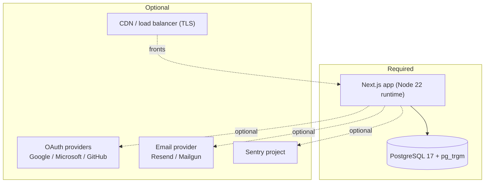
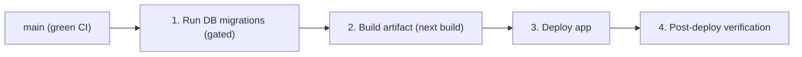

# DevOps Setup

_Audience: DevOps / infrastructure engineers standing the system up from scratch and operating it._

> **Scope note.** The repository defines the **application and its database**, plus a CI pipeline. It does **not** include infrastructure-as-code or a committed production deployment target. Where the hosting platform is a free choice, this guide gives platform-neutral steps and marks decisions as `TODO:`.

---

## 1. What the system needs



| Dependency | Required? | Notes |
| --- | --- | --- |
| **Node.js 22 runtime** | Yes | CI uses Node 22. No `.nvmrc`/`engines` pin yet (`TODO:` add one). |
| **pnpm 10.33.2** | Yes (build) | Pinned via `packageManager`; use Corepack. |
| **PostgreSQL 17** | Yes | Needs the `pg_trgm` extension (text search). The local image also enables `vector` (pgvector); confirm whether production needs it. |
| **TLS termination** | Production | HSTS is sent on every response; terminate TLS at a proxy/CDN/LB. |
| OAuth provider apps | Optional | Only if social login is enabled. |
| Email provider | Optional | Resend or Mailgun; unset = outbox-only. |
| Sentry project | Optional | Error/performance monitoring. |
| Object storage / queue / cache | **None** | The app uses none today. Rate limiting is in-process (see §8). |

> `TODO:` Decide whether the production database image needs `pgvector` (`vector` extension). It's enabled locally via `docker/postgres/init/01-extensions.sql`, but no application code in scope was confirmed to use vector columns. `pg_trgm` **is** required.

## 2. Required accounts / services

| Service | Why | Setup pointer |
| --- | --- | --- |
| PostgreSQL host (managed or self-run) | Primary datastore | A managed Postgres 17 with a pooled connection endpoint is recommended for serverless hosts. |
| Application host | Run the Next.js app | See [Deployment → Hosting model](./deployment.md#4-hosting-model). `TODO:` choose Vercel vs. Node server/container. |
| Git host with Actions (GitHub) | CI pipeline | The pipeline is GitHub Actions (`.github/workflows/ci.yml`). |
| Secrets manager | Inject env at deploy | `TODO:` choose (platform secrets, Vault, etc.). |
| OAuth provider consoles | Social login (optional) | Register redirect URIs `BETTER_AUTH_URL/api/auth/callback/<provider>`. |
| Email provider (optional) | Real email delivery | Resend or Mailgun account + API key. |
| Sentry (optional) | Observability | One project; DSN + (for source maps) org/project/auth-token. |

## 3. Database

1. **Provision PostgreSQL 17** (managed recommended). Create a database and a user.
2. **Enable extensions** the app expects, in the **`public`** schema (kept on the search_path so they resolve from every app schema):
   ```sql
   CREATE EXTENSION IF NOT EXISTS pgcrypto WITH SCHEMA public;  -- gen_random_uuid()
   CREATE EXTENSION IF NOT EXISTS pg_trgm  WITH SCHEMA public;  -- trigram search
   -- vector is enabled locally; enable only if you confirm production needs it
   CREATE EXTENSION IF NOT EXISTS vector   WITH SCHEMA public;
   ```
   Locally these are applied automatically by `docker/postgres/init/01-extensions.sql`. The migrations also run `create extension if not exists … with schema public`, so this step is belt-and-suspenders.
3. **Choose the application schema** (optional). All tables (app + Better Auth) deploy into one schema, **`auth`** by default; override with `DB_SCHEMA`. The schema itself is created automatically by the migrate step — you do **not** create it by hand. Applied at the connection level via `search_path=<DB_SCHEMA>,public`. To isolate a second application, give it a different `DB_SCHEMA`.
4. **Use a pooled endpoint** in `DATABASE_URL` on serverless platforms; tune `PGPOOL_MAX` and the timeouts for your host. Run migrations/seeds/reset against the **direct** (non-pooled) endpoint — a transaction-pooling pooler can drop the session `search_path` (see [Configuration](./configuration.md#database-postgresql) for the `ALTER ROLE … SET search_path` workaround).
5. **Apply schema before serving traffic** (idempotent; creates the `DB_SCHEMA` schema and provisions all tables into it):
   ```bash
   pnpm db:auth:migrate   # Better Auth tables → DB_SCHEMA
   pnpm db:app:migrate    # application schema (0001-initial-schema.sql) → DB_SCHEMA
   ```
6. **Bootstrap the first admin** (one-time):
   ```bash
   pnpm db:seed           # default org + permission catalog + roles + admin user
   ```
   In production, change the seeded admin password immediately and/or supply non-default `SEED_ADMIN_*` values.

See [Configuration → Database](./configuration.md#database-postgresql) and the [Data layer](./architecture.md#5-data-model).

## 4. Environment provisioning

1. Start from [`.env.example`](../.env.example).
2. Provide the **required** set: `BETTER_AUTH_SECRET`, `BETTER_AUTH_URL`, `NEXT_PUBLIC_APP_URL`, `DATABASE_URL`, and (for SSO) `SSO_HANDOFF_ISSUER` / `SSO_HANDOFF_AUDIENCE_PREFIX` / `SSO_HANDOFF_JWT_SECRET` / `SSO_HANDOFF_APPLICATION_ID`.
3. Generate secrets with a CSPRNG; keep `SSO_HANDOFF_JWT_SECRET` **distinct** from `BETTER_AUTH_SECRET`.
4. Enable optional features per environment (email, machine API, social login, Sentry).
5. Inject secrets through your platform's secrets mechanism — never commit `.env`.

Full reference: [Configuration](./configuration.md).

## 5. Build pipeline (CI)

CI is GitHub Actions: **`.github/workflows/ci.yml`**, triggered on `push` and `pull_request`, with in-progress runs cancelled per ref. Runners use **Node 22** and **pnpm 10.33.2**, with a **PostgreSQL service container** (`pgvector/pgvector:pg17`) on port 5444.


| Job | Blocking | Does |
| --- | --- | --- |
| **quality** | yes | typecheck → lint → format check → `next build` → sharded tests with coverage gate → upload coverage artifact |
| **browser** | yes | install Playwright → build → migrate + seed → start server → e2e → accessibility (axe-core) → upload traces on failure |
| **audit** | no | `pnpm audit --audit-level high` (non-blocking backlog) |

See [Testing](./testing.md) and [Deployment → CI/CD](./deployment.md#6-cicd-pipeline).

## 6. Deployment steps (platform-neutral)



1. **Gate on green CI** on `main`.
2. **Run migrations first**, before the new version serves traffic:
   ```bash
   pnpm db:auth:migrate && pnpm db:app:migrate
   ```
   The schema is idempotent and the runner records applied files, so re-running is safe.
3. **Build & deploy** the app (`pnpm build` then `pnpm start`, or your platform's build step). See [Deployment](./deployment.md).
4. **Verify** (see §11 and [Deployment → Post-deploy](./deployment.md#8-post-deployment-verification)).

## 7. Rollback strategy

- **Application:** redeploy the previous known-good build/image. The app is stateless apart from the database, so app rollback is a redeploy.
- **Database:** migrations are additive and idempotent; there are **no down-migrations**. Roll back data via your provider's point-in-time recovery / snapshot, not by reverting schema. Coordinate app and schema versions so an older app can run against the current schema.

> `TODO:` Define the concrete rollback runbook for your chosen host (image tags / deployment history) and your database's PITR window.

## 8. Monitoring & logging

| Signal | Source | Notes |
| --- | --- | --- |
| **Audit trail** | `app_audit_events` table | First-party, durable record of who-did-what; query by `request_id`. |
| **Errors / traces / Web Vitals** | Sentry (opt-in) | Enable via `NEXT_PUBLIC_SENTRY_DSN`; PII scrubbed before send. See [Configuration](./configuration.md). |
| **Request correlation** | `x-request-id` response header | Ties a response to its audit rows and Sentry events. |
| **App logs** | stdout/stderr of the Node process | Captured by your platform's log aggregation. |
| **DB health** | Postgres metrics | Connections, slow queries; the app sets per-statement timeouts. |

**Rate limiting is in-process** (per-actor token bucket). It resets on restart and is **not shared across instances** — acceptable for a single instance, but multi-instance deployments should treat it as best-effort until a shared backend is added.

> `TODO:` If running multiple app instances, plan a shared rate-limit backend (e.g. Redis) — the current store is in-memory per process.

## 9. Backup & restore

- **What to back up:** the PostgreSQL database is the only stateful component. There is no object storage or queue to back up.
- **How:** use the managed provider's automated backups + point-in-time recovery, or scheduled `pg_dump`.
- **Restore test:** periodically restore into a scratch database and run `pnpm db:app:migrate` to confirm the schema applies cleanly.

> `TODO:` Set the backup frequency and retention to meet your RPO/RTO; document the restore runbook.

## 10. Security considerations

- **Secrets:** distinct `BETTER_AUTH_SECRET` and `SSO_HANDOFF_JWT_SECRET`; rotate on a schedule (rotating the auth secret signs users out). Keep `SENTRY_AUTH_TOKEN` build-only.
- **Headers:** static ones (X-Frame-Options DENY, nosniff, HSTS, Permissions-Policy, Reporting-Endpoints) ship from `next.config.mjs`. The CSP is **enforcing** and nonce-based, minted per request in `src/proxy.ts` (`script-src` uses `'nonce-…' 'strict-dynamic'`, no `'unsafe-inline'`/`'unsafe-eval'`); violations still report to `/api/security/csp-report`.
- **Origin/CSRF guard** on admin mutations; **trusted proxy count** for correct client-IP attribution behind a CDN.
- **Machine API** is off by default; enable per environment with a real signing key and least-privilege scopes.
- **TLS everywhere** in production so HSTS is meaningful.
- **Tenant isolation** is enforced centrally and CI-tested; keep the invariant tests in the required checks.

## 11. Production-readiness checklist

- [ ] PostgreSQL 17 provisioned; `pg_trgm` enabled; pooled `DATABASE_URL`.
- [ ] `pnpm db:auth:migrate` and `pnpm db:app:migrate` run successfully against production.
- [ ] First admin bootstrapped; default seed password changed.
- [ ] All **required** env vars set; secrets from a manager, not `.env`.
- [ ] `BETTER_AUTH_SECRET` ≠ `SSO_HANDOFF_JWT_SECRET`; both strong and unique.
- [ ] `BETTER_AUTH_URL` / `NEXT_PUBLIC_APP_URL` match the real public origin.
- [ ] TLS terminated; HSTS verified; `TRUSTED_PROXY_COUNT` matches the proxy depth.
- [ ] Optional features configured intentionally (email, OAuth, machine API, Sentry).
- [ ] CI green on `main`; required checks include the scope/rate-limit invariants and coverage gate.
- [ ] Backups + PITR enabled and a restore tested.
- [ ] Monitoring in place (Sentry and/or platform logs); audit log reachable by ops.
- [ ] Rollback runbook written for the chosen host and DB.
- [ ] `TODO:` items in this doc resolved for your environment.

---

_Next: [Deployment](./deployment.md) for build/artifact/release detail._
