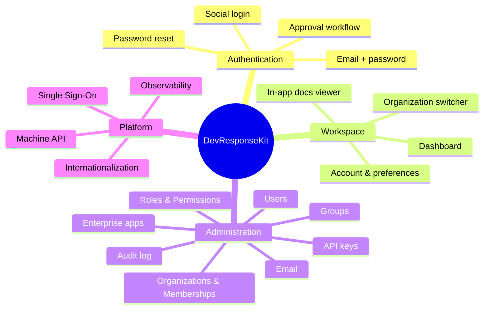

# Features

_Audience: marketing, product, and QA. Plain-English descriptions of what the system does, the flows users follow, and the roles that gate each capability._

> Screenshots are referenced as placeholders (`TODO: Add screenshot …`) because the repository does not ship image captures. Capture them from a running instance (see [Developer Onboarding](./developer-onboarding.md)).

---

## Feature map

---

## 1. Authentication & onboarding

Users sign in with **email and password** or, when configured, with **Google, Microsoft, or GitHub**. The sign-in and sign-up screens, password reset flow, and account-status screens are all built in.

A defining behavior: **authentication is not the same as authorization.** A self-registered user is created in a `pending_approval` state and cannot enter the secure workspace until an administrator approves them. This supports controlled onboarding for enterprise environments.

**Account-status screens**

| Screen | When the user sees it |
| --- | --- |
| Pending approval | Account created but not yet approved by an admin |
| Blocked | Account blocked, suspended, or deactivated |

**User flow — sign up and get approved**
1. User visits `/sign-up` and registers (or signs in with a social provider).
2. The account is created in `pending_approval` and the user lands on the pending-approval screen.
3. An administrator sees the new registration in the admin console and approves it.
4. The user's status becomes `active` and they can enter the workspace.

**User flow — forgot password**
1. User visits `/forgot-password` and submits their email.
2. A reset email is rendered, recorded in the outbox, and (if a provider is configured) sent.
3. The user opens the link, lands on `/reset-password`, and sets a new password.

> `TODO: Add screenshot of the sign-in screen.`
> `TODO: Add screenshot of the pending-approval screen.`

## 2. The secure workspace

After sign-in, users enter a **composable application shell** with a sidebar (permission-filtered), a header with an **organization switcher** and **language switcher**, and a content area.

| Area | Route | What it does |
| --- | --- | --- |
| Dashboard | `/app/dashboard` | Landing area of the secure shell |
| Account overview | `/app/account` | Read-only summary of the user's profile, status, memberships, and roles |
| Profile | `/app/account/profile` | Edit display name and profile details |
| Preferences | `/app/account/preferences` | Language, time zone, and date/number format |
| Security | `/app/account/security` | Change password, view and revoke active sessions |
| Personal API keys | `/app/account/api-keys` | Create, rotate, and revoke the user's own API keys |
| Docs viewer | `/app/docs` | In-app Markdown documentation reader with diagrams and code highlighting |

**User flow — switch active organization**
1. A user who belongs to more than one organization opens the organization switcher in the header.
2. They select an organization; the active organization is remembered and their effective permissions are recalculated for that tenant.

> `TODO: Add screenshot of the secure shell with the organization switcher.`

## 3. Administrator console

The administrator workspace lives at `/app/administrator` and is organized into navigation groups. Each screen and action is gated by a permission, so administrators only see what they're allowed to use. The canonical navigation is defined in `src/app/[locale]/(secure)/app/administrator/_components/administrator-navigation.ts`.

| Nav group | Screen | Purpose | Gating permission |
| --- | --- | --- | --- |
| **Overview** | Home | Metrics (users, orgs, roles, permissions, apps) and recent activity | any `admin.*` |
| **Identity** | Users | List, search, bulk-action, and CSV-export users; create users; per-user detail with sessions, roles, memberships, impersonation | `admin.users.read` (+ create/update/manage/…) |
| **Access** | Roles | Create roles and edit their permissions; see members | `admin.roles.read` (+ create/update/assign) |
| **Access** | Permissions | Browse the permission catalog and the roles that use each permission | `admin.roles.read` (+ `admin.permissions.manage` to extend) |
| **Access** | Groups | Create groups, bundle roles into them, and manage members | `admin.groups.read` (+ create/update/assign) |
| **Tenancy** | Organizations | Create and manage organizations, members, and provider bindings | `admin.orgs.read` (+ create/update/manage) |
| **Tenancy** | Memberships | Browse user↔organization memberships and their roles | `admin.orgs.read` |
| **Apps** | Enterprise Apps | Register and manage applications that participate in SSO | `admin.apps.read` (+ `admin.apps.manage`) |
| **APIs** | API Keys | Issue, rotate, and revoke API keys on behalf of users | `admin.apikeys.read` (+ `admin.apikeys.manage`) |
| **Communication** | Email (Outbox & Templates) | View sent/queued email; edit templates; send a test | `admin.email.read` (+ `admin.email.manage`) |
| **Activity** | Audit Log | Search and filter the audit trail | `admin.audit.read` |

Common console affordances include server-side **pagination**, **search**, per-field **filters**, **bulk actions** (e.g. approve/block/suspend/delete users), and **CSV export**.

> `TODO: Add screenshot of the administrator Users grid.`
> `TODO: Add screenshot of the Role detail (permissions dual-list editor).`
> `TODO:` Confirm which advanced grid affordances (faceted/date-range filters, column visibility, multi-column sort) are shipped vs. planned.

### Selected administrator flows

**Create an organization** _(requires `admin.orgs.create`, Super Admin)_
1. Go to **Tenancy → Organizations** and choose **New organization**.
2. Enter a slug and name; save. The organization is now available and isolated.

**Create a user and approve them** _(requires `admin.users.create` / `admin.users.manage`)_
1. Go to **Identity → Users → New user**, enter email and password, save (status starts `pending_approval`).
2. From the user's detail page (or a bulk action), approve the user → status becomes `active`.

**Create a role and assign permissions** _(requires `admin.roles.create` / `admin.roles.update`)_
1. Go to **Access → Roles → New role**, enter a key and name.
2. Open the role, use the **permissions dual-list editor** to add permissions, and save.

**Create a group and bundle roles** _(requires `admin.groups.create` / `admin.groups.assign`)_
1. Go to **Access → Groups → New group**. A Super Admin chooses the target organization via a searchable combobox; an org admin's group is created in their own organization automatically.
2. Open the group, add roles on the **Roles** tab, and add users on the **Members** tab. Members inherit the group's roles.

**Issue an API key for a user** _(requires `admin.apikeys.manage`)_
1. Go to **APIs → API Keys → New API key**, select the owner and the scopes.
2. The secret is shown **once** — copy it immediately. The key's scopes can never exceed the owner's own permissions.

## 4. Single Sign-On (cross-subdomain)

Connected applications on different subdomains can share one sign-in. After signing in to the hub, a user is handed a **short-lived, single-use token** that the destination application exchanges for its own session — no shared cookies, and the token is valid for at most ~60 seconds and only once.

**User flow — SSO into a connected app**
1. A signed-in user navigates to (or is redirected to) the SSO launch endpoint for a registered application.
2. The system verifies the user's access to that application and issues a one-time handoff token.
3. The destination application validates the token and establishes the user's session there.

Administrators register participating applications under **Apps → Enterprise Apps**, including the allowed destination origin. See [Architecture](./architecture.md#single-sign-on-handoff) and [Configuration](./configuration.md) for the security model.

## 5. Machine API

A versioned REST API under `/api/v1` lets other systems integrate. Callers authenticate with an **API key** or a **short-lived bearer token** and receive exactly the access their credential's **scopes** allow. Both credential types are **disabled by default** and enabled per environment. See the [API Reference](./api.md).

## 6. Internationalization

The entire UI is available in **English (`en`)**, **French (`fr`)**, **Spanish (`es`)**, and **Ukrainian (`uk`)**. The active language is part of the URL (e.g. `/en/...`, `/uk/...`), users can switch via the language switcher, and their preference is remembered. Translation completeness is enforced by a test that requires every text key to exist in all four languages.

## 7. Email

Outbound email is **outbox-first**: every message is rendered and recorded before any delivery attempt, so administrators can always see what was (or would have been) sent. With no email provider configured, messages are recorded as `logged` and not actually sent — ideal for development. Supported providers are **Resend** and **Mailgun**. Templates are editable in the admin console.

## 8. Audit & accountability

Every significant action (create, update, delete, status change, sign-in events, etc.) is written to a durable **audit log** with the actor, target, organization, outcome, and a request-correlation id. Administrators browse it under **Activity → Audit Log**.

## 9. Security & observability

- **Browser security headers** (clickjacking protection, content-type sniffing protection, HSTS, a report-only Content-Security-Policy, and more) ship on every response.
- **Session controls** let users and admins view and revoke active sessions.
- **Optional error & performance monitoring** via Sentry, with personal data scrubbed before anything leaves the server. Disabled unless explicitly configured.

---

## Roles & permissions reference

DevResponseKit uses a **three-tier** model. See [Architecture → Authorization](./architecture.md#authorization-the-three-tier-model) for the enforcement details.

| Tier | Who | Scope |
| --- | --- | --- |
| **Super Admin** | Holds the `superuser` marker | All organizations; can manage global configuration |
| **Organization Admin** | Holds `admin.*` permissions (no `superuser`) | A single organization |
| **User** | No `admin.*` permissions | Themselves only |

The permission catalog contains **35** `admin.*` permission keys grouped by domain (users, roles, groups, organizations, permissions, enterprise apps, API keys, OAuth clients, audit, email), plus the `superuser` marker and the `shell.view` / `audit.view` user-level markers. The full enumerated list is in [API Reference → Permission catalog](./api.md#5-permission-catalog).

---

_Next: [Architecture](./architecture.md) for how these features are implemented._
