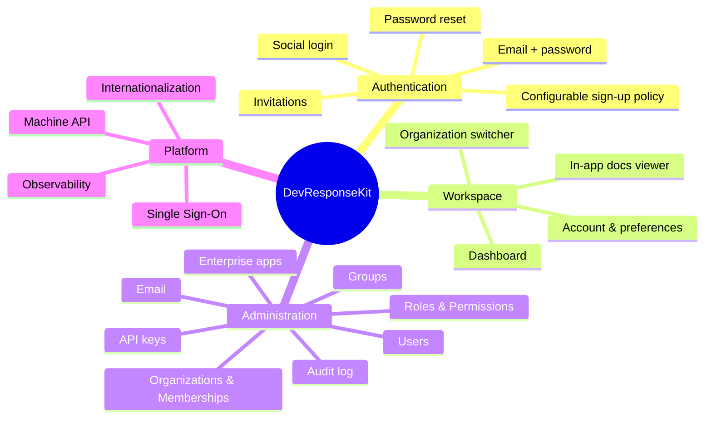
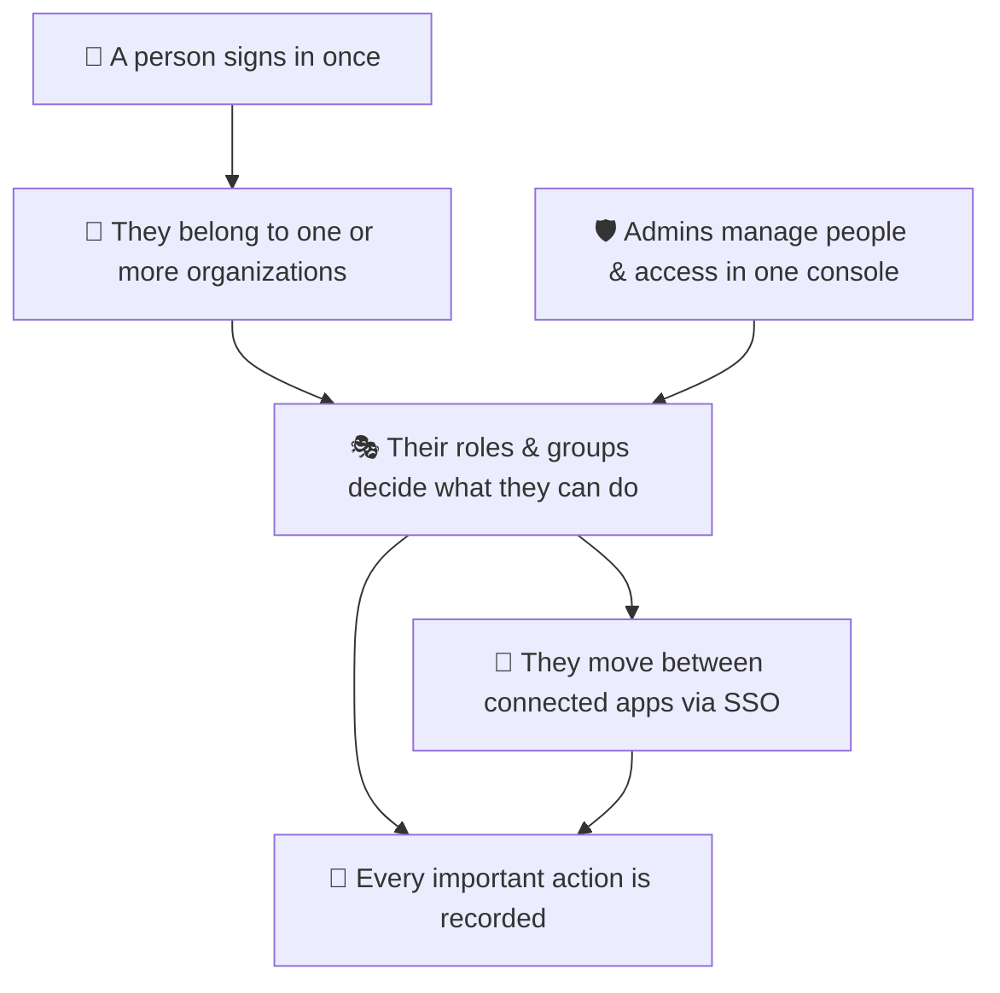

# Product Overview

_Audience: marketing, sales, product, and business stakeholders. No engineering background required. This is the single marketing-facing overview — it covers what the product is, who it's for, the plain-English feature catalog, how it stands apart, and ready-to-use promotional copy._

---

## What it is

**DevResponseKit** is a production-grade, security-first **enterprise application shell** — the assembled, tested foundation that B2B software teams build their product on top of. Instead of spending the first months of a project rebuilding the same "boring but critical" plumbing (sign-in, organizations, roles and permissions, an admin console, single sign-on, an API for integrations, audit logs, multi-language support), teams start with all of it already in place and focus on the features that make their product unique.

The running application presents itself as the **"DevResponse Enterprise Platform"** — a secure, multi-tenant workspace with a polished administrator console, built on Next.js 16, Better Auth, and PostgreSQL.

## The core value proposition

> **Clerk/WorkOS-class identity — organizations, role-based access control, SSO, API keys, and audit — that you own and self-host, wrapped in a tested admin console and multi-app shell.**

Three ideas drive the product:

1. **Own your identity layer.** Authentication and access control run on self-hosted open-source foundations, so there is no per-user pricing meter and no vendor lock-in on the most sensitive part of your stack.
2. **Multi-tenant isolation that is enforced, not assumed.** Every tenant's data is walled off by a single, central access model — and that model is checked automatically by the test suite, so isolation cannot silently erode as the codebase grows.
3. **Enterprise expectations, day one.** The things enterprise buyers ask for in security reviews — audit trails, SSO, granular permissions, session controls, an admin console — are present from the first commit, not bolted on later.

## Who it's for

| Audience | Why it fits |
| --- | --- |
| **Enterprise platform teams** | Need RBAC, audit, SSO, and an admin console for internal or customer-facing platforms, often under compliance pressure. |
| **Security- & compliance-sensitive teams** | Must be able to *demonstrate* tenant isolation and access control, not just claim it. |
| **B2B SaaS founders** | Want organizations, roles, and an admin console without paying per-seat identity-vendor pricing. |
| **Agencies & system integrators** | Need an ownable, extensible foundation they can tailor per client. |
| **Internal-tools / multi-app organizations** | Want users to move seamlessly between several related applications with one sign-in. |

### Use cases

- **Internal enterprise platform** — a company-wide tool suite where employees in different departments need different access, with SSO between the tools and a full audit trail.
- **B2B SaaS product** — customers are organizations; each has its own admins, members, roles, and isolated data.
- **Compliance-driven deployment** — regulated environments that require audit logging, controlled access, and the ability to demonstrate isolation.
- **Multi-app portfolio** — a hub plus several satellite applications that share one identity and let users move between them seamlessly.

---

## Feature catalog

A plain-English tour of what the product does. Each capability is described once here. For the technical implementation, see [Architecture](./architecture.md).

### Authentication & onboarding

Users sign in with **email and password** or, when configured, with **Google, Microsoft, or GitHub**. The sign-in and sign-up screens, password-reset flow, and account-status screens are all built in.

A defining behavior: **authentication is not the same as authorization**, and onboarding is **configurable per organization**. Under the platform default, a self-registered user is created in a `pending_approval` state and cannot enter the secure workspace until an administrator approves them. Each organization can instead run its own sign-up policy — instant activation, invitation-only, or auto-approval of verified email domains — and toggle whether email verification is required. Accounts that are blocked, suspended, or deactivated see a dedicated status screen.

**Sign up and get approved:** a user registers at `/sign-up` (or via a social provider); under the default policy they first confirm their address on the verify-email screen, then land on the pending-approval screen until an administrator approves the registration and their status becomes `active`.

**Get invited:** an administrator invites an email address into an organization; the invitee opens the emailed link at `/invite`, creates an account (or signs in), and joins the inviting organization **active** — no separate approval step.

**Forgot password:** a user submits their email at `/forgot-password`; a reset email is rendered, recorded in the outbox, and (if a provider is configured) sent; the user opens the link and sets a new password.

### The secure workspace

After sign-in, users enter a **composable application shell** with a permission-filtered sidebar, a header with an **organization switcher** and **language switcher**, and a content area. Users who belong to more than one organization can switch the active organization; their effective permissions are recalculated for that tenant and the choice is remembered.

The workspace includes a **dashboard**, a read-only **account overview** (profile, status, memberships, roles), an editable **profile**, **preferences** (language, time zone, date/number format), a **security** screen (change password, view and revoke active sessions), **personal API keys**, and an **in-app docs viewer** that renders Markdown with diagrams and code highlighting.

### Administrator console

The administrator workspace is organized into navigation groups. Every screen and action is gated by a permission, so administrators only see what they're allowed to use.

| Nav group | Screen | Purpose |
| --- | --- | --- |
| **Overview** | Home | Metrics (users, orgs, roles, permissions, apps) and recent activity |
| **Identity** | Users | List, search, bulk-action, and CSV-export users; create users; per-user detail with sessions, roles, memberships, and impersonation |
| **Access** | Roles | Create roles and edit their permissions; see members |
| **Access** | Permissions | Browse the permission catalog and the roles that use each permission |
| **Access** | Groups | Create groups, bundle roles into them, and manage members |
| **Tenancy** | Organizations | Create and manage organizations, members, invitations, provider bindings, and the per-organization sign-up/authentication policy |
| **Tenancy** | Memberships | Browse user↔organization memberships and their roles |
| **Apps** | Enterprise Apps | Register and manage applications that participate in SSO |
| **APIs** | API Keys | Issue, rotate, and revoke API keys on behalf of users |
| **Communication** | Email (Outbox & Templates) | View sent/queued email; edit templates; send a test |
| **Activity** | Audit Log | Search and filter the audit trail |

Common console affordances include server-side **pagination**, **search**, per-field **filters**, **bulk actions** (e.g. approve/block/suspend/delete users), and **CSV export**.

**Selected administrator flows:**

- **Create an organization** (Super Admin) — enter a slug and name; the organization is immediately available and isolated.
- **Create a user and approve them** — create with email and password (status starts `pending_approval`), then approve from the user's detail page or a bulk action.
- **Invite a user into an organization** — from the organization's **Members** tab, enter an email and optional role; the invitee gets a single-use link and joins active on acceptance. Resend rotates the link; revoke cancels it.
- **Set an organization's sign-up policy** — on the organization's **Authentication** tab, choose admin approval, instant activation, or invite-only; toggle email verification; and list auto-approved email domains. Superadmins edit the platform default from the Organizations page.
- **Create a role and assign permissions** — name the role, then use the **permissions dual-list editor** to add permissions.
- **Create a group and bundle roles** — a Super Admin chooses the target organization; an org admin's group is created in their own organization automatically. Add roles on the **Roles** tab and users on the **Members** tab; members inherit the group's roles.
- **Issue an API key for a user** — select the owner and the scopes. The secret is shown **once** — copy it immediately. A key's scopes can never exceed the owner's own permissions.

### Single Sign-On (cross-subdomain)

Connected applications on different subdomains can share one sign-in. After signing in to the hub, a user is handed a **short-lived, single-use token** (valid for at most ~60 seconds and only once) that the destination application exchanges for its own session — no shared cookies. The system verifies the user's access to the target application before issuing the token, and the destination validates it before establishing the session. Administrators register participating applications under **Apps → Enterprise Apps**, including the allowed destination origin. See [Architecture → Single Sign-On handoff](./architecture.md#single-sign-on-handoff).

### Machine API

A versioned REST API under `/api/v1` lets other systems integrate. Callers authenticate with an **API key** or a **short-lived bearer token** and receive exactly the access their credential's **scopes** allow — never more than the owner who created them. Both credential types are **disabled by default** and enabled per environment. See the [API Reference](./api.md).

### Internationalization

The entire experience ships in **English (`en`)**, **French (`fr`)**, **Spanish (`es`)**, **Ukrainian (`uk`)**, **Portuguese (`pt`)**, **Simplified Chinese (`zh`)**, **Hindi (`hi`)**, and **Japanese (`ja`)** — eight locales in total. The active language is part of the URL (e.g. `/en/...`, `/ja/...`), users can switch via the language switcher, and their preference is remembered. Translation completeness is enforced by a test that requires every text key to exist in all eight languages.

### Email

Outbound email is **outbox-first**: every message is rendered and recorded before any delivery attempt, so administrators can always see what was (or would have been) sent. With no provider configured, messages are recorded as `logged` and not actually sent — ideal for development. Supported providers are **Resend** and **Mailgun**. Templates are editable in the admin console.

### Audit & accountability

Every significant action (create, update, delete, status change, sign-in events, and more) is written to a durable **audit log** with the actor, target, organization, outcome, and a request-correlation id. Administrators browse it under **Activity → Audit Log**.

### Security & observability

- **Browser security headers** — clickjacking protection, content-type-sniffing protection, HSTS, and an enforcing nonce-based Content-Security-Policy — ship on every response.
- **Session controls** let users and admins view and revoke active sessions.
- **Optional error & performance monitoring** via Sentry, with personal data scrubbed before anything leaves the server. Disabled unless explicitly configured.

---

## Roles & permissions

DevResponseKit uses a **three-tier** access model. See [Architecture → Authorization](./architecture.md#authorization-the-three-tier-model) for enforcement details.

| Tier | Who | Scope |
| --- | --- | --- |
| **Super Admin** | Holds the `superuser` marker | All organizations; can manage global configuration |
| **Organization Admin** | Holds `admin.*` permissions (no `superuser`) | A single organization |
| **User** | No `admin.*` permissions | Themselves only |

The permission catalog contains **35** `admin.*` permission keys grouped by domain (users, roles, groups, organizations, permissions, enterprise apps, API keys, OAuth clients, audit, email). **Groups bundle roles, never raw permissions**, and are always scoped to a single organization — so a group is simply a convenient way to assign existing roles to many people at once, never a new source of authority. The full enumerated list lives in the [API Reference → Permission catalog](./admin-manager.md#61-permission-catalog).

## How it fits together (non-technical)

- A person **signs in once**.
- They belong to one or more **organizations** (tenants).
- Their **roles and groups** determine what they can see and do.
- They can move between **connected applications** without signing in again.
- **Administrators** manage people and access from a single console.
- **Every significant action** is recorded for accountability.

---

## Differentiators & business benefits

What sets DevResponseKit apart from a generic starter template or a hosted identity vendor:

1. **Verifiable tenant isolation** — access rules live in one place and are enforced by an automated test that fails the build if a new feature forgets to scope itself to a tenant.
2. **A real admin console, included** — a broad set of management screens with search, pagination, bulk actions, and CSV export, not a thin starter stub.
3. **Permissions as data** — the permission catalog is defined once and shared between setup and runtime, so it cannot drift out of sync.
4. **Scoped machine API** — integration credentials can never grant more access than the person who created them.
5. **Cross-subdomain SSO done safely** — single-use, short-lived handoff tokens with an allow-list of trusted destinations.
6. **Self-hosted, zero marginal identity cost** — the authentication layer is open-source and runs on your own infrastructure.

What that means for the business:

| Benefit | What it delivers |
| --- | --- |
| **Faster time-to-market** | The undifferentiated foundation is already built and tested — teams ship product features sooner. |
| **Lower identity cost at scale** | Self-hosted authentication avoids per-seat/per-MAU vendor fees that grow with success. |
| **Smoother enterprise sales** | Audit logs, SSO, and granular permissions answer security-review questions that otherwise stall deals. |
| **Reduced risk** | Tenant isolation is centrally enforced and continuously tested, lowering the chance of a cross-tenant data incident. |
| **Full ownership** | You control the code, the data, and the deployment — no lock-in on the identity layer. |

> The positioning above intentionally names no specific competitors or benchmarks beyond the product class. The public landing page (`src/app/[locale]/(public)/page.tsx`) leans on these same value propositions — keep the two aligned.

---

## Suggested promotional copy

**One-liner**
> Ship your B2B platform on a foundation that already handles identity, access, and administration — self-hosted, multi-tenant, and enterprise-ready from day one.

**Short paragraph**
> DevResponseKit gives your team the enterprise plumbing that usually takes months to build: multi-tenant organizations, role-based access control, an administrator console, single sign-on, a secure integration API, and audit logging — assembled, tested, and documented. Own your identity layer, isolate every tenant by design, and spend your engineering time on the product, not the plumbing.

**Three-bullet pitch**
> - **Enterprise-ready foundation** — organizations, RBAC, admin console, SSO, API, and audit out of the box.
> - **Tenant isolation you can prove** — access rules are centralized and continuously tested.
> - **Yours to own** — self-hosted authentication with no per-seat pricing and no lock-in.

### Website / landing-page copy

**Hero headline**
> The enterprise foundation for multi-tenant B2B platforms.

**Hero sub-headline**
> Organizations, roles & permissions, SSO, a versioned API, audit logs, and a full admin console — assembled, tested, and yours to self-host.

**Section: "Stop rebuilding the boring parts"**
> Every B2B product needs the same identity and administration layer. DevResponseKit ships it for you — so your first sprint is about your product, not your plumbing.

**Section: "Isolation by design"**
> Multi-tenancy is only safe if it's enforced. DevResponseKit centralizes every access decision and backs it with an automated test that fails the build the moment a feature forgets to scope itself.

**Section: "Own your identity layer"**
> Self-hosted authentication means no per-user meter and no vendor holding your most sensitive data. Scale to thousands of users without your identity bill scaling with you.

**Primary call-to-action**
> Clone the repo and run it locally in minutes.

> `TODO:` Confirm the public marketing domain, brand voice, and any approved tagline before publishing this copy. `TODO:` Replace illustrative cost claims with figures approved by the business.

### Sales / demo talking points

1. **Open the admin console.** Show users, roles, permissions, and groups — "this is the access model your security team will ask about, and it's already here."
2. **Create an organization and a user.** Demonstrate that a new tenant is fully isolated and that a new user starts in a controlled, pending state until approved (the default policy — organizations can also auto-activate, go invite-only, or invite users in directly).
3. **Build a role and a group.** Show how permissions compose into roles, roles bundle into groups, and groups assign access to many people at once.
4. **Trigger an SSO handoff.** Sign in once and move to a connected app without re-authenticating.
5. **Open the audit log.** "Every action you just saw is recorded — who, what, when, and the outcome."
6. **Show the API.** Mint a scoped API key and call the versioned API — "integrations get exactly the access you grant, never more."
7. **Switch languages.** Flip the UI to French or Ukrainian to show built-in internationalization.

---

_Next: [Architecture](./architecture.md) for how these features are implemented, or the [documentation index](./README.md) for the full set._
