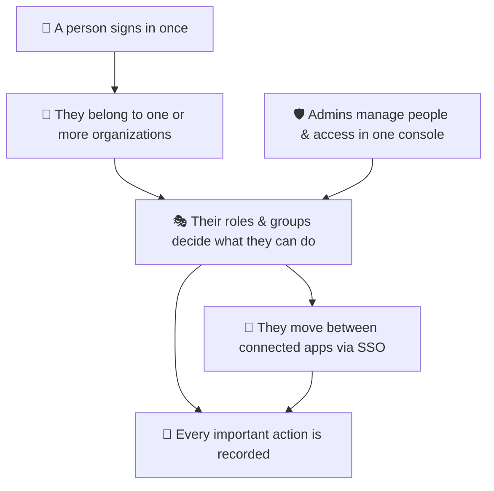

# Product Overview

_Audience: marketing, sales, and business stakeholders. No engineering background required._

---

## What it is

**DevResponseKit** is an **enterprise application shell** — the assembled, tested foundation that B2B software teams build their product on top of. Instead of spending the first months of a project rebuilding the same "boring but critical" plumbing (sign-in, organizations, roles and permissions, an admin console, single sign-on, an API for integrations, audit logs, multi-language support), teams start with all of it already in place and focus on the features that make their product unique.

The running application presents itself as the **"DevResponse Enterprise Platform"** — a secure, multi-tenant workspace with a polished administrator console.

## The core value proposition

> **Clerk/WorkOS-class identity — organizations, role-based access control, SSO, API keys, and audit — that you own and self-host, wrapped in a tested admin console and multi-app shell.**

Three ideas drive the product:

1. **Own your identity layer.** Authentication and access control run on self-hosted open-source foundations, so there is no per-user pricing meter and no vendor lock-in on the most sensitive part of your stack.
2. **Multi-tenant isolation that is enforced, not assumed.** Every tenant's data is walled off by a single, central access model — and that model is checked automatically by the test suite, so isolation cannot silently erode as the codebase grows.
3. **Enterprise expectations, day one.** The things enterprise buyers ask for in security reviews — audit trails, SSO, granular permissions, session controls, an admin console — are present from the first commit, not bolted on later.

## Who it's for

| Audience | Why it fits |
| --- | --- |
| **Enterprise platform teams** | Need RBAC, audit, SSO, and an admin console for internal or customer-facing platforms, often under compliance pressure. |
| **Security- & compliance-sensitive teams** | Must be able to *demonstrate* tenant isolation and access control, not just claim it. |
| **B2B SaaS founders** | Want organizations, roles, and an admin console without paying per-seat identity-vendor pricing. |
| **Agencies & system integrators** | Need an ownable, extensible foundation they can tailor per client. |
| **Internal-tools / multi-app organizations** | Want users to move seamlessly between several related applications with one sign-in. |

## Key features

- **Multi-tenant organizations** — users belong to organizations; data and administration are scoped per tenant.
- **Three-tier access control** — Platform Super Admin, Organization Admin, and User, with a fine-grained permission catalog.
- **Groups** — bundle roles and assign them to many users at once within an organization.
- **Administrator console** — manage users, roles, permissions, groups, organizations, memberships, enterprise apps, API keys, email, and audit logs from one workspace.
- **Single Sign-On across applications** — sign in once and move between related apps on different subdomains.
- **Machine API** — a versioned REST API with API keys and short-lived tokens so other systems can integrate securely.
- **Audit logging** — a durable record of who did what, when, and with what outcome.
- **Internationalization** — the entire experience ships in English, French, Spanish, Ukrainian, Portuguese, Simplified Chinese, Hindi, and Japanese.
- **Transactional email** — password resets and notifications, with an in-app outbox showing every message.
- **Security hardening out of the box** — modern browser security headers, session controls, and optional error/performance monitoring.

See the [Features](./features.md) document for a plain-English breakdown of each.

## Business benefits

| Benefit | What it means for the business |
| --- | --- |
| **Faster time-to-market** | The undifferentiated foundation is already built and tested — teams ship product features sooner. |
| **Lower identity cost at scale** | Self-hosted authentication avoids per-seat/per-MAU vendor fees that grow with success. |
| **Smoother enterprise sales** | Audit logs, SSO, and granular permissions answer security-review questions that otherwise stall deals. |
| **Reduced risk** | Tenant isolation is centrally enforced and continuously tested, lowering the chance of a cross-tenant data incident. |
| **Full ownership** | You control the code, the data, and the deployment — no lock-in on the identity layer. |

## Differentiators

1. **Verifiable tenant isolation** — access rules live in one place and are enforced by an automated test that fails the build if a new feature forgets to scope itself to a tenant.
2. **A real admin console, included** — a broad set of management screens with search, pagination, bulk actions, and CSV export, not a thin starter stub.
3. **Permissions as data** — the permission catalog is defined once and shared between setup and runtime, so it cannot drift out of sync.
4. **Scoped machine API** — integration credentials can never grant more access than the person who created them.
5. **Cross-subdomain SSO done safely** — single-use, short-lived handoff tokens with an allow-list of trusted destinations.
6. **Self-hosted, zero marginal identity cost** — the authentication layer is open-source and runs on your own infrastructure.

## Use cases

- **Internal enterprise platform** — a company-wide tool suite where employees in different departments need different access, with SSO between the tools and a full audit trail.
- **B2B SaaS product** — customers are organizations; each has its own admins, members, roles, and isolated data.
- **Compliance-driven deployment** — regulated environments that require audit logging, controlled access, and the ability to demonstrate isolation.
- **Multi-app portfolio** — a hub plus several satellite applications that share one identity and let users move between them seamlessly.

## How it fits together (non-technical)

- A person **signs in once**.
- They belong to one or more **organizations** (tenants).
- Their **roles and groups** determine what they can see and do.
- They can move between **connected applications** without signing in again.
- **Administrators** manage people and access from a single console.
- **Every significant action** is recorded for accountability.

---

## Suggested promotional language

**One-liner**
> Ship your B2B platform on a foundation that already handles identity, access, and administration — self-hosted, multi-tenant, and enterprise-ready from day one.

**Short paragraph**
> DevResponseKit gives your team the enterprise plumbing that usually takes months to build: multi-tenant organizations, role-based access control, an administrator console, single sign-on, a secure integration API, and audit logging — assembled, tested, and documented. Own your identity layer, isolate every tenant by design, and spend your engineering time on the product, not the plumbing.

**Three-bullet pitch**
> - **Enterprise-ready foundation** — organizations, RBAC, admin console, SSO, API, and audit out of the box.
> - **Tenant isolation you can prove** — access rules are centralized and continuously tested.
> - **Yours to own** — self-hosted authentication with no per-seat pricing and no lock-in.

## Suggested website / landing-page copy

**Hero headline**
> The enterprise foundation for multi-tenant B2B platforms.

**Hero sub-headline**
> Organizations, roles & permissions, SSO, a versioned API, audit logs, and a full admin console — assembled, tested, and yours to self-host.

**Section: "Stop rebuilding the boring parts"**
> Every B2B product needs the same identity and administration layer. DevResponseKit ships it for you — so your first sprint is about your product, not your plumbing.

**Section: "Isolation by design"**
> Multi-tenancy is only safe if it's enforced. DevResponseKit centralizes every access decision and backs it with an automated test that fails the build the moment a feature forgets to scope itself.

**Section: "Own your identity layer"**
> Self-hosted authentication means no per-user meter and no vendor holding your most sensitive data. Scale to thousands of users without your identity bill scaling with you.

**Primary call-to-action**
> Clone the repo and run it locally in minutes.

> `TODO:` Confirm the public marketing domain, brand voice, and any approved tagline before publishing this copy. `TODO:` Replace illustrative cost claims with figures approved by the business.

## Suggested sales / demo talking points

1. **Open the admin console.** Show users, roles, permissions, and groups — "this is the access model your security team will ask about, and it's already here."
2. **Create an organization and a user.** Demonstrate that a new tenant is fully isolated and that a new user starts in a controlled, pending state until approved.
3. **Build a role and a group.** Show how permissions compose into roles, roles bundle into groups, and groups assign access to many people at once.
4. **Trigger an SSO handoff.** Sign in once and move to a connected app without re-authenticating.
5. **Open the audit log.** "Every action you just saw is recorded — who, what, when, and the outcome."
6. **Show the API.** Mint a scoped API key and call the versioned API — "integrations get exactly the access you grant, never more."
7. **Switch languages.** Flip the UI to French or Ukrainian to show built-in internationalization.

---

_Next: see [Features](./features.md) for the detailed, plain-English feature catalog._
