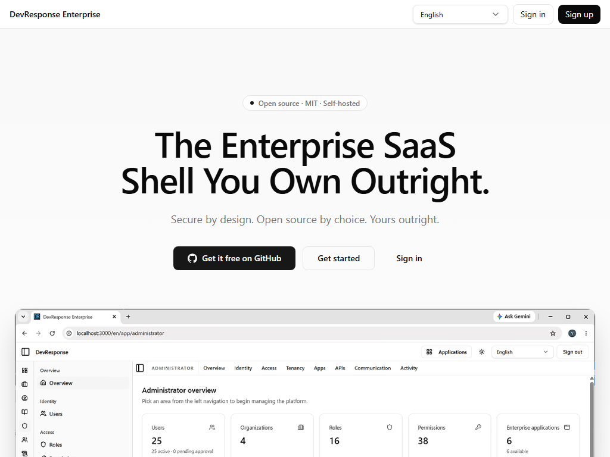
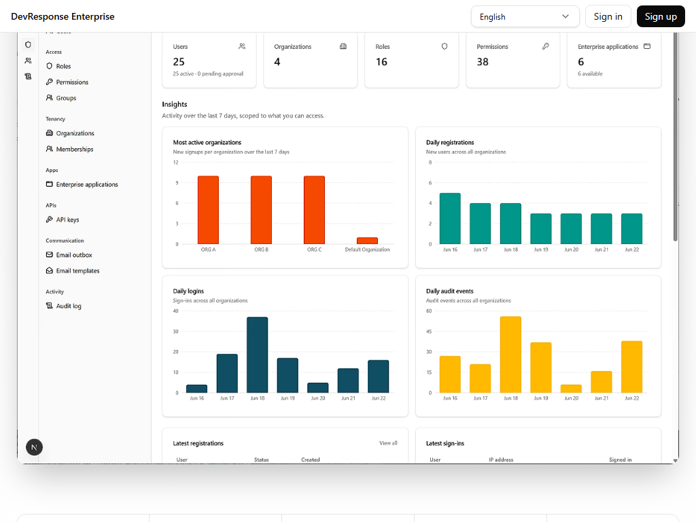
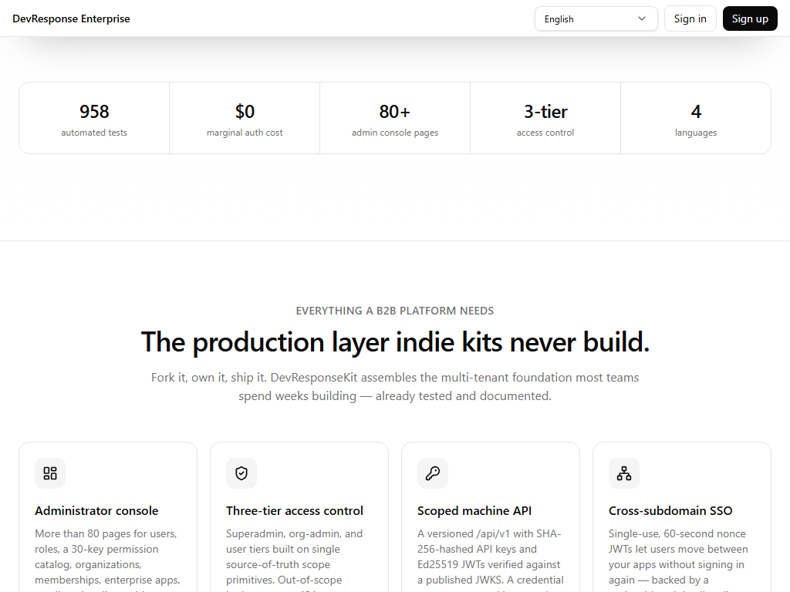
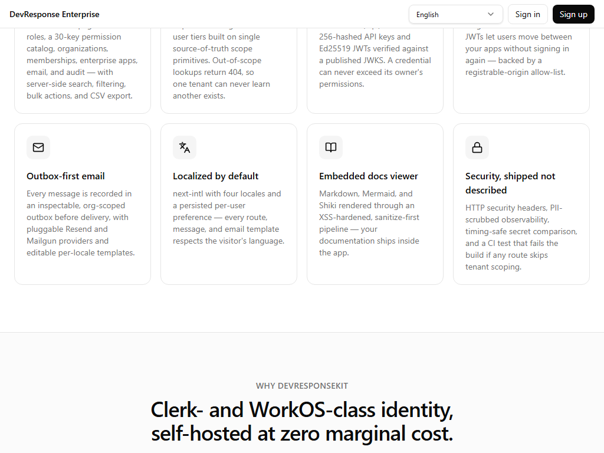

# Public landing page

## Purpose
The unauthenticated marketing front door of the deployment. It pitches DevResponseKit ("The Enterprise SaaS Shell You Own Outright") to prospective adopters and funnels visitors to sign-in, sign-up, or the GitHub repository.

## Key elements
- Brand bar: product name, language switcher, **Sign in** / **Sign up** buttons.
- Hero with tagline, GitHub call-to-action, and a product screenshot of the admin console.
- Stats band: 958 automated tests, zero marginal auth cost, 80+ admin console pages, 3-tier access control, multiple languages.
- Feature grid: administrator console, three-tier access control, scoped machine API, cross-subdomain SSO, outbox-first email, localization, embedded docs viewer, security features.
- "Why DevResponseKit" section (self-hosted identity, verifiable multi-tenant isolation, code/data ownership, test coverage).
- Tech-stack list (Next.js 16, React 19, TypeScript 5.9, PostgreSQL + Kysely, Better Auth, next-intl, Tailwind CSS 4, Vitest/Playwright/axe) and a closing CTA with footer.

## Actions available
- **Sign in** / **Sign up** → auth screens.
- **Get it free on GitHub** → external repository (github.com/devresponse/devresponsekit).
- Language switcher: re-renders the page in the selected locale.

## Navigation
- Reached from: direct visit to the site root (redirects to `/en`).
- Leads to: `/en/sign-in`, `/en/sign-up`, GitHub.

## Access
Public — no session required.

## Observations
Long single-scroll page (four viewport heights at 1024×768). Skip-links are present for accessibility.
