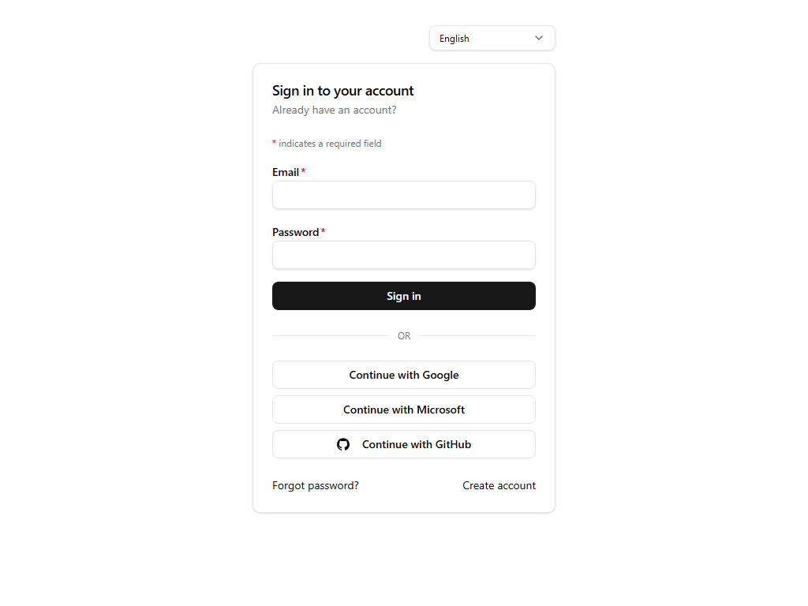

# Sign in

## Purpose
Authenticates existing users with email/password or a social identity provider.

## Key elements
- Email and password fields (both required, with a "* indicates a required field" legend).
- Primary **Sign in** submit button.
- Social sign-in: **Continue with Google**, **Continue with Microsoft**, **Continue with GitHub**.
- **Forgot password?** and **Create account** links.
- Standalone language switcher (the page renders outside the app shell).

## Actions available
- Submit credentials → on success redirects into the app shell (`/en/app/dashboard`).
- Social buttons → OAuth flow with the chosen provider.
- Links → `/en/forgot-password`, `/en/sign-up`.

## Navigation
- Reached from: landing page, sign-up page, or any expired-session redirect.
- Leads to: `/en/app/dashboard` on success.

## Access
Public — this is the entry point for authentication.

## Observations
Whether a freshly registered account can sign in immediately depends on the organization's sign-up policy (email verification and approval mode are configured in the admin console under Organizations).
