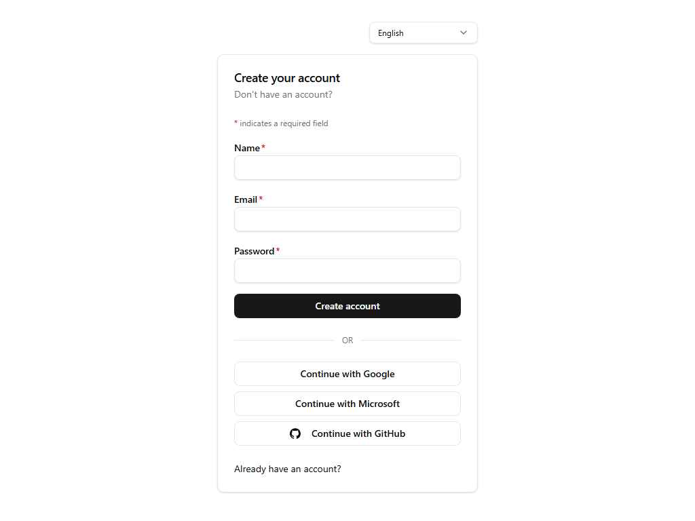

# Sign up

## Purpose
Self-service account registration with email/password or a social provider.

## Key elements
- Name, Email, Password fields (all required).
- **Create account** submit button.
- Social sign-up: Google, Microsoft, GitHub.
- **Already have an account?** link back to sign-in.
- Language switcher.

## Actions available
- Submit the form → creates the account; what happens next (immediate access, email verification, administrator approval, or invitation requirement) is governed by the platform/organization sign-up policy.
- Social buttons → provider OAuth flow.

## Navigation
- Reached from: landing page or sign-in page.
- Leads to: verification / pending-approval notice or the app shell, depending on policy.

## Access
Public.

## Observations
The sign-up policy that controls activation is visible (and editable) on the admin **Organizations** page as "Platform sign-up defaults" — see [38-admin-organizations](38-admin-organizations.md).
