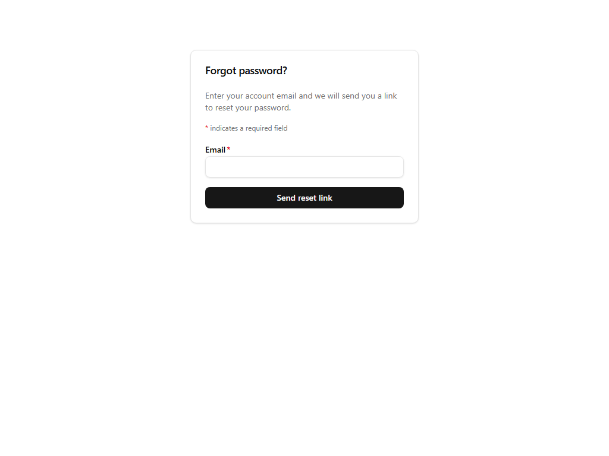

# Forgot password

## Purpose
Starts the password-reset flow by emailing a reset link to the account address.

## Key elements
- Single required Email field with explanatory copy ("Enter your account email and we will send you a link to reset your password.").
- **Send reset link** submit button.

## Actions available
- Submit → sends a reset email (recorded in the platform's email outbox before delivery).

## Navigation
- Reached from: the "Forgot password?" link on sign-in.
- Leads to: the emailed link opens the reset-password screen (token-gated; not capturable without a live token).

## Access
Public.

## Observations
The token-gated `/reset-password` companion screen is intentionally not part of this walkthrough because it requires a valid emailed token.
