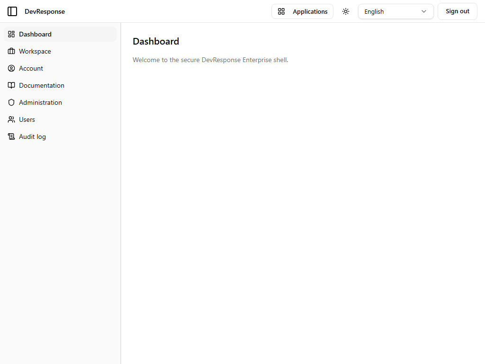

# Dashboard

## Purpose
The default screen after signing in — a minimal home inside the authenticated app shell. Its main job on this demo is to present the shell chrome around a welcome message.

## Key elements
- Brand bar: sidebar toggle, **Applications** switcher (opens a menu of the enterprise applications: Portal, Analytics, Documentation), theme toggle (light/dark), language switcher, **Sign out**.
- Primary sidebar: Dashboard, Workspace, Account, Documentation, Administration, Users, Audit log. The sidebar is served by a navigation API and only shows entries the current user's permissions allow.
- Main region: "Dashboard — Welcome to the secure DevResponse Enterprise shell."

## Actions available
- All shell-level controls (app switcher, theme, language, sign out).
- Sidebar navigation to every other authenticated area.

## Navigation
- Reached from: successful sign-in (default redirect) or the sidebar.
- Leads to: every app and admin area via the sidebar.

## Access
Any signed-in active member (`shell.view`). The Administration/Users/Audit entries only appear for users holding the matching admin permissions.

## Observations
Content is intentionally sparse — the value of the shell is the chrome (navigation, switcher, theming, localization), not this page.
