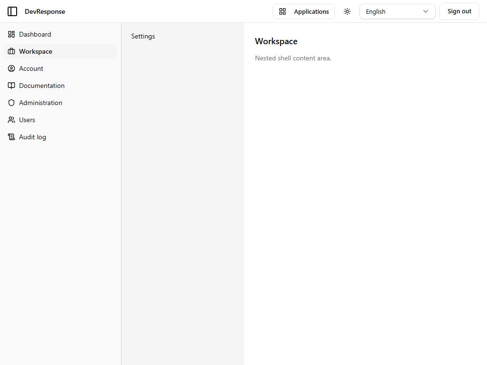

# Workspace

## Purpose
Demonstrates the nested-shell pattern: a section that carries its own secondary sidebar inside the primary application shell. In a real deployment this is where product features would live.

## Key elements
- Primary sidebar (unchanged) plus a nested "Workspace" sidebar containing a placeholder **Settings** entry (not a link on the demo).
- Main region: "Workspace — Nested shell content area."

## Actions available
- None beyond shell navigation; the nested Settings item is inert placeholder content.

## Navigation
- Reached from: primary sidebar → Workspace.
- Leads to: nowhere further (placeholder section).

## Access
Any signed-in active member (`shell.view`).

## Observations
`/en/app/workspace/settings` returns a 404 — the nested nav item is a visual placeholder only.
