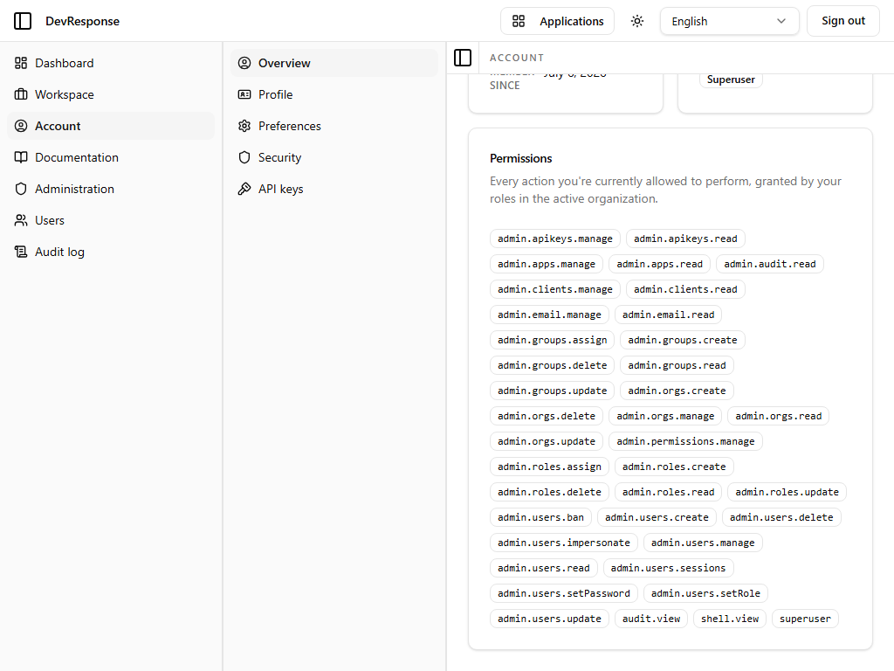

# Account · Overview

## Purpose
A read-only summary of the signed-in user's identity, organization memberships, roles, and the exact permission set those roles grant in the active organization.

## Key elements
- Account sub-navigation: Overview, Profile, Preferences, Security, API keys.
- **Identity** card: display name, email, status (Active), member-since date.
- **Organizations** list with membership status (Default Organization · Active for the seed admin).
- **Roles**: Administrator, Platform Administrator, Superuser (for the seed admin).
- **Permissions**: the full effective permission list — 38 keys for the seed admin, from `admin.apikeys.manage` through `superuser`, including the `shell.view` membership baseline.

## Actions available
- None on this tab — it is informational; edits happen on the sibling tabs.

## Navigation
- Reached from: primary sidebar → Account.
- Leads to: Profile, Preferences, Security, API keys sub-pages.

## Access
Any signed-in user; content is self-scoped.

## Observations
The permission list is a genuinely useful debugging surface: it shows the resolved union of role grants, so permission questions ("why can't this user see X?") can be answered from the user's own account page.
