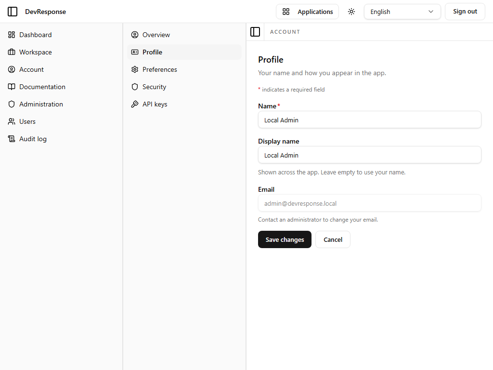

# Account · Profile

## Purpose
Lets the user edit their own display identity.

## Key elements
- **Name** (required), **Display name**, and **Email** fields.
- **Save changes** / **Cancel** buttons.

## Actions available
- Save changes → persists the profile (not exercised in this read-only walkthrough).
- Cancel → discards edits.

## Navigation
- Reached from: Account sub-navigation → Profile.

## Access
Any signed-in user; self-scoped.

## Observations
Email is displayed with the profile but changing the sign-in address is a more privileged operation than the name fields (admins can manage users' emails from the admin console).
