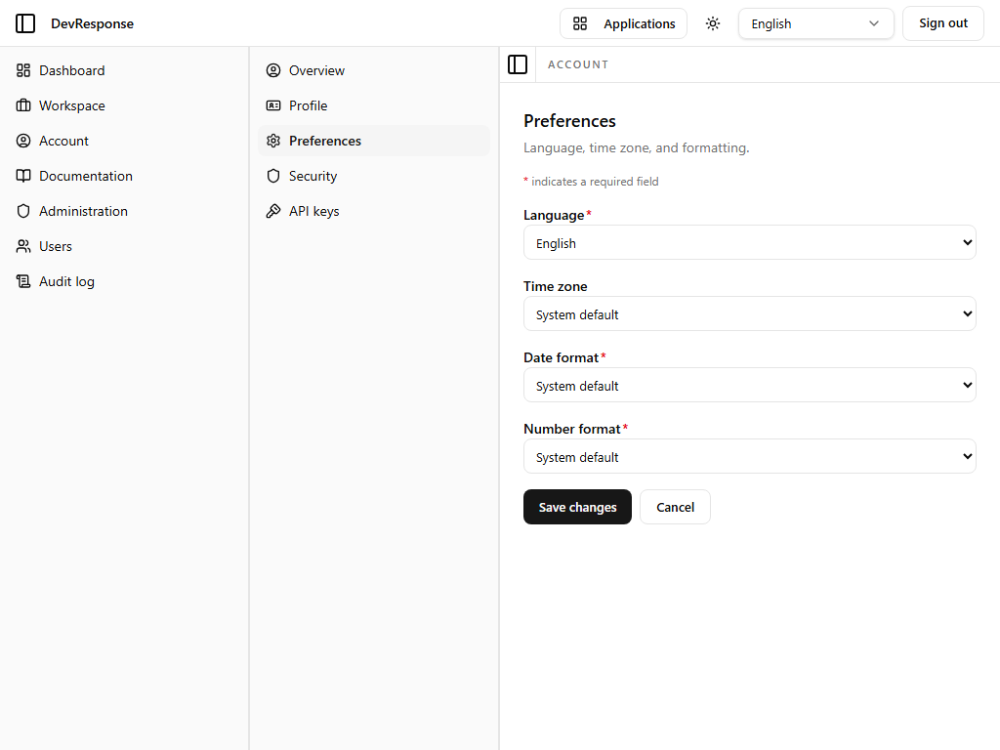

# Account · Preferences

## Purpose
Per-user localization and formatting preferences, persisted to the account (not just the browser).

## Key elements
- **Language** (required): English, French, Spanish, Ukrainian, Portuguese, Chinese (Simplified), Hindi, Japanese.
- **Time zone**: system default or any IANA zone.
- **Date format** and **Number format** (required selects).
- **Save changes** / **Cancel**.

## Actions available
- Save changes → persists the preferences; the language choice also drives which locale the app and transactional emails use for this user.

## Navigation
- Reached from: Account sub-navigation → Preferences.

## Access
Any signed-in user; self-scoped.

## Observations
The language list here matches the locale switcher in the brand bar — the switcher changes the session immediately, while this page stores the durable per-user preference.
