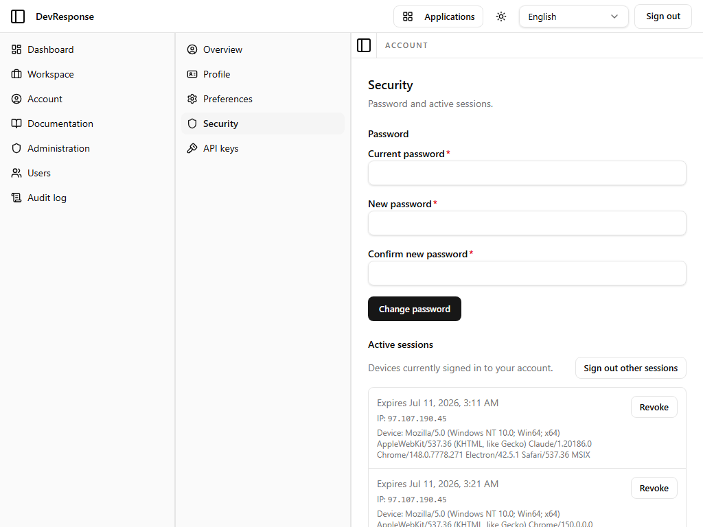

# Account · Security

## Purpose
Self-service credential and session hygiene: change the password and inspect or revoke active sessions.

## Key elements
- **Password** form: current password, new password, confirm new password (all required) with a **Change password** button.
- **Active sessions** list: one card per signed-in device showing expiry, IP address, and user-agent string, each with a **Revoke** button.
- **Sign out other sessions** bulk action.

## Actions available
- Change password (requires the current password).
- Revoke an individual session, or sign out every session except the current one.

## Navigation
- Reached from: Account sub-navigation → Security.

## Access
Any signed-in user; self-scoped. Administrators can additionally manage any user's sessions from the admin user detail page.

## Observations
The session card shown in the capture is the walkthrough's own browser session (IP and user-agent are displayed verbatim).
