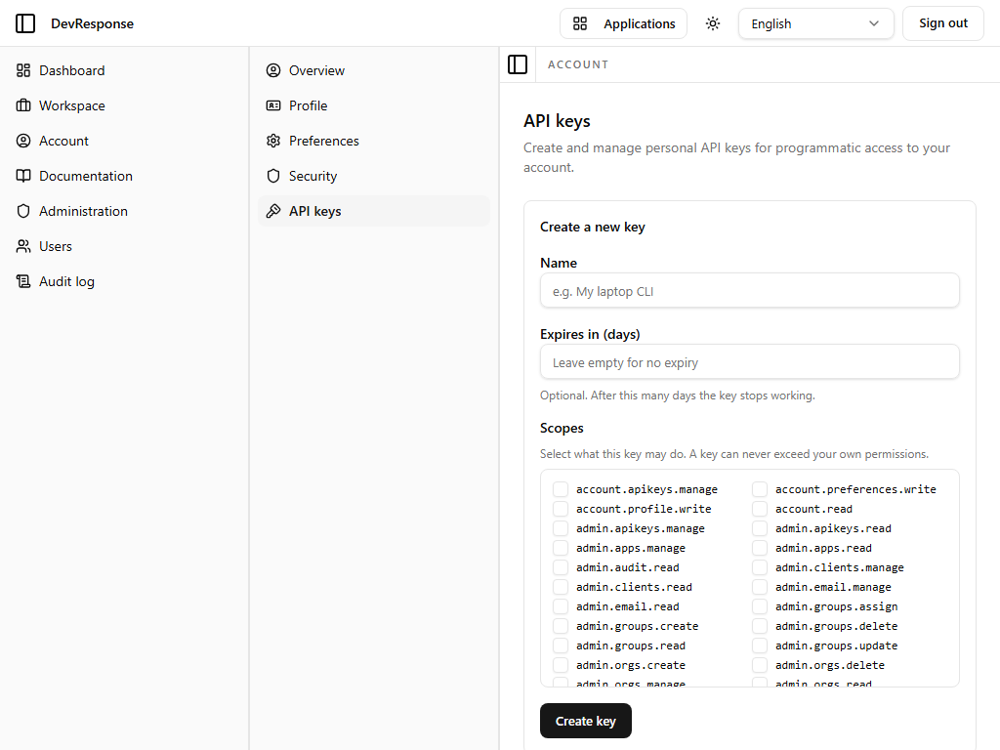

# Account · API keys

## Purpose
Self-service creation and management of personal API keys for the machine API (`/api/v1`).

## Key elements
- **Create a new key** form: name, optional expiry in days, and a scope picker.
- Scope picker lists every permission the user could delegate — with the hard rule stated inline: "A key can never exceed your own permissions" (permission ∩ scope intersection).
- **Your API keys** list (empty state for the seed admin: "You don't have any API keys yet.").

## Actions available
- Create key → generates the secret, which is shown only once at creation time.
- Manage existing keys (once any exist).

## Navigation
- Reached from: Account sub-navigation → API keys.

## Access
Any signed-in user; self-scoped (`account.apikeys.manage` scope exists for delegating this ability to a key itself).

## Observations
Because the seed admin holds every admin permission, the scope list on this account shows the full catalog — a regular member would see only their own, much shorter list.
