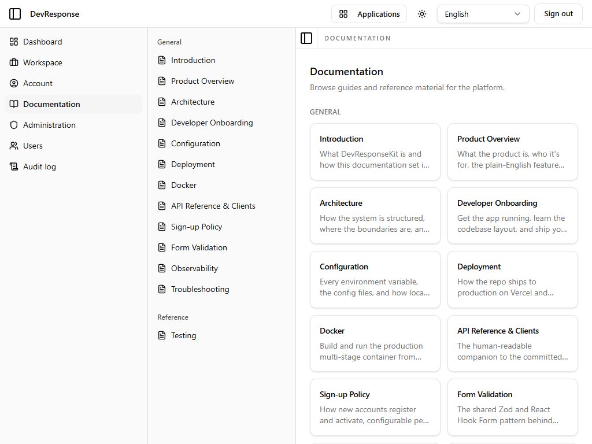

# Documentation catalog

## Purpose
The embedded documentation viewer's index: an auto-generated catalog of every markdown document shipped with the platform, grouped by section.

## Key elements
- **General** section: Introduction, Product Overview, Architecture, Developer Onboarding, Configuration, Deployment, Docker, API Reference & Clients, Sign-up Policy, Form Validation, Observability, Troubleshooting.
- **Reference** section: Testing.
- Each entry shows a title and one-line summary sourced from the document's frontmatter.

## Actions available
- Click any card → opens the rendered document at `/en/app/docs/<slug>`.

## Navigation
- Reached from: primary sidebar → Documentation.
- Leads to: 13 individual document pages (one representative captured: [Architecture](18-docs-architecture.md)).

## Access
Any signed-in active member.

## Observations
The catalog is frontmatter-driven — adding or removing a markdown file under `docs/` updates this page automatically.
