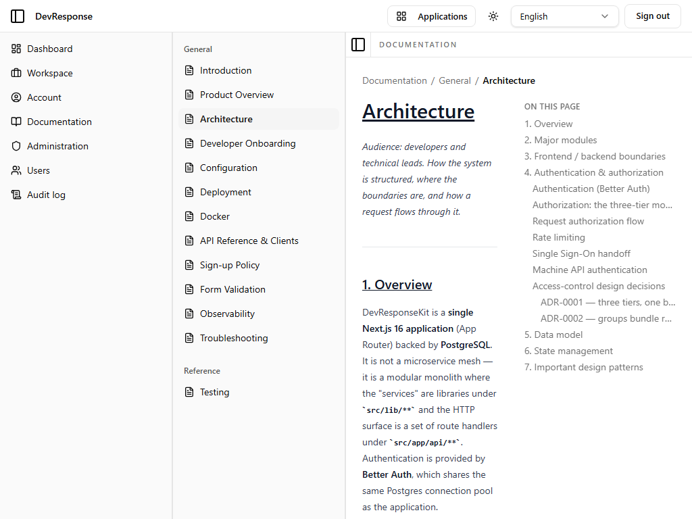
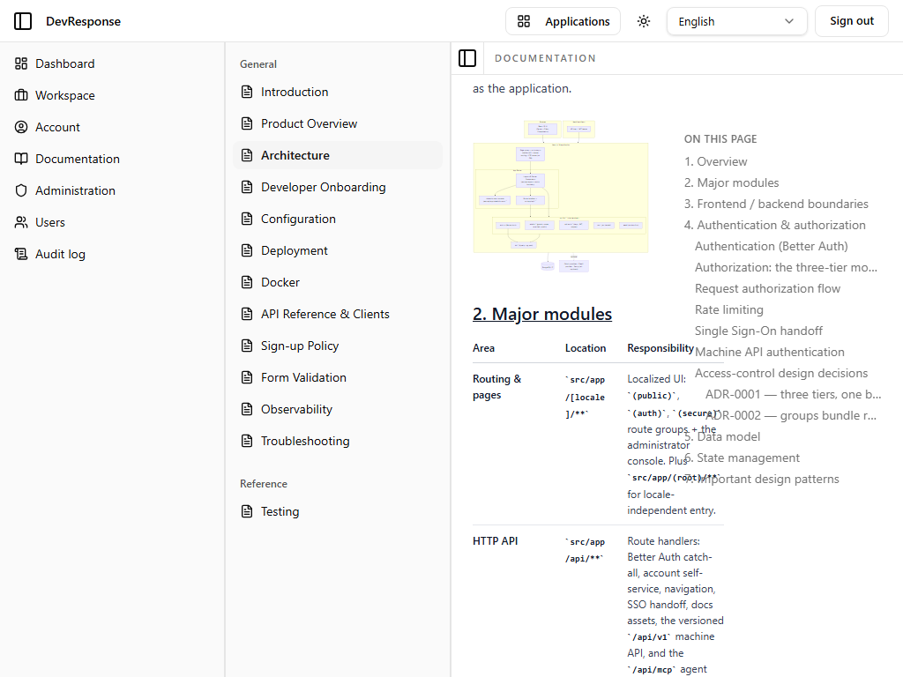

# Documentation · Architecture

## Purpose
A rendered documentation page — captured as the representative example of the doc viewer. It shows the full markdown pipeline: headings, tables, code, Mermaid diagrams, and an on-page table of contents.

## Key elements
- Breadcrumb (Documentation / General / Architecture).
- Docs sidebar listing all 13 documents with the current one highlighted.
- Rendered body with numbered sections (Overview, Major modules, Frontend/backend boundaries, Authentication & authorization, Data model, State management, Design patterns).
- A rendered **Mermaid** diagram (architecture flow) — proof the sanitize-first rendering pipeline preserves diagram labels.
- "On this page" anchor TOC on the right.

## Actions available
- Anchor links to page sections; sidebar to switch documents.

## Navigation
- Reached from: the documentation catalog.
- Leads to: sibling documents via the docs sidebar.

## Access
Any signed-in active member.

## Observations
At the 1024px capture width the right-hand "On this page" TOC overlaps the module table's text (visible in the scrolled view) — a responsive-layout nit worth fixing for narrow viewports. All other pages rendered cleanly at this width.
