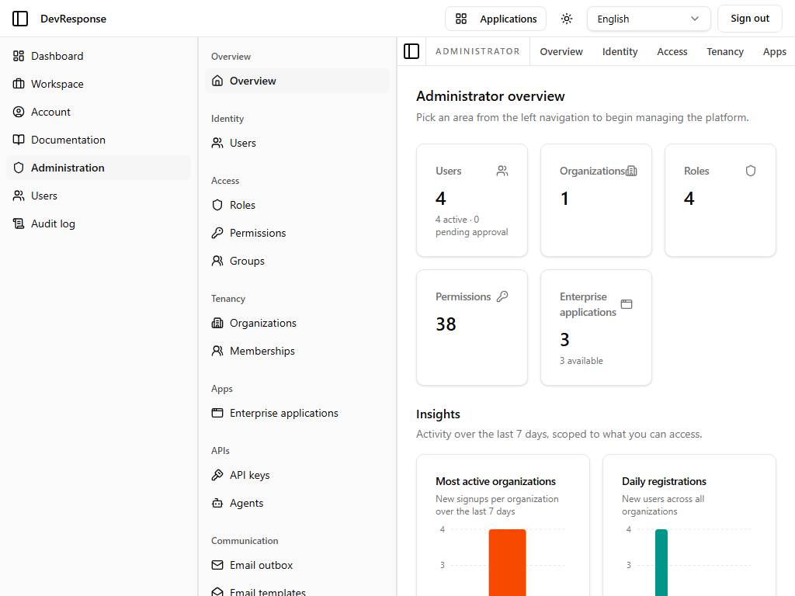
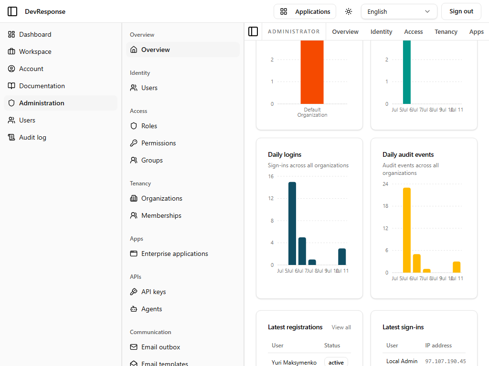
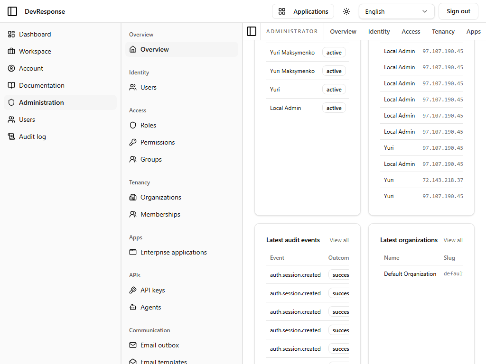

# Administrator · Overview

## Purpose
The admin console's landing page: headline counts for every managed entity plus a seven-day activity dashboard.

## Key elements
- Admin console chrome: a nested sidebar grouped into **Overview / Identity / Access / Tenancy / Apps / APIs / Communication / Activity**, mirrored by a horizontal tab bar.
- Stat cards: Users (4, with active/pending split), Organizations (1), Roles (4), Permissions (38), Enterprise applications (3).
- **Insights** (last 7 days, scoped to the viewer's access): most active organizations, daily registrations, daily logins, daily audit events — each as a small bar chart with an accompanying data table.
- **Latest** tables: registrations, sign-ins (with IP), audit events, organizations, with "View all" links into the corresponding list pages.

## Actions available
- Navigation only — every card and "View all" link leads to the matching management page.

## Navigation
- Reached from: primary sidebar → Administration.
- Leads to: all 12 admin section pages.

## Access
Requires admin console access; each nav group appears only with the matching `admin.*.read` permission.

## Observations
The insights are described as "scoped to what you can access" — org-scoped admins see only their organizations' activity.
