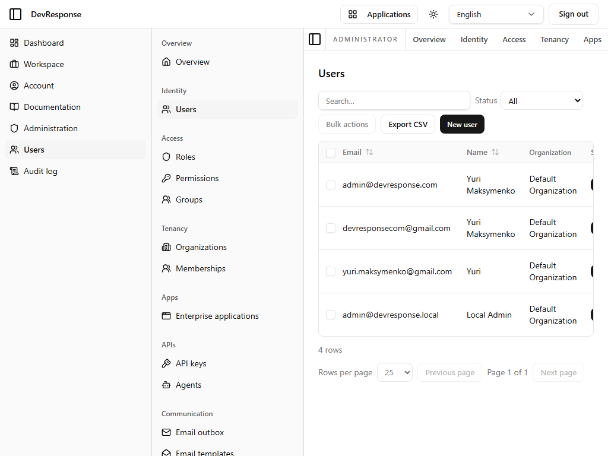

# Administrator · Users

## Purpose
Platform-wide user management: browse, filter, export, and open every user account.

## Key elements
- Status filter: All / Active / Pending approval / Blocked / Suspended / Deactivated.
- **Bulk actions** menu and **Export CSV**.
- **New user** button → [create form](33-admin-user-create.md).
- Sortable table: Email, Name, Organization, Status, Created; rows link to the [user detail page](32-admin-user-detail.md).
- Pagination with selectable page size (10/25/50/100).

## Actions available
- Filter/sort/paginate the list; export to CSV; open a user; create a user; apply bulk actions to selected rows.

## Navigation
- Reached from: admin sidebar (Identity → Users) or the primary sidebar's "Users" shortcut.
- Leads to: user detail pages, user creation form.

## Access
`admin.users.read` to view; mutating actions map to the finer-grained `admin.users.*` permissions.

## Observations
The demo contains 4 users, all active members of the Default Organization.
