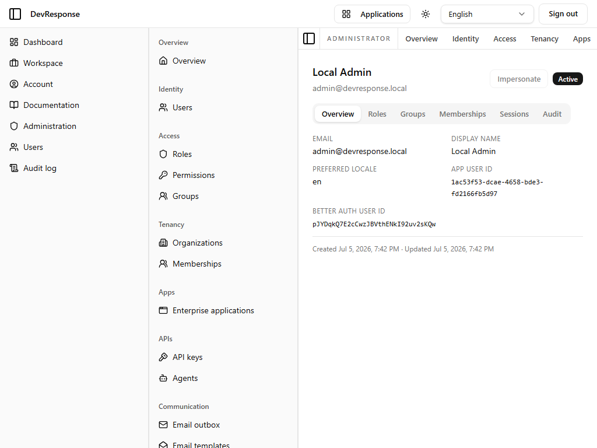

# Administrator · User detail

## Purpose
The management hub for a single account (captured for the seed "Local Admin" user). Everything an administrator can know or change about a user hangs off this page's tabs.

## Key elements
- Header: display name, email, status badge, and an **Impersonate** button.
- Tabs: **Overview** (captured), **Roles**, **Groups**, **Memberships**, **Sessions**, **Audit**.
- Overview fields: email, display name, preferred locale, app user ID, Better Auth user ID, created/updated timestamps.

## Actions available
- **Impersonate** (`admin.users.impersonate`) — act as this user; during impersonation the actor holds only the target's permissions and stops via the impersonation banner. *Not exercised in this walkthrough.*
- Per-tab management: assign roles/groups, manage org memberships, revoke sessions, review the user's audit trail, set password, ban/suspend (behind the respective `admin.users.*` permissions).

## Navigation
- Reached from: the users list.
- Leads to: tab content in place; related role/group/org pages.

## Access
`admin.users.read` to view; each mutation requires its specific permission.

## Observations
The page exposes both the application-level user ID and the underlying Better Auth ID — handy when correlating audit events or database rows.
