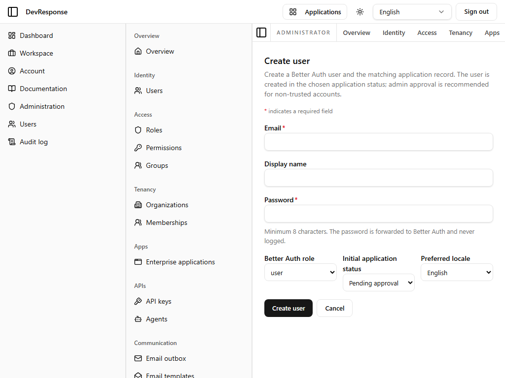

# Administrator · Create user

## Purpose
Administrative user provisioning — creating an account directly, bypassing self-service sign-up. Captured as the representative example of the admin console's create forms (roles, groups, organizations, enterprise apps, and API keys follow the same pattern).

## Key elements
- **Email** (required), **Display name**, **Password** (required).
- **Better Auth role** select (auth-layer role for the new account).
- **Initial application status** select (e.g. active vs. pending approval).
- **Preferred locale** select.
- **Create user** / **Cancel**.

## Actions available
- Create user (`admin.users.create`) — *not exercised in this walkthrough.*
- Cancel → back to the users list.

## Navigation
- Reached from: Users list → New user.
- Leads to: the new user's detail page on success.

## Access
`admin.users.create`.

## Observations
Programmatically provisioned users must have their email treated as verified (or verification handled) for first sign-in to succeed when the platform requires email verification — the form's status/locale selects exist to make provisioned accounts immediately usable.
