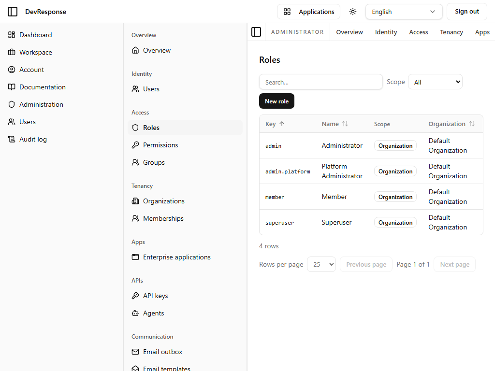

# Administrator · Roles

## Purpose
Manages the application roles that bundle permissions and get assigned to users (directly or via groups).

## Key elements
- Scope filter: All / Global / Organization.
- **New role** button.
- Table: Key, Name, Scope, Organization, Permissions (count), Members (count), Created — with per-row **Duplicate** and **Delete**.
- Seed data: `admin` (Administrator, 4 permissions), `admin.platform` (Platform Administrator, 36), `member` (Member, 1), `superuser` (Superuser, 2) — all org-scoped to the Default Organization.

## Actions available
- Open a role → [role detail](35-admin-role-detail.md); duplicate a role as a starting point; delete (destructive — not exercised).

## Navigation
- Reached from: admin sidebar (Access → Roles).
- Leads to: role detail pages, role creation form.

## Access
`admin.roles.read`; create/update/delete/assign map to `admin.roles.*`.

## Observations
The seed role split is informative: `member` holds only `shell.view`, `admin` holds the user-management reads, and `admin.platform` holds effectively everything else — the `superuser` role carries the `superuser` bypass permission.
