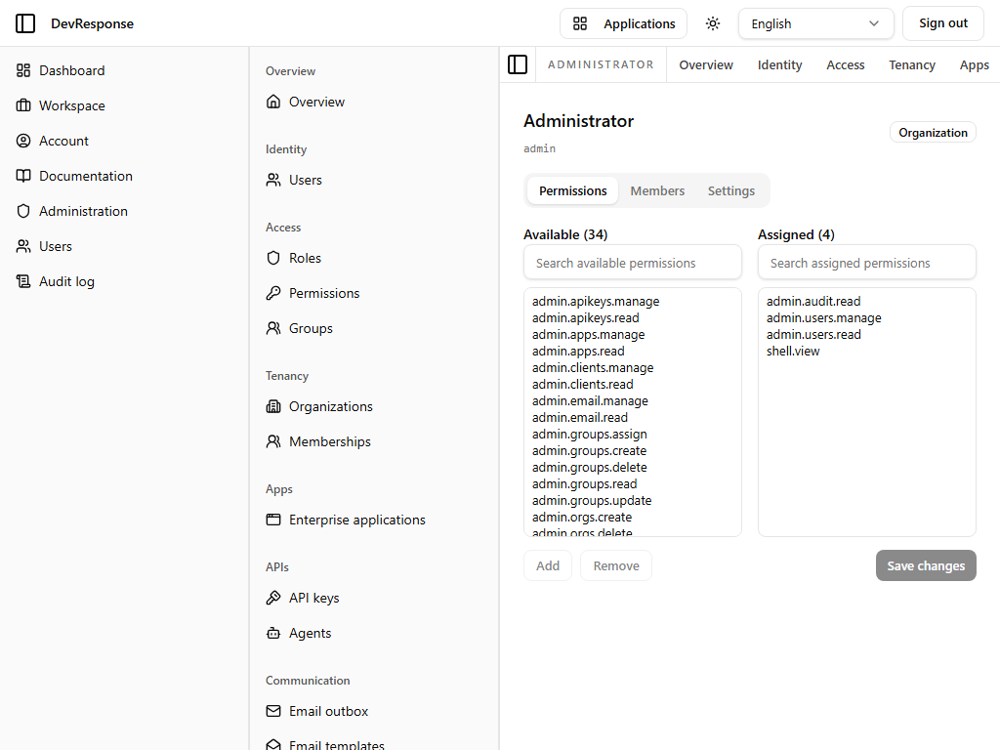
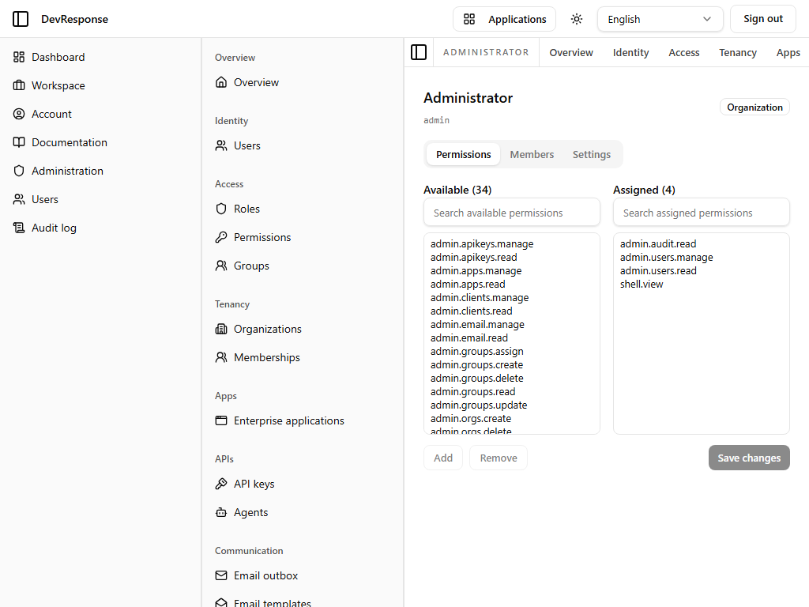

# Administrator · Role detail

## Purpose
Edits a single role (captured for the seed `admin` / "Administrator" role): which permissions it grants, who holds it, and its settings.

## Key elements
- Header: role name, key, and scope badge (Organization).
- Tabs: **Permissions** (captured), **Members**, **Settings**.
- Permissions tab is a dual-list editor: **Available** (34 unassigned permission keys) and **Assigned** (4: `admin.audit.read`, `admin.users.manage`, `admin.users.read`, `shell.view`) with **Add** / **Remove** / **Save changes**.

## Actions available
- Move permissions between lists and save (`admin.roles.update`) — *not exercised.*
- Members tab: assign/unassign users (`admin.roles.assign`).
- Settings tab: rename or reconfigure the role.

## Navigation
- Reached from: the roles list.
- Leads to: tab content in place.

## Access
`admin.roles.read` to view; `admin.roles.update` / `admin.roles.assign` to change.

## Observations
Changes are staged in the UI until **Save changes** — the dual-list pattern makes the diff explicit before committing.
