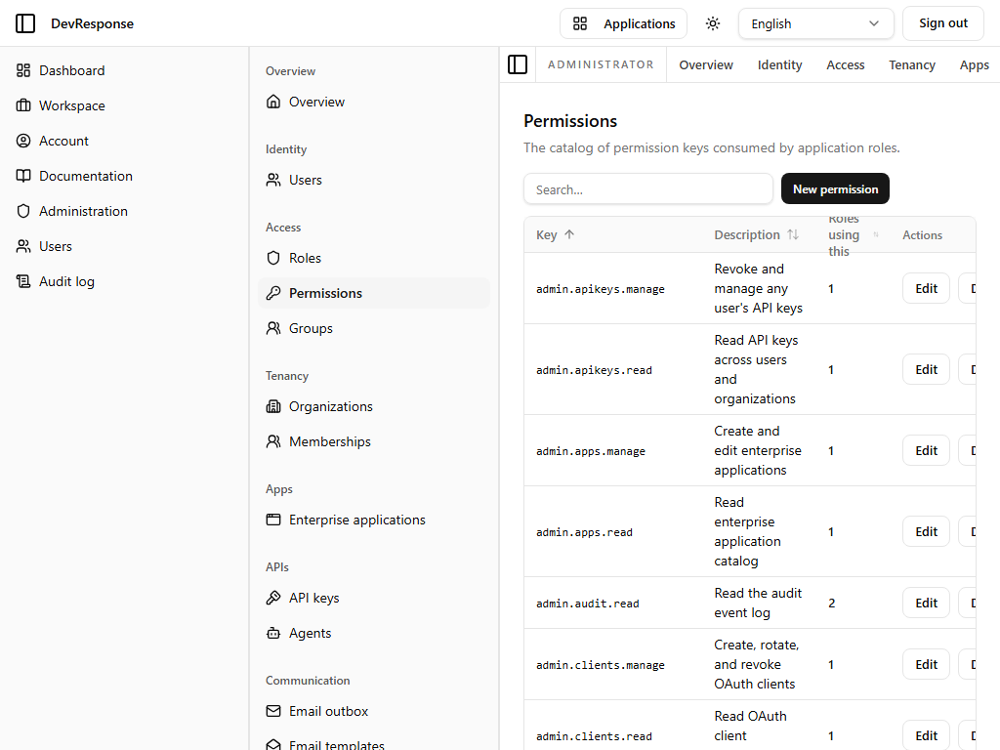
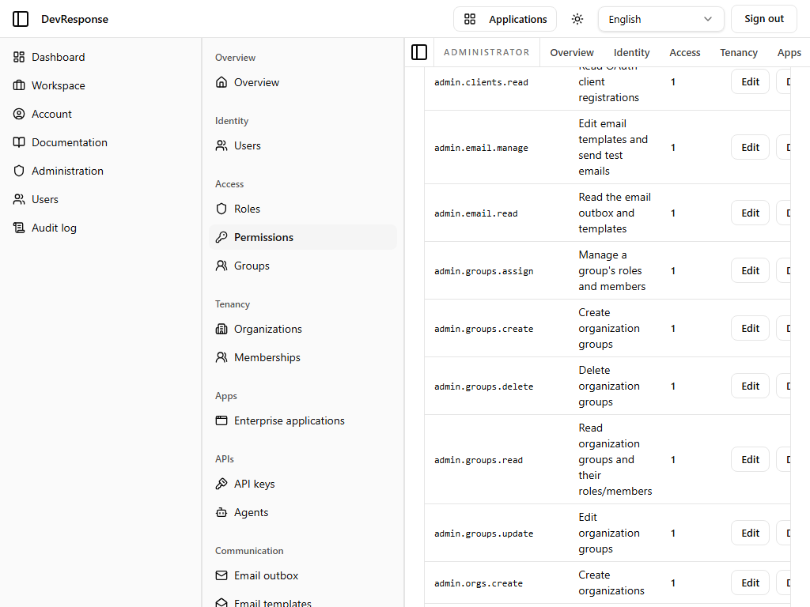

# Administrator · Permissions

## Purpose
The catalog of permission keys that roles are built from — the single source of truth for what actions exist in the platform.

## Key elements
- **New permission** button.
- Table: Key, Description, Roles using this (count), and per-row **Edit** / **Delete**.
- 38 seeded keys covering API keys, apps, audit, OAuth clients, email, groups, orgs, permissions, roles, and users (e.g. `admin.users.impersonate` — "Impersonate another user"), plus `audit.view`, `shell.view`, and `superuser`.

## Actions available
- Create, edit, or delete permission keys (`admin.permissions.manage`) — *not exercised.*

## Navigation
- Reached from: admin sidebar (Access → Permissions).

## Access
Viewing and managing the catalog sits behind `admin.permissions.manage` (there is no separate read key in the catalog).

## Observations
Each row's "Roles using this" count makes the blast radius of editing a key visible before touching it. The catalog is also pinned by a repo test against the seed data, so drift between code and database is caught in CI.
