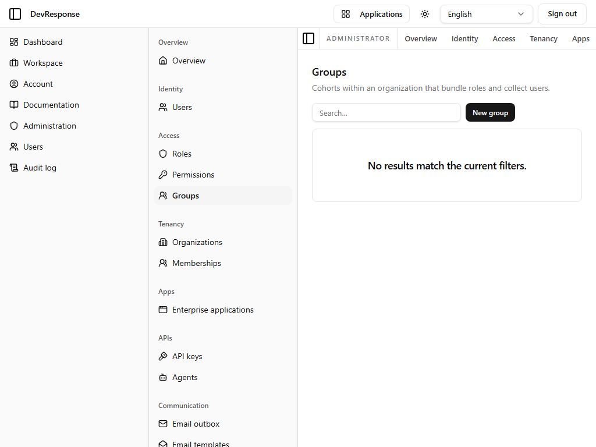

# Administrator · Groups

## Purpose
Manages groups — org-scoped cohorts that bundle **roles** (never raw permissions, per the platform's ADR-0002) and collect users, so membership changes cascade role assignments.

## Key elements
- Explanatory subtitle: "Cohorts within an organization that bundle roles and collect users."
- **New group** button.
- Empty state on the demo: "No results match the current filters."

## Actions available
- Create a group (`admin.groups.create`), then assign roles and members to it (`admin.groups.assign`) — *not exercised.*

## Navigation
- Reached from: admin sidebar (Access → Groups).
- Leads to: group detail/editor pages once groups exist.

## Access
`admin.groups.read`; mutations map to `admin.groups.create/update/delete/assign`.

## Observations
The demo ships no seed groups, so this page documents the empty state. The group → roles → permissions indirection is the intended way to manage access at scale.
