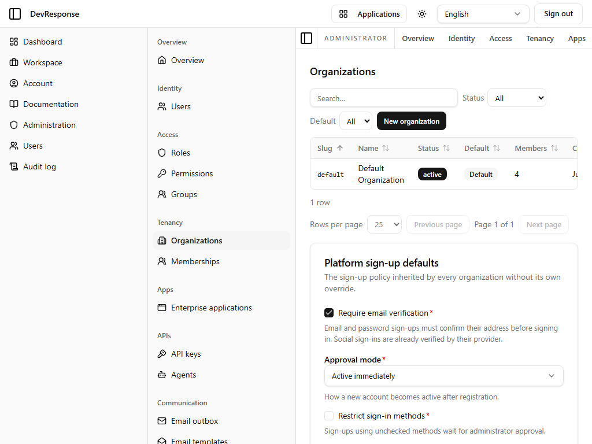
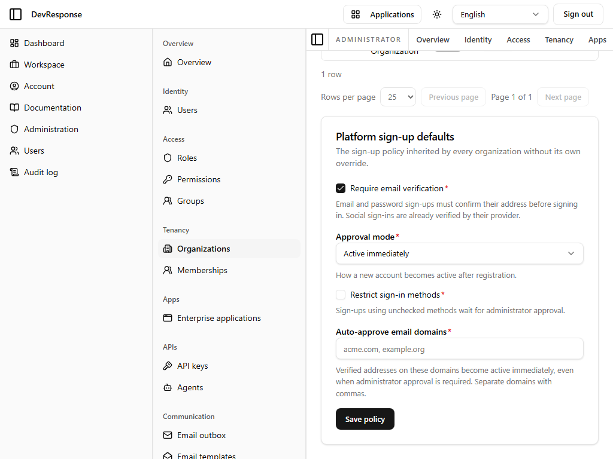

# Administrator · Organizations

## Purpose
Tenant management: the list of organizations plus the platform-wide sign-up policy that every organization inherits unless it sets its own override.

## Key elements
- Filters: Status (All / Active / Pending / Suspended / Archived) and Default (Yes/No).
- **New organization** button; table with Slug, Name, Status, Default badge, Members, Created, and per-row **Delete**.
- **Platform sign-up defaults** panel:
  - **Require email verification** toggle (social sign-ins count as pre-verified).
  - **Approval mode**: Active immediately / Administrator approval required / Invitation required.
  - **Restrict sign-in methods** (unchecked methods route sign-ups to admin approval).
  - **Auto-approve email domains** (verified addresses on listed domains activate immediately).
  - **Save policy** button.

## Actions available
- Open an organization → [org detail](39-admin-org-detail.md); create or delete organizations (`admin.orgs.create/delete`); save the platform sign-up policy — *none exercised.*

## Navigation
- Reached from: admin sidebar (Tenancy → Organizations).

## Access
`admin.orgs.read`; policy edits require `admin.orgs.manage`.

## Observations
This page is the runtime control plane for the sign-up flow observed on the public sign-up screen — policy changes here take effect without redeploying.
