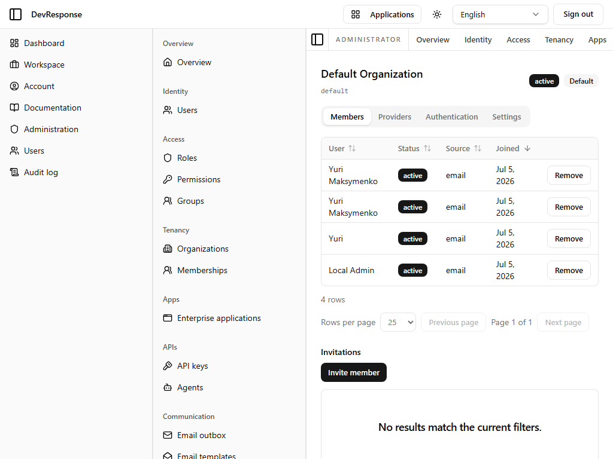

# Administrator · Organization detail

## Purpose
Manages a single tenant (captured for the seed "Default Organization"): its members, invitations, identity-provider bindings, authentication policy, and settings.

## Key elements
- Header: organization name, slug, status badge, and Default badge.
- Tabs: **Members** (captured), **Providers**, **Authentication**, **Settings**.
- Members tab: table of members (User, Status, Source — e.g. "email", Joined) with per-row **Remove**, plus an **Invitations** section with an **Invite member** button (empty invitation list on the demo).

## Actions available
- Remove members, invite members (sends an invitation email) — *not exercised.*
- **Providers** tab: bind identity providers / email-domain routing for org-scoped sign-in.
- **Authentication** tab: the per-organization sign-up/auth policy override (same controls as the platform defaults).
- **Settings** tab: rename, change status, and other org attributes.

## Navigation
- Reached from: the organizations list.
- Leads to: tab content in place.

## Access
`admin.orgs.read` to view; `admin.orgs.update` / `admin.orgs.manage` for changes.

## Observations
All four demo users are members here via the "email" source. Invitation-based onboarding (visible as the Invitations section) pairs with the "Invitation required" approval mode on the sign-up policy.
