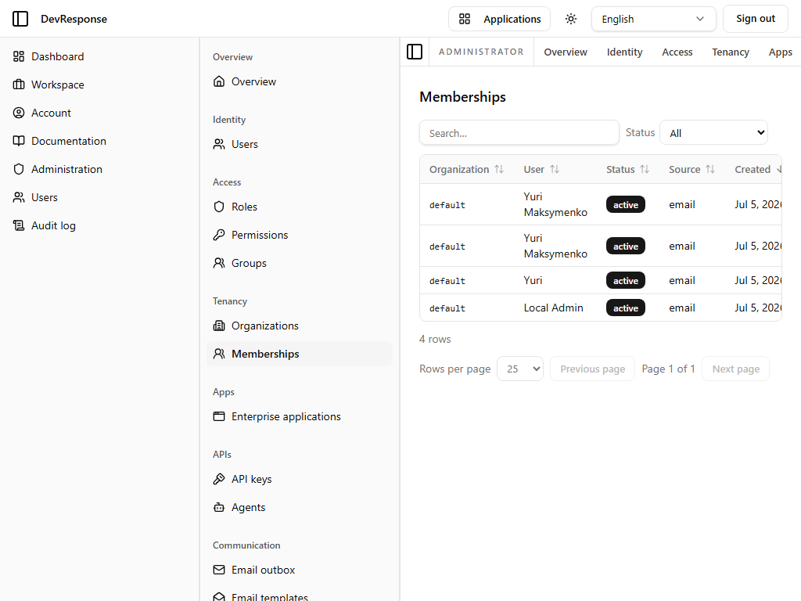

# Administrator · Memberships

## Purpose
A flat, cross-organization view of every user↔organization membership — the join table made browsable.

## Key elements
- Status filter: All / Active / Pending approval / Blocked / Suspended.
- Table: Organization, User, Status, Source (how the membership came to be, e.g. "email" sign-up), Created.
- Pagination controls.

## Actions available
- Filtering and sorting only — membership mutations happen on the organization detail or user detail pages.

## Navigation
- Reached from: admin sidebar (Tenancy → Memberships).

## Access
`admin.orgs.read`.

## Observations
Useful for answering "which org is this user in, and how did they get there?" across tenants without opening each organization. The demo shows the four seed users, all active in `default`.
