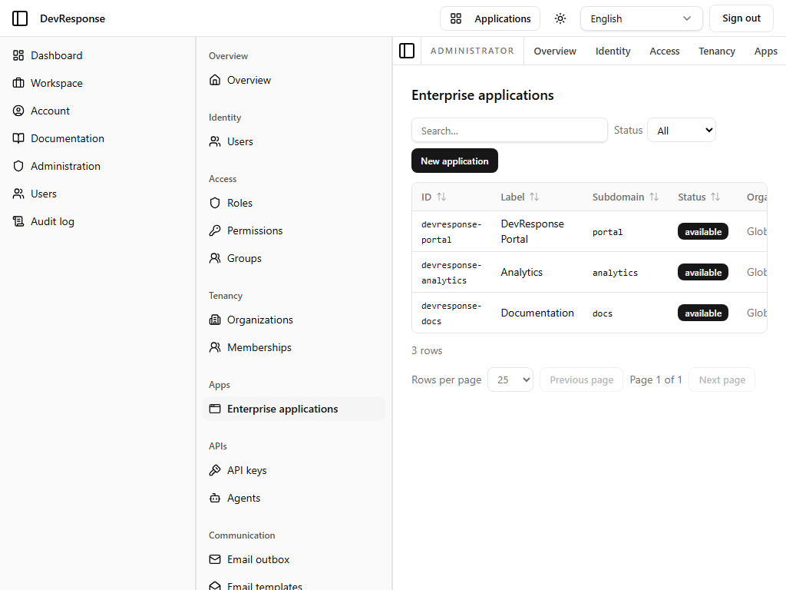

# Administrator · Enterprise applications

## Purpose
Manages the catalog of companion applications that appear in the shell's **Applications** switcher and participate in cross-subdomain SSO.

## Key elements
- Status filter: All / Available / Disabled; **New application** button.
- Table: ID, Label, Subdomain, Status, Organization (scope), Sort order, Created, with per-row **Delete**.
- Seed catalog: `devresponse-portal` (Portal · portal), `devresponse-analytics` (Analytics · analytics), `devresponse-docs` (Documentation · docs) — all Global, available, sort order 100.

## Actions available
- Open an app to edit it, create a new application, or delete one (`admin.apps.manage`) — *not exercised.*

## Navigation
- Reached from: admin sidebar (Apps → Enterprise applications).
- Leads to: per-app editor pages (same form pattern as the other editors; not separately captured).

## Access
`admin.apps.read`; mutations require `admin.apps.manage`.

## Observations
Apps can be scoped Global or to a single organization, and the subdomain column ties each entry to the SSO handoff (single-use nonce JWTs let users move between subdomains without re-authenticating).
