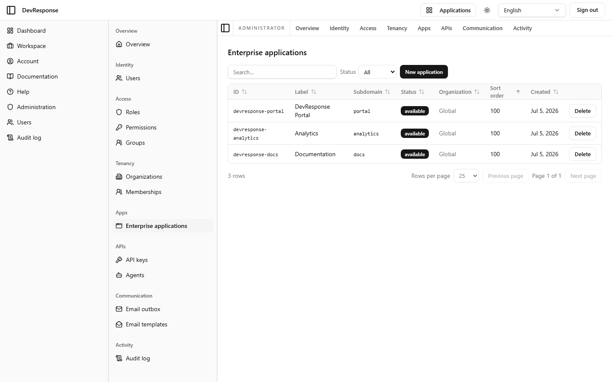

# Administrator · Enterprise applications

## Purpose
Manages the catalog of companion applications that appear in the shell's **Applications** switcher and participate in cross-subdomain SSO.

## Key elements
- Status filter: All / Available / Disabled; **New application** button.
- Table: ID, Label, Subdomain, Status, Organization (scope), Sort order, Created, with per-row **Delete**.
- Seed catalog: `devresponse-portal` (Portal · portal), `devresponse-analytics` (Analytics · analytics), `devresponse-docs` (Documentation · docs) — all Global, available, sort order 100.

## Actions available
- Open an app to edit it, create a new application, or delete one (`admin.apps.manage`) — *not exercised.*
- Setting an app to **Disabled**, or deleting it, stops new launches at once. On a satellite that runs a kit version with F-82, it also ends the sessions its launches opened: at once if the satellite shares this deployment's database, and otherwise within the satellite's `SSO_SESSION_LIFETIME_HOURS` (8 hours unless it sets another value) of the launch. A satellite fork that has not ported F-82, such as today's `devresponseapps` forks, keeps those sessions.

## Navigation
- Reached from: admin sidebar (Apps → Enterprise applications).
- Leads to: per-app editor pages (same form pattern as the other editors; not separately captured).

## Access
`admin.apps.read`; mutations require `admin.apps.manage`. An organization admin registers apps in its own organization only, under the organization's slug: an id such as `org-a.crm` and an SSO audience ending in an id under the slug (`devresponse-app:org-a.crm`). Any other id or audience, and every Global app, is a superadmin's to register (I-01). For an organization admin the **New application** form creates the app in the active organization and starts the id with `<org-slug>.`; a superadmin picks Global or an organization in the form (R14).

## Observations
Apps can be scoped Global or to a single organization, and the subdomain column ties each entry to the SSO handoff (single-use nonce JWTs let users move between subdomains without re-authenticating).
