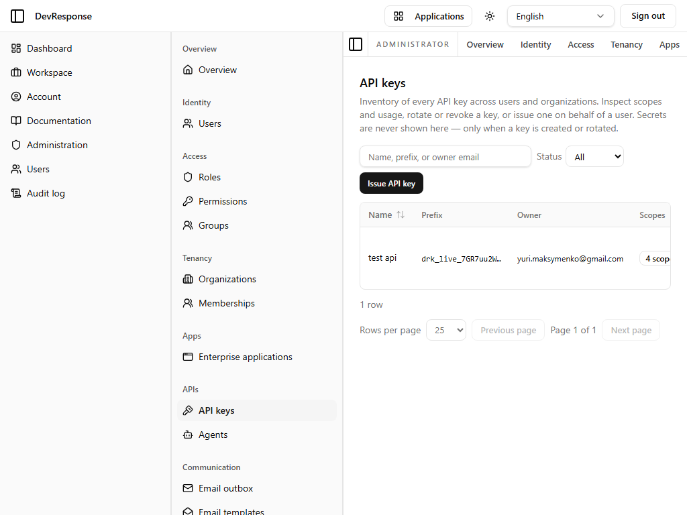

# Administrator · API keys

## Purpose
Platform-wide inventory of every API key across all users and organizations — the administrative counterpart to the self-service Account → API keys page.

## Key elements
- Explanatory header: inspect scopes and usage, rotate or revoke, or issue a key on behalf of a user; "Secrets are never shown here — only when a key is created or rotated."
- Status filter (All / Active / Revoked) and an **Issue API key** button.
- Table: Name, Prefix (e.g. `drk_live_7GR7uu2W…`), Owner, Scopes (count), Status, Last used, Expires, Created — with per-row **View** / **Rotate** / **Revoke**.

## Actions available
- View a key's scopes/usage; rotate (invalidates the old secret, shows a new one once); revoke; issue a key for any user (`admin.apikeys.manage`) — *none exercised.*

## Navigation
- Reached from: admin sidebar (APIs → API keys).

## Access
`admin.apikeys.read`; rotate/revoke/issue require `admin.apikeys.manage`.

## Observations
Keys are stored hashed (SHA-256) — the prefix column plus last-used timestamp is the operational fingerprint. The demo shows one key ("test api", 4 scopes, active).
