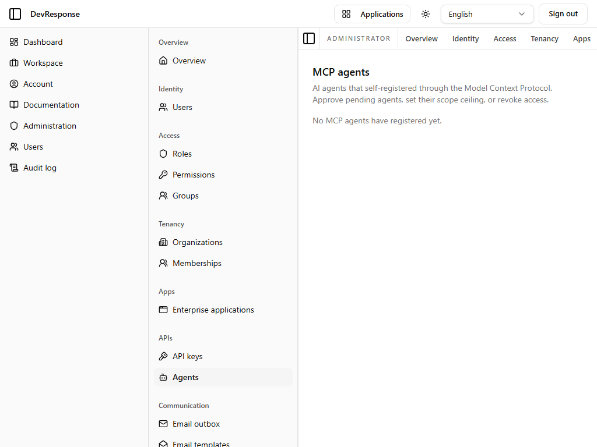

# Administrator · MCP agents

## Purpose
Governance for AI agents that self-register through the Model Context Protocol gateway: approval, scope ceilings, and revocation.

## Key elements
- Explanatory header: "AI agents that self-registered through the Model Context Protocol. Approve pending agents, set their scope ceiling, or revoke access."
- Empty state on the demo: "No MCP agents have registered yet."

## Actions available
- Once agents register: approve pending agents, set the maximum scopes they may hold, revoke access — *nothing to exercise on the demo.*

## Navigation
- Reached from: admin sidebar (APIs → Agents).

## Access
`admin.clients.read` / `admin.clients.manage` (agents are OAuth-client registrations under the hood).

## Observations
This page documents the intended lifecycle: MCP dynamic client registration lands agents here with zero scopes by default, and nothing works until an administrator grants a ceiling — a deliberate approve-first posture.
