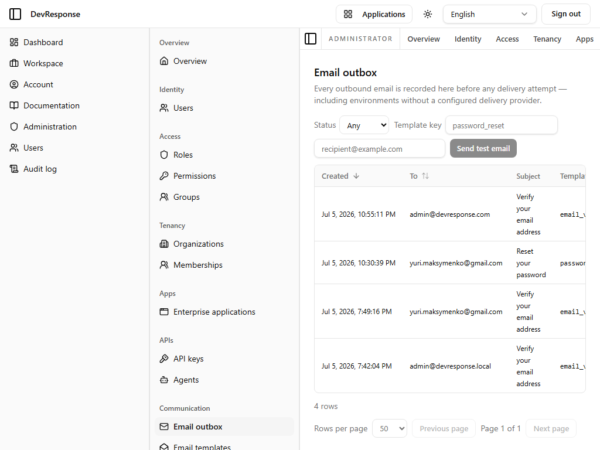

# Administrator · Email outbox

## Purpose
The inspectable record of the platform's outbox-first email design: "Every outbound email is recorded here before any delivery attempt — including environments without a configured delivery provider."

## Key elements
- Filters: **Status** (Any/…) and **Template key** (e.g. `password_reset`).
- **Send test email** control with a recipient field.
- Table: Created, To, Subject, Template — the demo shows 4 recorded messages: three "Verify your email address" (`email_verification`) and one "Reset your password" (`password_reset`), matching the seed users' sign-ups.
- Pagination (4 rows, page size selectable).

## Actions available
- Filter the outbox; send a test email (`admin.email.manage`) — *not exercised.*
- Rows open delivery detail.

## Navigation
- Reached from: admin sidebar (Communication → Email outbox).

## Access
`admin.email.read`; test sends require `admin.email.manage`.

## Observations
Because messages are recorded before any delivery attempt, this page doubles as the "where did my verification email go?" debugging surface on environments with no delivery provider configured. (Note: during exploration this page appeared stuck on "Loading…" in one embedded-browser session, but it renders normally in a clean browser — the capture above is the real state.)
