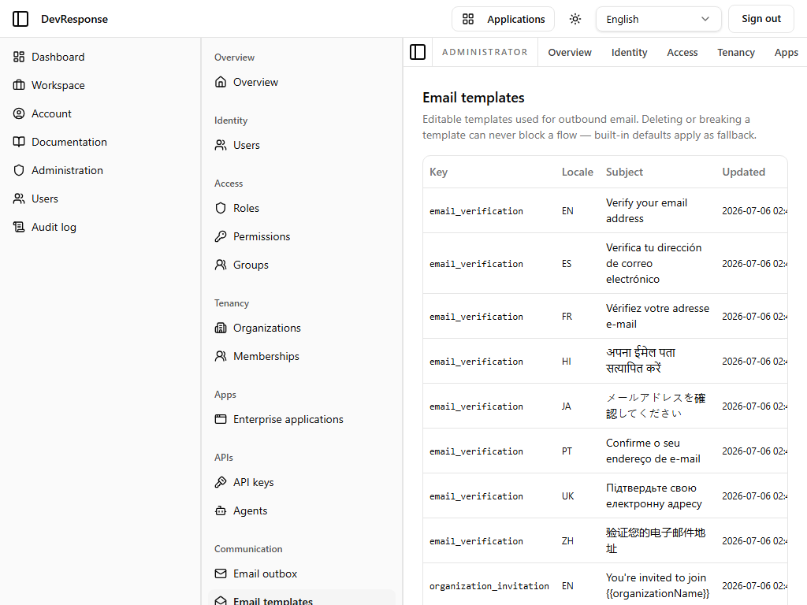

# Administrator · Email templates

## Purpose
The catalog of editable transactional-email templates, with one row per template key per locale. The header states the safety guarantee: "Deleting or breaking a template can never block a flow — built-in defaults apply as fallback."

## Key elements
- Table: Key, Locale, Subject, Updated.
- The demo shows `email_verification` localized across EN, ES, FR, HI, JA, PT, UK, ZH (each with its translated subject line) followed by `organization_invitation` and other keys — the full key × locale matrix.

## Actions available
- Open a template to edit its subject/body per locale (`admin.email.manage`) — *not exercised.*

## Navigation
- Reached from: admin sidebar (Communication → Email templates).

## Access
`admin.email.read` to view; `admin.email.manage` to edit.

## Observations
The visible subjects (e.g. "Verify your email address" / "Verifica tu dirección de correo electrónico" / "Підтвердьте свою електронну адресу") demonstrate that transactional email is localized with the same locale set as the UI, and invitation subjects carry `{{organizationName}}` placeholders.
