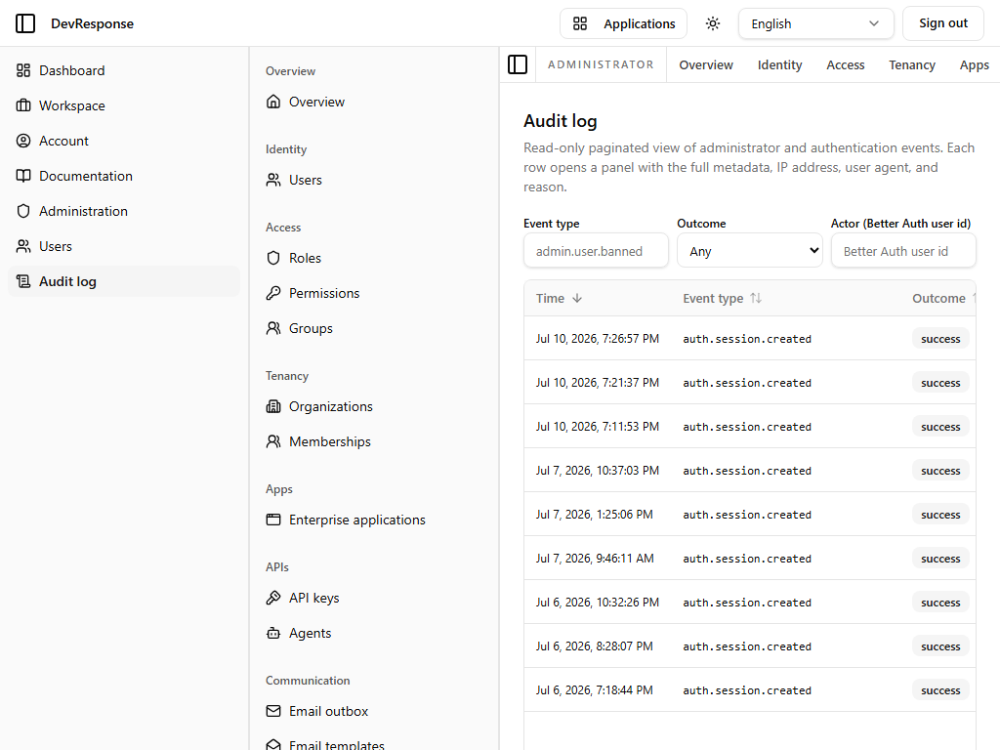

# Administrator · Audit log

## Purpose
"Read-only paginated view of administrator and authentication events. Each row opens a panel with the full metadata, IP address, user agent, and reason."

## Key elements
- Filters: **Event type** (free text, e.g. `admin.user.banned`), **Outcome** (Any/…), and **Actor** (Better Auth user id).
- Table: Time, Event type, Outcome — the demo shows a series of `auth.session.created` events with `success` outcomes, one per sign-in of the seed users.
- Row click → detail panel with full event metadata.

## Actions available
- Filtering and inspection only — the log is read-only by design.

## Navigation
- Reached from: admin sidebar (Activity → Audit log) or the primary sidebar's "Audit log" shortcut.

## Access
`admin.audit.read` (the permission catalog also carries a broader `audit.view` key).

## Observations
The same event stream feeds the "Daily audit events" chart on the admin overview. (Note: during exploration this page appeared stuck on "Loading…" in one embedded-browser session, but it renders normally in a clean browser — the capture above is the real state.)
